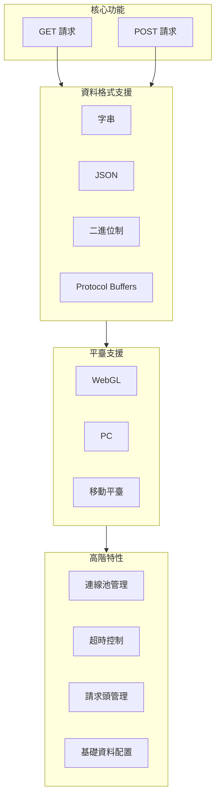
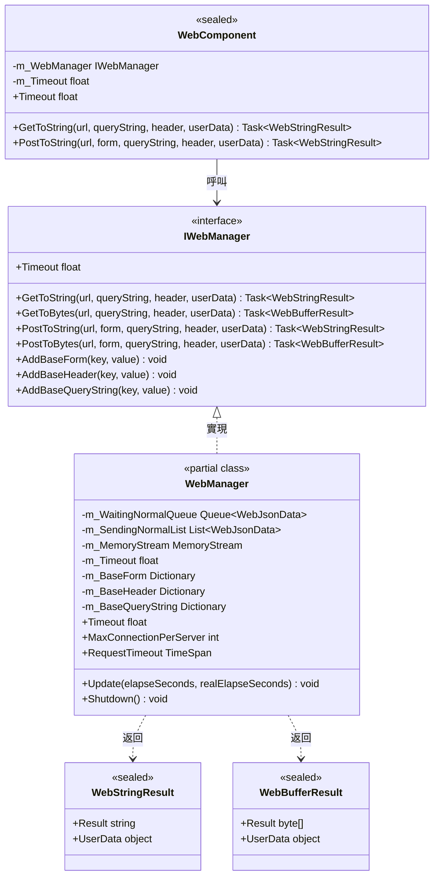
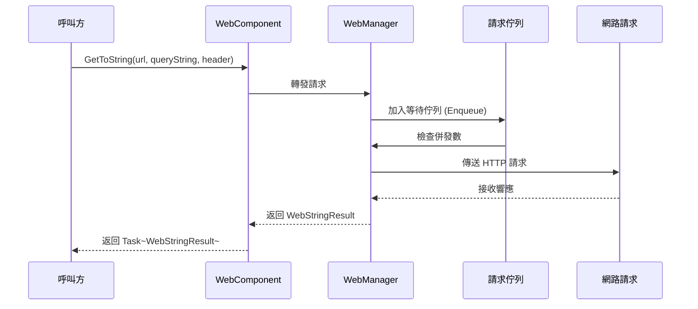

# 外掛介紹

GameFrameX Web 組件是一個高效能的 Unity HTTP 網路請求庫，提供簡潔易用的 API 來處理各種網路請求場景。支援 GET、POST 請求，可處理字串、JSON、二進位制資料等多種格式。

## 概述

GameFrameX Web 是 GameFrameX 遊戲框架體系中的網路功能模組，專為 Unity 遊戲開發者設計。該外掛提供了一套完整的 HTTP 客戶端解決方案，幫助開發者快速實現客戶端與伺服器之間的通訊需求。

作為 GameFrameX 框架的核心組件之一，Web 組件與其他模組（如 Network、Data、Procedure 等）緊密配合，共同構建完整的遊戲後端通訊體系。無論是簡單的資料獲取還是複雜的二進位制檔案上傳，Web 組件都能提供穩定、高效的網路請求服務。

### 設計目標

GameFrameX Web 組件的設計遵循以下核心理念：

1. **簡潔易用**：提供清晰的 API 介面，開發者無需關心底層實現細節
2. **高效能**：基於 C# Task 非同步模式，充分利用多執行緒優勢
3. **跨平臺**：統一介面適配不同執行平臺（WebGL、PC、移動端）
4. **可擴充套件**：模組化設計，支援自定義資料序列化和請求處理

## 核心特性

GameFrameX Web 組件提供了豐富的功能特性，滿足各種網路請求場景的需求：



### 非同步處理

基於現代 C# 非同步程式設計模式（async/await），開發者可以編寫清晰、簡潔的非同步程式碼，避免傳統回呼地獄問題：

```csharp
// 非同步獲取字串資料
string result = await webManager.GetToString("https://api.example.com/data");
Debug.Log("Response: " + result);
```

> Source: [README.md](https://github.com/GameFrameX/com.gameframex.unity.web/blob/main/README.md#L66-L68)

### 多資料格式支援

支援多種資料格式的請求和響應處理：

- **字串格式**：適用於簡單的文字資料交換
- **JSON 格式**：廣泛用於前後端資料互動，自動序列化/反序列化
- **二進位制格式**：適用於檔案下載、圖片載入等場景
- **Protocol Buffers**：高效二進位制序列化，適合高效能場景

### 連線池管理

內建智慧連線複用機制，透過 `MaxConnectionPerServer` 屬性控制單個伺服器的最大併發連線數，避免過多連線導致伺服器壓力或效能問題。預設值為 8 個併發連線。

## 架構設計

GameFrameX Web 組件採用分層架構設計，確保程式碼的模組化和可維護性：



### 核心組件說明

| 組件 | 型別 | 職責 |
|------|------|------|
| **IWebManager** | 介面 | 定義 Web 請求的抽象介面，統一管理所有 HTTP 請求操作 |
| **WebManager** | 類 | 核心實現類，繼承 `GameFrameworkModule`，實現完整的請求邏輯 |
| **WebComponent** | Unity 組件 | `IWebManager` 的 Unity 組件封裝，方便在場景物件上使用 |
| **WebStringResult** | 結果類 | 封裝字串型別的請求結果 |
| **WebBufferResult** | 結果類 | 封裝位元組陣列型別的請求結果 |

### 請求處理流程



## 平臺支援

GameFrameX Web 組件針對不同 Unity 平臺提供了差異化的實現，確保在各種執行環境下都能正常工作：

| 平臺 | 實現方式 | 特殊說明 |
|------|----------|----------|
| **WebGL** | UnityWebRequest | 不支援多執行緒，所有請求在主執行緒處理 |
| **PC** | HttpWebRequest | 使用 .NET 原生網路庫 |
| **Android** | HttpWebRequest | 使用 .NET 原生網路庫 |
| **iOS** | HttpWebRequest | 使用 .NET 原生網路庫 |

### 平臺差異處理

組件內部透過條件編譯指令 `#if UNITY_WEBGL` 自動選擇合適的網路實現：

```csharp
#if UNITY_WEBGL
using UnityEngine.Networking;
// WebGL 平臺使用 UnityWebRequest
UnityWebRequest unityWebRequest = UnityWebRequest.Get(webJsonData.URL);
#else
// 其他平臺使用 HttpWebRequest
HttpWebRequest request = WebRequest.CreateHttp(webJsonData.URL);
#endif
```

> Source: [WebManager.cs](https://github.com/GameFrameX/com.gameframex.unity.web/blob/main/Runtime/Web/WebManager.cs#L213-L260)

## 快速開始

### 安裝

透過 Git URL 安裝（推薦）：

1. 在 Unity 編輯器中開啟 Package Manager
2. 點選 "+" 按鈕選擇 "Add package from git URL"
3. 輸入以下 URL：
   ```
   https://github.com/gameframex/com.gameframex.unity.web.git
   ```

### 基本用法

```csharp
using GameFrameX.Web.Runtime;
using System.Threading.Tasks;
using System.Collections.Generic;

public class WebExample : MonoBehaviour
{
    private IWebManager webManager;
    
    private async void Start()
    {
        // 獲取 Web 管理器例項
        webManager = GameFrameworkEntry.GetModule<IWebManager>();
        
        // 傳送 GET 請求獲取字串
        string result = await webManager.GetToString("https://api.example.com/data");
        Debug.Log("GET Response: " + result);
        
        // 傳送 POST 請求帶表單資料
        var formData = new Dictionary<string, string>
        {
            { "username", "testuser" },
            { "password", "testpass" }
        };
        
        string postResult = await webManager.PostToString("https://api.example.com/login", formData);
        Debug.Log("POST Response: " + postResult);
    }
}
```

> Source: [README.md](https://github.com/GameFrameX/com.gameframex.unity.web/blob/main/README.md#L52-L81)

### 使用 WebComponent

推薦使用 `WebComponent` 方式，它是一個 Unity 組件，可以直接新增到遊戲物件上：

```csharp
using GameFrameX.Web.Runtime;
using System.Threading.Tasks;
using System.Collections.Generic;

public class MyWebService : MonoBehaviour
{
    private WebComponent webComponent;
    
    private void Awake()
    {
        webComponent = gameObject.GetOrOrAddComponent<WebComponent>();
    }
    
    public async Task<string> GetUserDataAsync(string userId)
    {
        var queryParams = new Dictionary<string, string>
        {
            { "userId", userId }
        };
        
        var headers = new Dictionary<string, string>
        {
            { "Authorization", "Bearer your-token-here" }
        };
        
        return await webComponent.GetToString(
            "https://api.example.com/users", 
            queryParams, 
            headers
        );
    }
}
```

> Source: [README.md](https://github.com/GameFrameX/com.gameframex.unity.web/blob/main/README.md#L90-L123)

## 配置選項

GameFrameX Web 組件提供多種配置選項：

| 配置項 | 型別 | 預設值 | 說明 |
|--------|------|--------|------|
| `Timeout` | float | 5.0 秒 | 請求超時時間 |
| `MaxConnectionPerServer` | int | 8 | 每個伺服器的最大併發連線數 |
| `RequestTimeout` | TimeSpan | 5 秒 | 請求超時時間（TimeSpan 型別） |

### 程式碼配置示例

```csharp
private void ConfigureWebManager()
{
    var webManager = GameFrameworkEntry.GetModule<IWebManager>();
    
    // 設定請求超時為 60 秒
    webManager.Timeout = 60f;
    
    // 設定最大併發連線數為 16
    webManager.MaxConnectionPerServer = 16;
}
```

> Source: [README.md](https://github.com/GameFrameX/com.gameframex.unity.web/blob/main/README.md#L292-L306)

## 版本資訊

- **當前版本**: 1.3.3
- **Unity 版本要求**: 2019.4+
- **許可證**: MIT / Apache License 2.0 雙許可證

## 相關連結

- [安裝方式](./02.installation)
- [基礎用法](./03.getting-started)
- [使用 WebComponent](./08.web-component)
- [WebManager 架構](./05.web-manager)
- [請求結果型別](./06.result-types)
- [IWebManager 介面](./04.iwebmanager-interface)
- [WebComponent 組件](./08.web-component)
- [超時配置](./10.timeout-settings)
- [基礎資料配置](./07.base-data)
- [平臺差異說明](./09.platform-differences)
- [常見問題](./11.troubleshooting)
