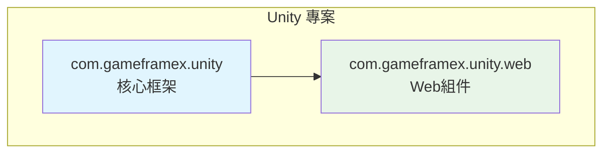
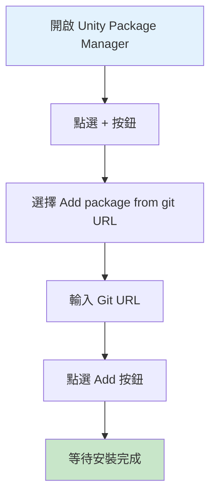
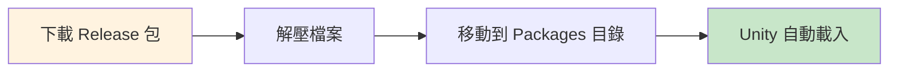

# 安裝方式

GameFrameX Web 組件支援多種安裝方式，以適應不同的專案需求和工作流程。本文將詳細介紹三種推薦的安裝方法。

## 概述

GameFrameX Web 是一個高效能的 Unity HTTP 網路請求庫，基於 C# Task 非同步模式構建，支援 GET、POST 請求，可處理字串、JSON、二進位制資料等多種格式。該組件依賴 GameFrameX 核心框架（com.gameframex.unity），安裝時需要確保專案已正確配置核心框架。



## 安裝前準備

在安裝 GameFrameX Web 組件之前，請確保您的開發環境滿足以下要求：

| 要求 | 最低版本 | 說明 |
|------|---------|------|
| Unity 編輯器 | 2019.4+ | LTS 版本推薦 |
| .NET Standard | 2.0+ | 指令碼執行時版本 |
| Git | 任意版本 | 用於克隆或新增 Git URL |

> **提示**：建議使用 Unity 2020.3 LTS 或更高版本以獲得最佳相容性。

## 安裝方式

### 方式一：透過 Git URL 安裝（推薦）

這是最推薦的安裝方式，可以輕鬆獲取最新版本和更新。

**操作步驟：**

1. 在 Unity 編輯器中開啟 **Package Manager** 視窗
2. 點選左上角的 **"+"** 按鈕
3. 在下拉選單中選擇 **"Add package from git URL..."**
4. 在輸入框中貼上以下 URL：
   ```
   https://github.com/gameframex/com.gameframex.unity.web.git
   ```
5. 點選 **"Add"** 按鈕等待安裝完成



> **Source**: [README.md](https://github.com/GameFrameX/com.gameframex.unity.web/blob/main/README.md#L20-L27)

**優勢：**
- 自動跟蹤上游更新
- 簡單快捷，一鍵安裝
- 便於版本管理

### 方式二：透過 manifest.json 安裝

適用於需要精確控制依賴版本或需要同時安裝多個 GameFrameX 組件的場景。

**操作步驟：**

1. 找到並開啟專案中的 `Packages/manifest.json` 檔案
2. 在 `dependencies` 節點中新增以下內容：

```json
{
  "dependencies": {
    "com.gameframex.unity.web": "https://github.com/gameframex/com.gameframex.unity.web.git",
    "com.gameframex.unity": "https://github.com/gameframex/com.gameframex.unity.git"
  }
}
```

> **Source**: [README.md](https://github.com/GameFrameX/com.gameframex.unity.web/blob/main/README.md#L29-L40)

**說明：**
- 必須同時新增 `com.gameframex.unity` 作為核心依賴
- 可以指定具體版本號，例如：`"com.gameframex.unity.web": "1.3.0"`
- 修改 manifest.json 後，Unity 會自動解析並安裝依賴

**版本格式說明：**

| 版本格式 | 示例 | 說明 |
|---------|------|------|
| 最新主版本 | `1.3.3` | 精確版本 |
| Git URL | `https://github.com/...git` | 始終獲取最新 |
| 分支 | `#develop` | 獲取指定分支 |

### 方式三：手動安裝

適用於無法訪問網路或需要離線使用的場景。

**操作步驟：**

1. 訪問 GitHub releases 頁面下載最新版本的釋出包：
   - [Releases 頁面](https://github.com/GameFrameX/com.gameframex.unity.web/releases)
2. 解壓下載的釋出包
3. 將解壓後的資料夾移動到專案的 `Packages` 目錄下
4. Unity 會自動識別並載入包



> **Source**: [README.md](https://github.com/GameFrameX/com.gameframex.unity.web/blob/main/README.md#L42-L46)

**注意事項：**
- 手動安裝的包不會自動接收更新
- 需要手動下載新版本並替換
- 確保資料夾名稱與包名匹配（com.gameframex.unity.web）

## 安裝後驗證

安裝完成後，可以透過以下方式驗證是否成功：

### 檢查 Package Manager

在 Unity 中開啟 **Window > Package Manager**，確認 `GameFrameX Web` 已出現在列表中，狀態顯示為 **"In Project"**。

### 檢查程式集引用

建立一個簡單的測試指令碼，確認名稱空間可以正常引用：

```csharp
using GameFrameX.Web.Runtime;

public class VerifyInstall : MonoBehaviour
{
    private IWebManager webManager;
    
    void Start()
    {
        // 嘗試獲取 Web 管理器例項
        webManager = GameFrameworkEntry.GetModule<IWebManager>();
        
        if (webManager != null)
        {
            Debug.Log("GameFrameX Web 安裝成功！");
        }
    }
}
```

### 檢查依賴項

確認以下依賴項已正確安裝：

| 依賴包 | 必需 | 說明 |
|--------|------|------|
| com.gameframex.unity | ✅ 必需 | 核心框架 |
| GameFrameX.Network.Runtime | ✅ 必需 | 網路基礎庫 |
| ProtoBuffer.Runtime | ✅ 必需 | Protobuf 支援 |

## 解除安裝方式

如需解除安裝 GameFrameX Web 組件，請根據安裝方式選擇對應的解除安裝方法：

### 透過 Package Manager 解除安裝

1. 開啟 **Window > Package Manager**
2. 在列表中找到 **Game Frame X Web**
3. 點選右側的 **"Remove"** 按鈕

### 透過 manifest.json 解除安裝

在 `Packages/manifest.json` 的 `dependencies` 中移除對應行：

```json
{
  "dependencies": {
    "com.gameframex.unity.web": "https://github.com/gameframex/com.gameframex.unity.web.git"
    // 移除上面這一行
  }
}
```

### 手動解除安裝

直接刪除 `Packages/com.gameframex.unity.web` 資料夾即可。

## 常見問題

### Q1: 安裝後提示缺少依賴怎麼辦？

這是因為核心框架未正確安裝。請先安裝 `com.gameframex.unity`：

```
https://github.com/gameframex/com.gameframex.unity.git
```

### Q2: Git URL 安裝失敗怎麼解決？

1. 檢查網路連線是否正常
2. 嘗試使用代理或 VPN
3. 確認 Git 已正確安裝且在系統 PATH 中

### Q3: 如何安裝特定版本？

在 manifest.json 中指定版本號：

```json
{
  "dependencies": {
    "com.gameframex.unity.web": "1.3.3"
  }
}
```

## 相關連結

- [外掛介紹](./01.overview)
- [快速開始 - 基礎用法](./03.getting-started)
- [快速開始 - 使用 WebComponent](./08.web-component)
- [GitHub 倉庫](https://github.com/GameFrameX/com.gameframex.unity.web.git)
- [官方文件](https://gameframex.doc.alianblank.com)
- [問題反饋](https://github.com/GameFrameX/com.gameframex.unity.web/issues)
