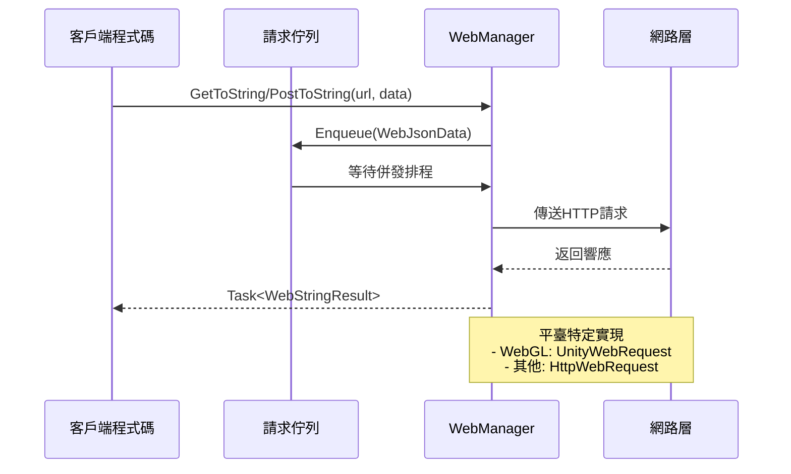

# 基礎用法

本文件介紹 GameFrameX Web 組件的基本使用方法，幫助開發者快速上手進行 HTTP 網路請求開發。

## 概述

GameFrameX Web 組件提供了簡潔易用的 HTTP 請求功能，支援 GET、POST 請求，可處理字串、JSON、二進位制資料等多種格式。該組件基於 C# Task 非同步模式開發，支援 async/await 語法，提供高效能的非阻塞請求處理。

在開始使用之前，請確保已經正確安裝並配置了 Web 組件，詳情請參閱 [安裝方式](./02.installation)。

## 獲取 WebManager 例項

使用 Web 組件的第一步是獲取 `IWebManager` 例項。有兩種主要方式獲取：

### 方式一：透過 GameFrameworkEntry 獲取（推薦）

透過 GameFramework 框架的入口獲取 Web 管理器例項，這是最常用的方式：

```csharp
using GameFrameX.Web.Runtime;
using GameFrameX.Runtime;
using System.Threading.Tasks;

public class WebExample : MonoBehaviour
{
    private IWebManager webManager;

    private async void Start()
    {
        // 獲取 Web 管理器例項
        webManager = GameFrameworkEntry.GetModule<IWebManager>();
        
        // 傳送 GET 請求
        var result = await webManager.GetToString("https://api.example.com/data");
        Debug.Log("Response: " + result.Result);
    }
}
```

> Source: [README.md](https://github.com/GameFrameX/com.gameframex.unity.web/blob/main/README.md#L52-L81)

### 方式二：透過 WebComponent 組件獲取

在 Unity 場景中建立 WebComponent 組件，透過組件方式使用：

```csharp
using GameFrameX.Web.Runtime;
using System.Threading.Tasks;
using System.Collections.Generic;

public class MyWebService : MonoBehaviour
{
    private WebComponent webComponent;
    
    private void Awake()
    {
        // 獲取或新增 WebComponent 組件
        webComponent = gameObject.GetOrAddComponent<WebComponent>();
    }
    
    public async Task<string> GetUserDataAsync(string userId)
    {
        var queryParams = new Dictionary<string, string>
        {
            { "userId", userId }
        };
        
        var headers = new Dictionary<string, string>
        {
            { "Authorization", "Bearer your-token-here" }
        };
        
        var result = await webComponent.GetToString(
            "https://api.example.com/users", 
            queryParams, 
            headers
        );
        
        return result.Result;
    }
}
```

> Source: [README.md](https://github.com/GameFrameX/com.gameframex.unity.web/blob/main/README.md#L83-L123)

## 傳送 GET 請求

GET 請求用於從伺服器獲取資料，WebManager 提供了多種過載方法滿足不同場景需求。

### 簡單 GET 請求

最基本的 GET 請求，僅需要提供 URL：

```csharp
// 獲取字串響應
var stringResult = await webManager.GetToString("https://api.example.com/data");
Debug.Log("Response: " + stringResult.Result);

// 獲取位元組陣列響應（適用於下載圖片、檔案等二進位制資料）
var bufferResult = await webManager.GetToBytes("https://api.example.com/image.png");
byte[] imageData = bufferResult.Result;
```

> Source: [IWebManager.cs](https://github.com/GameFrameX/com.gameframex.unity.web/blob/main/Runtime/Web/IWebManager.cs#L18-L26)

### 帶查詢引數的 GET 請求

透過 Dictionary 傳遞 URL 查詢引數：

```csharp
var queryParams = new Dictionary<string, string>
{
    { "page", "1" },
    { "pageSize", "20" },
    { "category", "book" }
};

var result = await webManager.GetToString(
    "https://api.example.com/products",
    queryParams
);
```

> Source: [IWebManager.cs](https://github.com/GameFrameX/com.gameframex.unity.web/blob/main/Runtime/Web/IWebManager.cs#L35-L45)

### 帶請求頭的 GET 請求

在需要認證或特殊頭部資訊的場景下使用：

```csharp
var queryParams = new Dictionary<string, string>
{
    { "id", "12345" }
};

var headers = new Dictionary<string, string>
{
    { "Authorization", "Bearer your-access-token" },
    { "Accept", "application/json" },
    { "Language", "zh-CN" }
};

var result = await webManager.GetToString(
    "https://api.example.com/user/profile",
    queryParams,
    headers
);
```

> Source: [IWebManager.cs](https://github.com/GameFrameX/com.gameframex.unity.web/blob/main/Runtime/Web/IWebManager.cs#L56-L67)

## 傳送 POST 請求

POST 請求用於向伺服器提交資料，支援表單資料和 JSON 格式。

### 簡單 POST 請求

最基本的 POST 表單請求：

```csharp
var formData = new Dictionary<string, object>
{
    { "username", "testuser" },
    { "password", "testpass" }
};

var result = await webManager.PostToString(
    "https://api.example.com/login",
    formData
);

Debug.Log("Login result: " + result.Result);
```

> Source: [IWebManager.cs](https://github.com/GameFrameX/com.gameframex.unity.web/blob/main/Runtime/Web/IWebManager.cs#L77-L87)

### 帶查詢引數的 POST 請求

同時使用 URL 查詢引數和表單資料：

```csharp
var formData = new Dictionary<string, object>
{
    { "title", "My Article" },
    { "content", "Article content here..." },
    { "author", "John Doe" }
};

var queryParams = new Dictionary<string, string>
{
    { "draft", "true" }  // URL 查詢引數
};

var result = await webManager.PostToString(
    "https://api.example.com/articles",
    formData,
    queryParams
);
```

> Source: [IWebManager.cs](https://github.com/GameFrameX/com.gameframex.unity.web/blob/main/Runtime/Web/IWebManager.cs#L87-L97)

### 帶請求頭的 POST 請求

傳送帶有完整請求頭資訊的 POST 請求：

```csharp
var formData = new Dictionary<string, object>
{
    { "data", "some value" }
};

var queryParams = new Dictionary<string, string>
{
    { "action", "update" }
};

var headers = new Dictionary<string, string>
{
    { "Authorization", "Bearer your-token" },
    { "Content-Type", "application/json" },
    { "X-Request-ID", Guid.NewGuid().ToString() }
};

var result = await webManager.PostToString(
    "https://api.example.com/data",
    formData,
    queryParams,
    headers
);
```

> Source: [IWebManager.cs](https://github.com/GameFrameX/com.gameframex.unity.web/blob/main/Runtime/Web/IWebManager.cs#L98)

### 二進位制資料上傳

上傳位元組陣列（如檔案、二進位制流）：

```csharp
public async Task UploadBinaryDataAsync(byte[] fileData, string fileName)
{
    var queryParams = new Dictionary<string, string>
    {
        { "fileName", fileName }
    };
    
    var headers = new Dictionary<string, string>
    {
        { "Content-Type", "application/octet-stream" },
        { "Authorization", "Bearer your-token" }
    };
    
    var result = await webManager.PostToBytes(
        "https://api.example.com/upload", 
        fileData, 
        queryParams, 
        headers
    );
    
    if (result.Result != null && result.Result.Length > 0)
    {
        Debug.Log("Upload successful!");
    }
}
```

> Source: [README.md](https://github.com/GameFrameX/com.gameframex.unity.web/blob/main/README.md#L188-L217)

## 處理請求結果

WebManager 的請求方法返回兩種結果型別：`WebStringResult` 和 `WebBufferResult`。

### WebStringResult（字串結果）

用於處理文字響應，如 JSON 字串、HTML 等：

```csharp
var result = await webManager.GetToString("https://api.example.com/data");

// 獲取響應內容
string responseText = result.Result;

// 獲取請求時傳入的自定義資料
object userData = result.UserData;

// 輸出結果
Debug.Log($"Response: {result}");
```

> Source: [WebStringResult.cs](https://github.com/GameFrameX/com.gameframex.unity.web/blob/main/Runtime/Web/WebStringResult.cs#L15-L38)

### WebBufferResult（位元組陣列結果）

用於處理二進位制響應，如圖片、音訊、檔案等：

```csharp
var result = await webManager.GetToBytes("https://api.example.com/image.png");

// 獲取二進位制資料
byte[] data = result.Result;

// 獲取請求時傳入的自定義資料
object userData = result.UserData;

// 檢查是否有資料
if (data != null && data.Length > 0)
{
    Debug.Log($"Downloaded {data.Length} bytes");
}
```

> Source: [WebBufferResult.cs](https://github.com/GameFrameX/com.gameframex.unity.web/blob/main/Runtime/Web/WebBufferResult.cs#L1-L21)

### 使用 UserData 傳遞上下文

在發起請求時傳入自定義資料，可以在結果中獲取，用於標識請求來源或傳遞上下文：

```csharp
// 發起請求時傳入上下文資料
var requestContext = new { requestId = Guid.NewGuid(), source = "ProfileScreen" };

var result = await webManager.GetToString(
    "https://api.example.com/user/123",
    requestContext  // 傳入自定義資料
);

// 在處理結果時獲取上下文
Debug.Log($"Request ID: {result.UserData}");
```

## 錯誤處理

完善的錯誤處理是網路請求開發的重要環節。WebManager 會丟擲不同型別的異常來指示錯誤型別。

### 基礎錯誤處理

```csharp
public async Task<string> SafeWebRequestAsync(string url)
{
    try
    {
        var result = await webManager.GetToString(url);
        return result.Result;
    }
    catch (Exception ex)
    {
        Debug.LogError($"Request failed: {ex.Message}");
        return null;
    }
}
```

### 針對特定異常型別的處理

```csharp
public async Task<string> HandleErrorsAsync(string url)
{
    try
    {
        return await webManager.GetToString(url);
    }
    catch (TimeoutException ex)
    {
        // 請求超時
        Debug.LogError($"請求超時: {ex.Message}");
        return null;
    }
    catch (WebException ex)
    {
        switch (ex.Status)
        {
            case WebExceptionStatus.Timeout:
                Debug.LogError("請求超時");
                break;
            case WebExceptionStatus.ConnectFailure:
                Debug.LogError("連線失敗");
                break;
            case WebExceptionStatus.ProtocolError:
                Debug.LogError($"協議錯誤: {ex.Message}");
                break;
            default:
                Debug.LogError($"網路錯誤: {ex.Message}");
                break;
        }
        return null;
    }
    catch (IOException ex)
    {
        Debug.LogError($"IO錯誤: {ex.Message}");
        return null;
    }
    catch (Exception ex)
    {
        Debug.LogError($"未知錯誤: {ex.Message}");
        return null;
    }
}
```

> Source: [WebManager.cs](https://github.com/GameFrameX/com.gameframex.unity.web/blob/main/Runtime/Web/WebManager.cs#L298-L324)

### 使用 UnityWebRequest 錯誤（WebGL 平臺）

在 WebGL 平臺上，錯誤透過 UnityWebRequest 返回：

```csharp
// WebGL 平臺的錯誤處理示例
// UnityWebRequest 會返回 isNetworkError 或 isHttpError
```

> Source: [WebManager.cs](https://github.com/GameFrameX/com.gameframex.unity.web/blob/main/Runtime/Web/WebManager.cs#L246-L252)

## 基礎資料管理

WebManager 支援設定基礎資料（Base Data），這些資料會自動新增到所有請求中，適用於需要統一攜帶認證資訊、版本號等場景。

### 新增基礎表單資料

```csharp
// 新增基礎表單資料，所有 POST 請求都會自動攜帶這些資料
webManager.AddBaseForm("appVersion", "1.0.0");
webManager.AddBaseForm("platform", "iOS");

// 傳送請求時，基礎表單資料會自動合併
var formData = new Dictionary<string, object>
{
    { "username", "testuser" }
};

// 實際傳送的表單會是: { "appVersion": "1.0.0", "platform": "iOS", "username": "testuser" }
var result = await webManager.PostToString("https://api.example.com/login", formData);
```

> Source: [WebManager.cs](https://github.com/GameFrameX/com.gameframex.unity.web/blob/main/Runtime/Web/WebManager.cs#L591-L594)

### 新增基礎請求頭

```csharp
// 新增基礎請求頭
webManager.AddBaseHeader("Authorization", "Bearer your-default-token");
webManager.AddBaseHeader("X-App-ID", "com.example.myapp");
webManager.AddBaseHeader("Accept", "application/json");

// 傳送請求時，基礎請求頭會自動合併到所有請求中
var result = await webManager.GetToString("https://api.example.com/data");
```

> Source: [WebManager.cs](https://github.com/GameFrameX/com.gameframex.unity.web/blob/main/Runtime/Web/WebManager.cs#L621-L624)

### 新增基礎查詢引數

```csharp
// 新增基礎查詢引數
webManager.AddBaseQueryString("lang", "zh-CN");
webManager.AddBaseQueryString("v", "1.0.0");

// 傳送請求時，基礎查詢引數會自動附加到 URL
var result = await webManager.GetToString("https://api.example.com/products");

// 實際請求的 URL 會是: https://api.example.com/products?lang=zh-CN&v=1.0.0
```

> Source: [WebManager.cs](https://github.com/GameFrameX/com.gameframex.unity.web/blob/main/Runtime/Web/WebManager.cs#L651-L654)

### 管理基礎資料

```csharp
// 移除指定的基礎資料
webManager.RemoveBaseForm("appVersion");
webManager.RemoveBaseHeader("Authorization");
webManager.RemoveBaseQueryString("lang");

// 清空所有基礎資料
webManager.ClearBaseForm();
webManager.ClearBaseHeader();
webManager.ClearBaseQueryString();
```

> Source: [WebManager.cs](https://github.com/GameFrameX/com.gameframex.unity.web/blob/main/Runtime/Web/WebManager.cs#L600-L674)

## 請求流程概述

WebManager 內部採用佇列機制管理請求，支援併發控制。以下是請求處理的基本流程：



## 相關連結

- [外掛介紹](./01.overview) - 瞭解 Web 組件的整體架構和特性
- [安裝方式](./02.installation) - 詳細安裝步驟
- [使用 WebComponent](./08.web-component) - 深入瞭解 WebComponent 組件
- [WebManager 架構](./05.web-manager) - 深入理解 WebManager 內部架構
- [請求結果型別](./06.result-types) - 詳細瞭解結果型別定義
- [IWebManager 介面](./04.iwebmanager-interface) - 完整的 API 介面文件
- [WebComponent 組件](./08.web-component) - WebComponent 組件詳細文件
- [超時配置](./10.timeout-settings) - 配置請求超時
- [基礎資料配置](./07.base-data) - 基礎資料管理詳解
- [平臺差異說明](./09.platform-differences) - 不同平臺的差異說明
- [常見問題](./11.troubleshooting) - 常見問題解答
