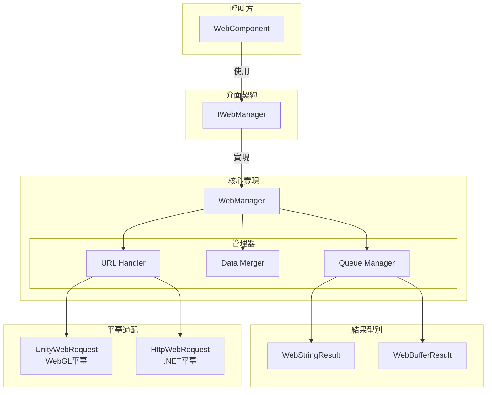
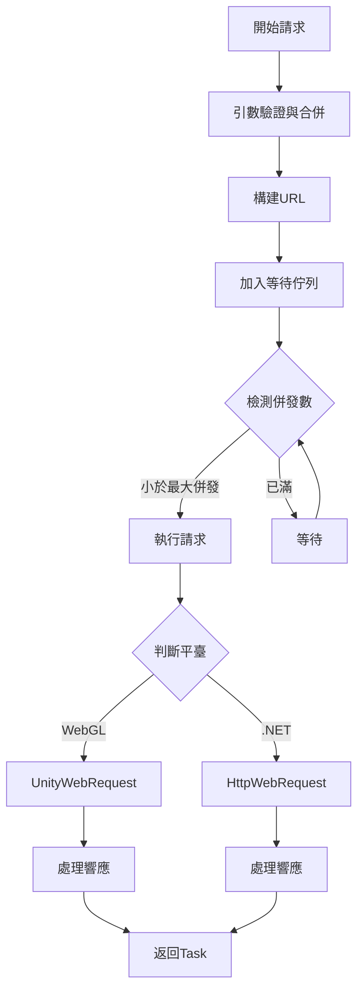

# IWebManager 介面

IWebManager 是 GameFrameX Web 外掛的核心介面，提供了統一的 HTTP GET 和 POST 請求功能。該介面封裝了底層網路請求的實現細節，支援多種請求引數組合，並提供了基礎資料管理功能。

## 概述

IWebManager 介面定義了 Web 請求管理器的契約規範，主要承擔以下職責：

1. **HTTP 請求處理**：提供 GET 和 POST 兩種 HTTP 方法的非同步請求支援
2. **響應型別支援**：支援字串和位元組陣列兩種響應格式
3. **請求引數管理**：支援查詢引數、HTTP 請求頭和表單資料的靈活組合
4. **基礎資料複用**：提供全域性基礎資料配置，每次請求自動合併基礎資料
5. **超時控制**：提供可配置的超時時間設定

該介面的預設實現為 `WebManager` 類，它繼承自 `GameFrameworkModule`，是 GameFrameX 框架的核心模組之一。

> **設計意圖**：IWebManager 採用佇列式的請求管理機制，透過等待佇列和傳送列表實現請求的緩衝與併發控制。預設最大併發數為 8 個連線，可根據伺服器承載能力調整。

## 架構設計

### 核心組件關係



### 請求處理流程



## API 參考

### 請求方法

#### GET 請求

##### `GetToString(url: string, userData?: object): Task<WebStringResult>`

傳送簡單的 GET 請求，返回字串格式的響應結果。

**引數：**
- `url` (string): 請求的目標 URL 地址
- `userData` (object, 可選): 使用者自定義資料，會在響應結果中原樣返回

**返回：** `Task<WebStringResult>` - 包含字串結果的非同步任務

**示例：**
```csharp
var webManager = GameFrameworkEntry.GetModule<IWebManager>();
var result = await webManager.GetToString("https://api.example.com/data");
Debug.Log(result.Result);
```
> Source: [IWebManager.cs](https://github.com/GameFrameX/com.gameframex.unity.web/blob/main/Runtime/Web/IWebManager.cs#L18)

---

##### `GetToString(url: string, queryString: Dictionary<string, string>, userData?: object): Task<WebStringResult>`

傳送帶查詢引數的 GET 請求，返回字串格式的響應結果。

**引數：**
- `url` (string): 請求的目標 URL 地址
- `queryString` (Dictionary<string, string>): URL 查詢引數字典
- `userData` (object, 可選): 使用者自定義資料

**返回：** `Task<WebStringResult>`

---

##### `GetToString(url: string, queryString: Dictionary<string, string>, header: Dictionary<string, string>, userData?: object): Task<WebStringResult>`

傳送帶查詢引數和請求頭的 GET 請求，返回字串格式的響應結果。

**引數：**
- `url` (string): 請求的目標 URL 地址
- `queryString` (Dictionary<string, string>): URL 查詢引數字典
- `header` (Dictionary<string, string>): HTTP 請求頭字典
- `userData` (object, 可選): 使用者自定義資料

**返回：** `Task<WebStringResult>`

---

##### `GetToBytes(url: string, userData?: object): Task<WebBufferResult>`

傳送簡單的 GET 請求，返回位元組陣列格式的響應結果。適用於下載二進位制資料如圖片、音訊等。

**引數：**
- `url` (string): 請求的目標 URL 地址
- `userData` (object, 可選): 使用者自定義資料

**返回：** `Task<WebBufferResult>` - 包含位元組陣列的非同步任務

**示例：**
```csharp
var webManager = GameFrameworkEntry.GetModule<IWebManager>();
var result = await webManager.GetToBytes("https://api.example.com/image.png");
byte[] imageData = result.Result;
```
> Source: [IWebManager.cs](https://github.com/GameFrameX/com.gameframex.unity.web/blob/main/Runtime/Web/IWebManager.cs#L26)

---

##### `GetToBytes(url: string, queryString: Dictionary<string, string>, userData?: object): Task<WebBufferResult>`

傳送帶查詢引數的 GET 請求，返回位元組陣列格式的響應結果。

---

##### `GetToBytes(url: string, queryString: Dictionary<string, string>, header: Dictionary<string, string>, userData?: object): Task<WebBufferResult>`

傳送帶查詢引數和請求頭的 GET 請求，返回位元組陣列格式的響應結果。

---

#### POST 請求

##### `PostToString(url: string, from?: Dictionary<string, object>, userData?: object): Task<WebStringResult>`

傳送簡單的 POST 請求，返回字串格式的響應結果。表單資料將以 JSON 格式傳送。

**引數：**
- `url` (string): 請求的目標 URL 地址
- `from` (Dictionary<string, object>, 可選): 表單資料字典
- `userData` (object, 可選): 使用者自定義資料

**返回：** `Task<WebStringResult>`

**示例：**
```csharp
var webManager = GameFrameworkEntry.GetModule<IWebManager>();
var formData = new Dictionary<string, object>
{
    { "username", "testuser" },
    { "password", "password123" }
};
var result = await webManager.PostToString("https://api.example.com/login", formData);
```
> Source: [IWebManager.cs](https://github.com/GameFrameX/com.gameframex.unity.web/blob/main/Runtime/Web/IWebManager.cs#L77)

---

##### `PostToString(url: string, from: Dictionary<string, object>, queryString: Dictionary<string, string>, userData?: object): Task<WebStringResult>`

傳送帶查詢引數的 POST 請求，返回字串格式的響應結果。

---

##### `PostToString(url: string, from: Dictionary<string, object>, queryString: Dictionary<string, string>, header: Dictionary<string, string>, userData?: object): Task<WebStringResult>`

傳送帶查詢引數和請求頭的 POST 請求，返回字串格式的響應結果。這是功能最完整的 POST 字串請求過載。

**引數：**
- `url` (string): 請求的目標 URL 地址
- `from` (Dictionary<string, object>): 表單資料字典
- `queryString` (Dictionary<string, string>): URL 查詢引數字典
- `header` (Dictionary<string, string>): HTTP 請求頭字典
- `userData` (object, 可選): 使用者自定義資料

**返回：** `Task<WebStringResult>`

---

##### `PostToBytes(url: string, from: Dictionary<string, object>, userData?: object): Task<WebBufferResult>`

傳送簡單的 POST 請求，返回位元組陣列格式的響應結果。適用於處理二進位制資料的上傳下載場景。

**引數：**
- `url` (string): 請求的目標 URL 地址
- `from` (Dictionary<string, object>): 表單資料字典
- `userData` (object, 可選): 使用者自定義資料

**返回：** `Task<WebBufferResult>`

---

##### `PostToBytes(url: string, from: Dictionary<string, object>, queryString: Dictionary<string, string>, userData?: object): Task<WebBufferResult>`

傳送帶查詢引數的 POST 請求，返回位元組陣列格式的響應結果。

---

##### `PostToBytes(url: string, from: Dictionary<string, object>, queryString: Dictionary<string, string>, header: Dictionary<string, string>, userData?: object): Task<WebBufferResult>`

傳送帶查詢引數和請求頭的 POST 請求，返回位元組陣列格式的響應結果。

---

##### `PostToBytes(url: string, from: byte[], queryString: Dictionary<string, string>, header: Dictionary<string, string>, userData?: object): Task<WebBufferResult>`

傳送原始位元組陣列的 POST 請求，返回位元組陣列格式的響應結果。適用於 ProtoBuf 等二進位制協議通訊。

**引數：**
- `url` (string): 請求的目標 URL 地址
- `from` (byte[]): 要傳送的原始位元組陣列資料
- `queryString` (Dictionary<string, string>): URL 查詢引數字典
- `header` (Dictionary<string, string>): HTTP 請求頭字典
- `userData` (object, 可選): 使用者自定義資料

**返回：** `Task<WebBufferResult>`

> **設計意圖**：此方法專門用於傳送二進位制資料請求，如 ProtoBuf 序列化的請求體，Content-Type 設定為 `application/octet-stream`。

---

### 配置屬性

#### `Timeout: float`

獲取或設定請求超時時間（單位：秒）。

**型別：** `float`

**預設值：** `5.0`

**示例：**
```csharp
var webManager = GameFrameworkEntry.GetModule<IWebManager>();
webManager.Timeout = 10f; // 設定超時時間為10秒
```
> Source: [IWebManager.cs](https://github.com/GameFrameX/com.gameframex.unity.web/blob/main/Runtime/Web/IWebManager.cs#L144)

---

### 基礎資料管理

基礎資料管理功能允許配置全域性的表單資料、請求頭和查詢引數，這些資料會在每次請求時自動與請求引數合併。這對於需要攜帶身份驗證令牌、裝置資訊等通用資料的場景非常有用。

#### 表單資料管理

##### `AddBaseForm(key: string, value: object): void`

新增基礎表單資料，該資料會在每次 POST 請求時自動合併到請求體中。

**引數：**
- `key` (string): 表單鍵名
- `value` (object): 表單值

**示例：**
```csharp
var webManager = GameFrameworkEntry.GetModule<IWebManager>();
// 新增全域性應用資訊
webManager.AddBaseForm("app_version", "1.0.0");
webManager.AddBaseForm("device_id", "ABC123");
```
> Source: [IWebManager.cs](https://github.com/GameFrameX/com.gameframex.unity.web/blob/main/Runtime/Web/IWebManager.cs#L151)

---

##### `RemoveBaseForm(key: string): void`

移除指定的基礎表單資料。

---

##### `ClearBaseForm(): void`

清空所有基礎表單資料。

---

#### 請求頭管理

##### `AddBaseHeader(key: string, value: string): void`

新增基礎請求頭資料，該資料會在每次 HTTP 請求時自動合併到請求頭中。

**引數：**
- `key` (string): 請求頭鍵名
- `value` (string): 請求頭值

**示例：**
```csharp
var webManager = GameFrameworkEntry.GetModule<IWebManager>();
webManager.AddBaseHeader("Authorization", "Bearer token123");
webManager.AddBaseHeader("Accept-Language", "zh-CN");
```
> Source: [IWebManager.cs](https://github.com/GameFrameX/com.gameframex.unity.web/blob/main/Runtime/Web/IWebManager.cs#L169)

---

##### `RemoveBaseHeader(key: string): void`

移除指定的基礎請求頭資料。

---

##### `ClearBaseHeader(): void`

清空所有基礎請求頭資料。

---

#### 查詢引數管理

##### `AddBaseQueryString(key: string, value: string): void`

新增基礎查詢引數資料，該引數會自動附加到每個請求的 URL 後面。

**引數：**
- `key` (string): 查詢引數鍵名
- `value` (string): 查詢引數值

**示例：**
```csharp
var webManager = GameFrameworkEntry.GetModule<IWebManager>();
webManager.AddBaseQueryString("platform", "android");
webManager.AddBaseQueryString("channel", "official");
```
> Source: [IWebManager.cs](https://github.com/GameFrameX/com.gameframex.unity.web/blob/main/Runtime/Web/IWebManager.cs#L187)

---

##### `RemoveBaseQueryString(key: string): void`

移除指定的基礎查詢引數資料。

---

##### `ClearBaseQueryString(): void`

清空所有基礎查詢引數資料。

---

## 響應結果型別

### WebStringResult

字串響應結果型別，用於 GetToString 和 PostToString 方法的返回值。

**屬性：**
| 屬性 | 型別 | 描述 |
|------|------|------|
| Result | string | 伺服器返回的字串內容 |
| UserData | object | 請求時傳入的使用者自定義資料 |

**示例：**
```csharp
var result = await webManager.GetToString("https://api.example.com/data");
// 訪問響應內容
string content = result.Result;
// 訪問請求時傳遞的自定義資料
object userData = result.UserData;
```
> Source: [WebStringResult.cs](https://github.com/GameFrameX/com.gameframex.unity.web/blob/main/Runtime/Web/WebStringResult.cs#L1-L39)

---

### WebBufferResult

位元組陣列響應結果型別，用於 GetToBytes 和 PostToBytes 方法的返回值。

**屬性：**
| 屬性 | 型別 | 描述 |
|------|------|------|
| Result | byte[] | 伺服器返回的位元組陣列內容 |
| UserData | object | 請求時傳入的使用者自定義資料 |

**示例：**
```csharp
var result = await webManager.GetToBytes("https://api.example.com/file");
// 訪問響應位元組陣列
byte[] data = result.Result;
```
> Source: [WebBufferResult.cs](https://github.com/GameFrameX/com.gameframex.unity.web/blob/main/Runtime/Web/WebBufferResult.cs#L1-L21)

---

## 錯誤處理

WebManager 在請求過程中可能丟擲以下異常：

| 異常型別 | 觸發條件 |
|----------|----------|
| TimeoutException | 請求超時（WebExceptionStatus.Timeout） |
| WebException | 網路錯誤或 HTTP 錯誤 |
| IOException | I/O 操作錯誤 |
| Exception | 其他未知錯誤 |

**示例 - 錯誤處理：**
```csharp
try
{
    var result = await webManager.GetToString("https://api.example.com/data");
    Debug.Log(result.Result);
}
catch (TimeoutException ex)
{
    Debug.LogError($"請求超時: {ex.Message}");
}
catch (WebException ex)
{
    Debug.LogError($"網路錯誤: {ex.Message}");
}
catch (Exception ex)
{
    Debug.LogError($"未知錯誤: {ex.Message}");
}
```
> Source: [WebManager.cs](https://github.com/GameFrameX/com.gameframex.unity.web/blob/main/Runtime/Web/WebManager.cs#L298-L324)

---

## 平臺差異

IWebManager 介面在不同平臺上有不同的底層實現：

| 平臺 | 底層實現 | 證書處理 |
|------|----------|----------|
| WebGL | UnityWebRequest | 預設跳過證書驗證 (DefaultBypassCertificate) |
| 其他平臺 (.NET) | HttpWebRequest | 使用系統預設證書 |

> **注意**：在 WebGL 平臺上，證書驗證預設被跳過以方便開發除錯。生產環境如需啟用證書驗證，請參考 [平臺差異說明](./09.platform-differences) 文件。

---

## 相關連結

- [WebComponent 組件](./08.web-component) - Unity 組件封裝
- [WebManager 架構](./05.web-manager) - 核心架構詳解
- [請求結果型別](./06.result-types) - 結果型別詳解
- [超時配置](./10.timeout-settings) - 超時配置詳解
- [基礎資料配置](./07.base-data) - 基礎資料配置詳解
- [平臺差異說明](./09.platform-differences) - 平臺差異詳解
