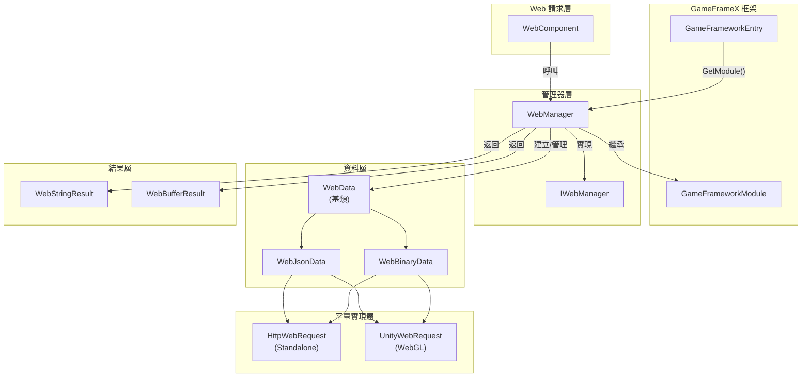
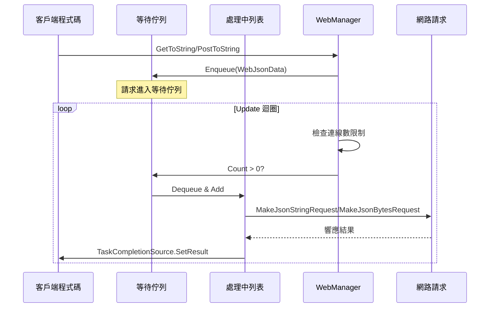
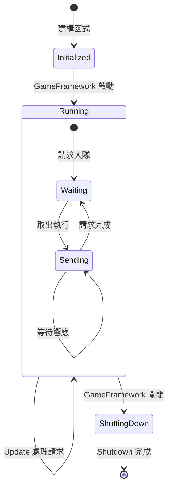
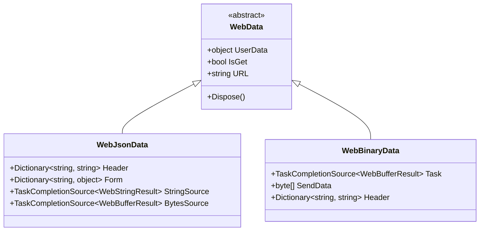

# WebManager 架構

WebManager 是 GameFrameX 框架中的 Web 請求管理模組，負責處理所有 HTTP GET 和 POST 請求。它採用佇列式的請求處理機制，支援連線數限制，並提供了跨平臺支援（Standalone 和 WebGL）。

## 概述

WebManager 作為 GameFrameX 框架的核心模組之一，封裝了底層的 HTTP 請求實現，為遊戲應用提供了統一的網路請求入口。其設計目標包括：

- **統一介面**：提供一致的 GET/POST 請求方法
- **非同步處理**：基於 Task 的非同步程式設計模型
- **連線管理**：支援每個伺服器最大連線數限制
- **跨平臺**：相容 Standalone 和 WebGL 平臺
- **基礎資料**：支援全域性請求頭、查詢引數和表單資料

WebManager 繼承自 `GameFrameworkModule`，是 GameFrameX 框架生命週期管理的一部分，能夠在遊戲初始化時自動建立，在遊戲關閉時自動清理資源。

## 架構設計

### 整體架構圖



### 核心組件

#### IWebManager 介面

`IWebManager` 介面定義了 Web 請求管理器的所有公共方法，是 WebManager 的抽象契約。介面提供了多種過載方法，支援不同的請求場景：

> 詳細介面定義請參見 [IWebManager 介面](./04.iwebmanager-interface)

#### WebManager 實現類

`WebManager` 是 `IWebManager` 介面的具體實現，繼承自 `GameFrameworkModule`。它採用部分類（partial class）的方式組織程式碼，將不同功能模組拆分到多個檔案中：

| 檔案 | 職責 |
|------|------|
| WebManager.cs | 主實現：佇列管理、請求處理、基礎資料合併 |
| WebManager.WebData.cs | WebData 基類定義 |
| WebManager.WebJsonData.cs | JSON 請求資料類 |
| WebManager.WebBinary.cs | Binary/ProtoBuf 請求處理 |

```csharp
public partial class WebManager : GameFrameworkModule, IWebManager
{
    // 等待處理的普通請求佇列
    private readonly Queue<WebJsonData> m_WaitingNormalQueue = new Queue<WebJsonData>(256);

    // 正在處理的普通請求列表
    private readonly List<WebJsonData> m_SendingNormalList = new List<WebJsonData>(16);

    // 每個伺服器的最大連線數
    public int MaxConnectionPerServer { get; set; }
}
```
> Source: [WebManager.cs](https://github.com/GameFrameX/com.gameframex.unity.web/blob/main/Runtime/Web/WebManager.cs#L20-L29)

#### WebComponent 組件

`WebComponent` 是 Unity 組件封裝，提供與 `IWebManager` 相同的方法簽名，但透過 Unity 組件的方式暴露給遊戲邏輯層。它在 `Awake` 階段獲取 `WebManager` 例項：

```csharp
protected override void Awake()
{
    ImplementationComponentType = Utility.Assembly.GetType(componentType);
    InterfaceComponentType = typeof(IWebManager);
    base.Awake();
    m_WebManager = GameFrameworkEntry.GetModule<IWebManager>();
}
```
> Source: [WebComponent.cs](https://github.com/GameFrameX/com.gameframex.unity.web/blob/main/Runtime/Web/WebComponent.cs#L76-L89)

## 請求處理流程

### 請求佇列機制

WebManager 採用生產者-消費者模式處理請求：



### 請求處理 Update 迴圈

WebManager 在每一幀的 `Update` 方法中檢查並處理等待中的請求：

```csharp
protected override void Update(float elapseSeconds, float realElapseSeconds)
{
    lock (m_StringBuilder)
    {
        // 檢查是否達到最大連線數
        if (m_SendingNormalList.Count < MaxConnectionPerServer)
        {
            // 從等待佇列中取出請求
            if (m_WaitingNormalQueue.Count > 0)
            {
                var webJsonData = m_WaitingNormalQueue.Dequeue();

                // 根據返回型別選擇處理方法
                if (webJsonData.UniTaskCompletionStringSource != null)
                {
                    MakeJsonStringRequest(webJsonData);
                }
                else
                {
                    MakeJsonBytesRequest(webJsonData);
                }

                // 移動到處理中列表
                m_SendingNormalList.Add(webJsonData);
            }
        }

        // 同時處理 Binary 請求
        UpdateBinary(elapseSeconds, realElapseSeconds);
    }
}
```
> Source: [WebManager.cs](https://github.com/GameFrameX/com.gameframex.unity.web/blob/main/Runtime/Web/WebManager.cs#L81-L107)

### 連線數限制機制

透過 `MaxConnectionPerServer` 屬性控制同時向同一伺服器傳送的請求數量：

- **預設值**：8 個連線
- **設計目的**：防止請求過多導致伺服器壓力過大或客戶端資源耗盡
- **工作方式**：只有當 `m_SendingNormalList.Count < MaxConnectionPerServer` 時，才會從等待佇列取出新請求

### 資料合併機制

WebManager 提供了基礎資料（Base Data）功能，允許設定全域性請求引數：

```csharp
// 基礎表單資料 - 所有請求都會攜帶
private readonly Dictionary<string, object> m_BaseForm = new Dictionary<string, object>(64);

// 基礎請求頭 - 所有請求都會攜帶
private readonly Dictionary<string, string> m_BaseHeader = new Dictionary<string, string>(64);

// 基礎查詢引數 - 所有請求都會攜帶
private readonly Dictionary<string, string> m_BaseQueryString = new Dictionary<string, string>(64);
```

在發起請求時，會自動合併基礎資料和請求特定的資料：

```csharp
private Dictionary<string, object> MergeForm(Dictionary<string, object> form)
{
    if (m_BaseForm.Count == 0)
    {
        return form;
    }

    // 複製基礎資料
    var result = new Dictionary<string, object>(m_BaseForm);

    // 覆蓋/新增外部資料
    if (form != null)
    {
        foreach (var kv in form)
        {
            result[kv.Key] = kv.Value;
        }
    }

    return result;
}
```
> Source: [WebManager.cs](https://github.com/GameFrameX/com.gameframex.unity.web/blob/main/Runtime/Web/WebManager.cs#L685-L705)

## 平臺差異處理

### WebGL 平臺

在 WebGL 平臺上，WebManager 使用 Unity 的 `UnityWebRequest` API：

```csharp
#if UNITY_WEBGL
using UnityEngine.Networking;

UnityWebRequest unityWebRequest;
if (webJsonData.IsGet)
{
    unityWebRequest = UnityWebRequest.Get(webJsonData.URL);
}
else
{
    unityWebRequest = UnityWebRequest.Post(webJsonData.URL, string.Empty);
}

unityWebRequest.certificateHandler = new DefaultBypassCertificate();
unityWebRequest.timeout = (int)RequestTimeout.TotalSeconds;
```

### Standalone 平臺

在 Standalone 平臺上，使用 .NET 的 `HttpWebRequest` API：

```csharp
HttpWebRequest request = WebRequest.CreateHttp(webJsonData.URL);
request.Method = webJsonData.IsGet ? WebRequestMethods.Http.Get : WebRequestMethods.Http.Post;
request.Timeout = (int)RequestTimeout.TotalMilliseconds;
```

### SSL 證書處理

WebGL 平臺使用 `DefaultBypassCertificate` 類繞過 SSL 證書驗證：

```csharp
public sealed class DefaultBypassCertificate : CertificateHandler
{
    protected override bool ValidateCertificate(byte[] certificateData)
    {
        return true;
    }
}
```
> Source: [DefaultBypassCertificate.cs](https://github.com/GameFrameX/com.gameframex.unity.web/blob/main/Runtime/Web/DefaultBypassCertificate.cs#L39-L45)

> ⚠️ **注意**：在生產環境中使用自簽名證書時，請謹慎處理 SSL 驗證。

## 資源管理

### 生命週期

WebManager 的資源管理分為三個階段：



### 資源清理

在 `Shutdown` 方法中，系統會清理所有等待和處理中的請求：

```csharp
protected override void Shutdown()
{
    // 清理等待佇列
    while (m_WaitingNormalQueue.Count > 0)
    {
        var webData = m_WaitingNormalQueue.Dequeue();
        webData.Dispose();
    }

    // 清理處理中列表
    while (m_SendingNormalList.Count > 0)
    {
        var webData = m_SendingNormalList[0];
        m_SendingNormalList.RemoveAt(0);
        webData.Dispose();
    }

    // 清理記憶體流
    m_MemoryStream.Dispose();
}
```
> Source: [WebManager.cs](https://github.com/GameFrameX/com.gameframex.unity.web/blob/main/Runtime/Web/WebManager.cs#L112-L131)

## 請求資料型別

WebManager 使用分層的資料類結構來封裝請求資訊：



- **WebData**：基類，包含通用屬性（UserData、IsGet、URL）
- **WebJsonData**：JSON 格式請求，包含表單資料和請求頭
- **WebBinaryData**：二進位制/ProtoBuf 格式請求

## 相關連結

- [IWebManager 介面](./04.iwebmanager-interface)
- [WebComponent 組件](./08.web-component)
- [請求結果型別](./06.result-types)
- [超時配置](./10.timeout-settings)
- [基礎資料配置](./07.base-data)
- [平臺差異說明](./09.platform-differences)
