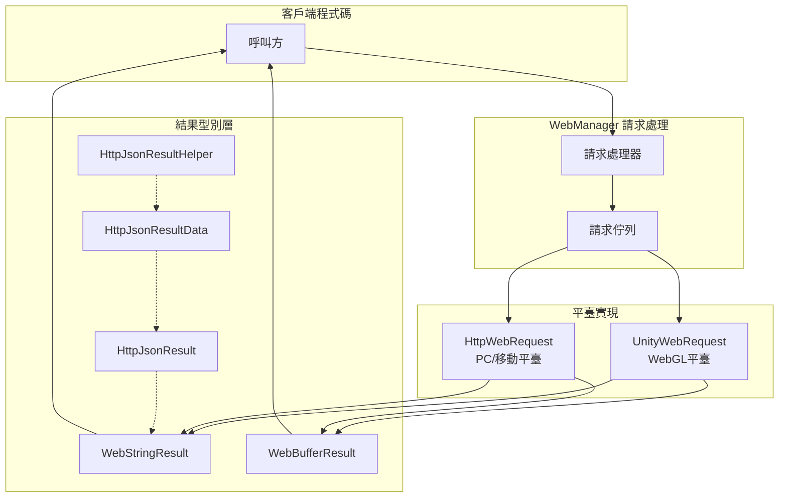

# 請求結果型別

GameFrameX Web 組件提供了多種請求結果型別，用於封裝不同格式的 HTTP 響應資料。這些結果型別設計簡潔，遵循統一的 API 設計模式，方便開發者根據業務需求選擇合適的返回型別。

## 概述

在 GameFrameX Web 組件中，所有 HTTP 請求方法都返回特定的結果型別。根據請求方式和資料格式的不同，開發者可以選擇獲取字串結果、位元組陣列結果或經過解析的 JSON 資料結構。

請求結果型別的設計遵循以下原則：
- **單一職責**：每種結果型別只負責封裝一種特定格式的資料
- **使用者資料傳遞**：支援透過 `UserData` 屬性在請求和響應之間傳遞上下文資料
- **異常處理**：請求失敗時透過異常機制傳遞錯誤資訊，而非返回錯誤碼

## 架構設計

請求結果型別在整體架構中扮演著資料封裝層的角色，負責將底層 HTTP 響應轉換為業務層可直接使用的物件。



### 各組件職責

| 組件 | 職責 |
|------|------|
| **WebStringResult** | 封裝字串格式的響應資料 |
| **WebBufferResult** | 封裝二進位制位元組陣列響應資料 |
| **HttpJsonResult** | 定義標準 JSON 響應結構（Code/Message/Data） |
| **HttpJsonResultData<T>** | 泛型結果包裝器，帶成功標誌 |
| **HttpJsonResultHelper** | 提供 JSON 字串到結果物件的轉換方法 |

## 核心結果型別

### WebStringResult - 字串結果

`WebStringResult` 用於封裝返回字串內容的 HTTP 響應，適用於處理純文字、HTML 或非結構化文字資料的場景。

```csharp
namespace GameFrameX.Web.Runtime
{
    [UnityEngine.Scripting.Preserve]
    public sealed class WebStringResult
    {
        [UnityEngine.Scripting.Preserve]
        public WebStringResult(object userData, string result)
        {
            UserData = userData;
            Result = result;
        }

        /// <summary>
        /// 獲取請求返回的字串結果
        /// </summary>
        public string Result { get; }

        /// <summary>
        /// 獲取使用者自定義資料，在請求時傳入的資料會原樣返回
        /// </summary>
        public object UserData { get; }

        public override string ToString()
        {
            return $"[Result]:{Result}";
        }
    }
}
```

> Source: [WebStringResult.cs](https://github.com/GameFrameX/com.gameframex.unity.web/blob/main/Runtime/Web/WebStringResult.cs#L1-L40)

**屬性說明：**

| 屬性 | 型別 | 描述 |
|------|------|------|
| `Result` | string | HTTP 響應返回的字串內容 |
| `UserData` | object | 發起請求時傳入的自定義資料，用於在回呼中識別請求上下文 |

### WebBufferResult - 二進位制結果

`WebBufferResult` 用於封裝返回位元組陣列的 HTTP 響應，適用於處理二進位制資料，如圖片、檔案、Protocol Buffers 等場景。

```csharp
namespace GameFrameX.Web.Runtime
{
    public sealed class WebBufferResult
    {
        public WebBufferResult(object userData, byte[] result)
        {
            UserData = userData;
            Result = result;
        }

        /// <summary>
        /// 請求結果
        /// </summary>
        public byte[] Result { get; }

        /// <summary>
        /// 使用者自定義資料
        /// </summary>
        public object UserData { get; }
    }
}
```

> Source: [WebBufferResult.cs](https://github.com/GameFrameX/com.gameframex.unity.web/blob/main/Runtime/Web/WebBufferResult.cs#L1-L21)

**屬性說明：**

| 屬性 | 型別 | 描述 |
|------|------|------|
| `Result` | byte[] | HTTP 響應返回的位元組陣列，可用於檔案下載、圖片載入等場景 |
| `UserData` | object | 發起請求時傳入的自定義資料 |

### HttpJsonResult - JSON 響應結構

`HttpJsonResult` 定義了標準的 JSON 響應結構，適用於需要解析服務端統一返回格式的場景。很多後端 API 會返回統一的 JSON 格式，如 `{ "code": 0, "message": "success", "data": {...} }`。

```csharp
using Newtonsoft.Json;

namespace GameFrameX.Web.Runtime
{
    [UnityEngine.Scripting.Preserve]
    public sealed class HttpJsonResult
    {
        /// <summary>
        /// 響應碼0 為成功
        /// </summary>
        [JsonProperty(PropertyName = "code")]
        public int Code { get; set; }

        /// <summary>
        /// 響應訊息
        /// </summary>
        [JsonProperty(PropertyName = "message")]
        public string Message { get; set; }

        /// <summary>
        /// 響應資料.
        /// </summary>
        [JsonProperty(PropertyName = "data")]
        public string Data { get; set; }

        public override string ToString()
        {
            return JsonConvert.SerializeObject(this);
        }
    }
}
```

> Source: [HttpJsonResult.cs](https://github.com/GameFrameX/com.gameframex.unity.web/blob/main/Runtime/Extensions/HttpJsonResult.cs#L1-L34)

**屬性說明：**

| 屬性 | 型別 | JSON 欄位 | 描述 |
|------|------|-----------|------|
| `Code` | int | code | 響應狀態碼，0 表示成功，其他值表示不同錯誤 |
| `Message` | string | message | 響應描述資訊，通常用於錯誤提示 |
| `Data` | string | data | 響應資料內容，為 JSON 字串格式 |

### HttpJsonResultData<T> - 泛型結果包裝器

`HttpJsonResultData<T>` 是泛型結果型別，它在 `HttpJsonResult` 的基礎上增加了成功標誌和型別化的資料屬性，方便直接獲取強型別的結果資料。

```csharp
namespace GameFrameX.Web.Runtime
{
    public sealed class HttpJsonResultData<T>
    {
        /// <summary>
        /// 是否成功
        /// 表示請求是否成功執行，成功為true，失敗為false。
        /// </summary>
        public bool IsSuccess { get; set; } = false;

        /// <summary>
        /// 響應碼
        /// 表示請求的處理結果，為0表示成功，其他值表示不同的錯誤型別。
        /// </summary>
        public int Code { get; set; }

        /// <summary>
        /// 資料物件
        /// 包含請求成功時返回的資料，型別為T。
        /// 如果請求失敗，可能為預設值或null。
        /// </summary>
        public T Data { get; set; }
    }
}
```

> Source: [HttpJsonResultData.cs](https://github.com/GameFrameX/com.gameframex.unity.web/blob/main/Runtime/Extensions/HttpJsonResultData.cs#L1-L29)

**屬性說明：**

| 屬性 | 型別 | 描述 |
|------|------|------|
| `IsSuccess` | bool | 請求是否成功完成的標誌 |
| `Code` | int | 響應狀態碼，與 HttpJsonResult.Code 一致 |
| `Data` | T | 泛型資料物件，已完成 JSON 反序列化 |

### HttpJsonResultHelper - JSON 解析輔助類

`HttpJsonResultHelper` 提供了將 JSON 字串轉換為強型別 `HttpJsonResultData<T>` 物件的擴充套件方法，簡化了從原始響應到業務物件的轉換過程。

```csharp
using System;
using GameFrameX.Runtime;
using Newtonsoft.Json;

namespace GameFrameX.Web.Runtime
{
    public static class HttpJsonResultHelper
    {
        /// <summary>
        /// 將JSON字串轉換為HttpJsonResultData&lt;T&gt;物件。
        /// 該方法嘗試反序列化給定的JSON字串，並根據HTTP響應的狀態碼設定IsSuccess屬性。
        /// 如果響應成功，Data屬性將包含反序列化後的資料物件；否則，Data將為預設值。
        /// </summary>
        /// <typeparam name="T">要反序列化為的物件型別，必須是類並具有無引數建構函式。</typeparam>
        /// <param name="jsonResult">包含HTTP響應的JSON字串。</param>
        /// <returns>HttpJsonResultData&lt;T&gt;物件，表示反序列化的結果。</returns>
        public static HttpJsonResultData<T> ToHttpJsonResultData<T>(this string jsonResult) where T : class, new()
        {
            HttpJsonResultData<T> resultData = new HttpJsonResultData<T>
            {
                IsSuccess = false,
            };
            try
            {
                var httpJsonResult = JsonConvert.DeserializeObject<HttpJsonResult>(jsonResult);
                if (httpJsonResult.Code != 0)
                {
                    resultData.Code = httpJsonResult.Code;
                    return resultData;
                }

                resultData.IsSuccess = true;
                resultData.Data = string.IsNullOrEmpty(httpJsonResult.Data) ? new T() : JsonConvert.DeserializeObject<T>(httpJsonResult.Data);
            }
            catch (Exception e)
            {
                Log.Error(e);
            }

            return resultData;
        }
    }
}
```

> Source: [HttpJsonResultHelper.cs](https://github.com/GameFrameX/com.gameframex.unity.web/blob/main/Runtime/Extensions/HttpJsonResultHelper.cs#L1-L50)

## 請求流程與結果處理

當呼叫 IWebManager 的請求方法時，整個請求到結果的流程如下：

```mermaid
sequenceDiagram
    participant Client as 客戶端程式碼
    participant QM as WebManager
    participant Queue as 請求佇列
    participant Platform as 平臺層<br/>(UnityWebRequest/HttpWebRequest)
    participant Result as 結果型別

    Client->>QM: GetToString(url, userData)
    QM->>Queue: Enqueue(WebJsonData)
    Queue->>Platform: Process Request
    
    alt 請求成功
        Platform->>Result: new WebStringResult(userData, content)
        Result-->>Client: Task&lt;WebStringResult&gt; 完成
    else 請求失敗
        Platform->>Client: SetException(Exception)
    end
```

### 結果型別選擇指南

| 場景 | 推薦結果型別 | 說明 |
|------|-------------|------|
| 獲取純文字響應 | `Task<WebStringResult>` | 適用於 HTML、純文字等非結構化資料 |
| 下載檔案/圖片 | `Task<WebBufferResult>` | 適用於二進位制資料處理 |
| 統一 JSON API | `WebStringResult` + `HttpJsonResultHelper` | 適用於標準 JSON 響應格式 |
| 強型別 JSON 資料 | `WebStringResult` + `HttpJsonResultData<T>` | 適用於需要型別安全的場景 |

## 使用示例

### 基本字串請求

```csharp
using GameFrameX.Web.Runtime;
using GameFrameX.Runtime;
using System.Threading.Tasks;

public async Task<string> GetStringResult()
{
    IWebManager webManager = GameFrameworkEntry.GetModule<IWebManager>();
    
    // 傳送 GET 請求
    var result = await webManager.GetToString("https://api.example.com/text");
    
    // 獲取字串結果
    string content = result.Result;
    
    // 獲取請求時傳入的自定義資料
    object userData = result.UserData;
    
    return content;
}
```

> Source: [WebManager.cs](https://github.com/GameFrameX/com.gameframex.unity.web/blob/main/Runtime/Web/WebManager.cs#L140-L143)

### 二進位制資料請求

```csharp
using GameFrameX.Web.Runtime;
using GameFrameX.Runtime;
using System.Threading.Tasks;

public async Task<byte[]> DownloadFile()
{
    IWebManager webManager = GameFrameworkEntry.GetModule<IWebManager>();
    
    // 傳送 GET 請求獲取位元組陣列
    var result = await webManager.GetToBytes("https://api.example.com/file/image.png");
    
    // 獲取二進位制資料
    byte[] data = result.Result;
    
    return data;
}
```

> Source: [WebManager.cs](https://github.com/GameFrameX/com.gameframex.unity.web/blob/main/Runtime/Web/WebManager.cs#L152-L155)

### JSON 響應解析

```csharp
using GameFrameX.Web.Runtime;
using GameFrameX.Runtime;
using Newtonsoft.Json;
using System.Threading.Tasks;

// 定義響應資料型別
public class UserInfo
{
    [JsonProperty("id")]
    public int Id { get; set; }
    
    [JsonProperty("name")]
    public string Name { get; set; }
    
    [JsonProperty("email")]
    public string Email { get; set; }
}

public async Task<UserInfo> GetUserInfo()
{
    IWebManager webManager = GameFrameworkEntry.GetModule<IWebManager>();
    
    // 獲取原始 JSON 字串
    var result = await webManager.GetToString("https://api.example.com/user/1");
    string jsonResponse = result.Result;
    
    // 使用輔助類轉換為強型別結果
    var jsonResult = jsonResponse.ToHttpJsonResultData<UserInfo>();
    
    // 檢查請求是否成功
    if (jsonResult.IsSuccess)
    {
        return jsonResult.Data;
    }
    else
    {
        Log.Error($"請求失敗，錯誤碼：{jsonResult.Code}");
        return null;
    }
}
```

> Source: [HttpJsonResultHelper.cs](https://github.com/GameFrameX/com.gameframex.unity.web/blob/main/Runtime/Extensions/HttpJsonResultHelper.cs#L20-L48)

### 帶使用者資料的請求追蹤

```csharp
using GameFrameX.Web.Runtime;
using GameFrameX.Runtime;
using System.Threading.Tasks;
using System.Collections.Generic;

public class RequestContext
{
    public string RequestId { get; set; }
    public string RequestType { get; set; }
}

public async Task TrackRequestWithUserData()
{
    IWebManager webManager = GameFrameworkEntry.GetModule<IWebManager>();
    
    // 建立請求上下文
    var context = new RequestContext 
    { 
        RequestId = System.Guid.NewGuid().ToString(),
        RequestType = "UserInfo" 
    };
    
    // 將上下文作為 userData 傳入
    var result = await webManager.GetToString(
        "https://api.example.com/user/1", 
        context  // 傳入自定義資料
    );
    
    // 在回呼中獲取上下文資訊
    var returnedContext = result.UserData as RequestContext;
    if (returnedContext != null)
    {
        Log.Info($"請求 {returnedContext.RequestId} 完成");
    }
}
```

### 錯誤處理

請求失敗時，異常會透過 Task 的異常機制傳播。需要在呼叫處進行 try-catch 處理：

```csharp
using GameFrameX.Web.Runtime;
using GameFrameX.Runtime;
using System;
using System.IO;
using System.Net;
using System.Threading.Tasks;

public async Task<string> SafeRequest(string url)
{
    IWebManager webManager = GameFrameworkEntry.GetModule<IWebManager>();
    
    try
    {
        var result = await webManager.GetToString(url);
        return result.Result;
    }
    catch (WebException ex) when (ex.Status == WebExceptionStatus.Timeout)
    {
        Log.Error($"請求超時：{url} - {ex.Message}");
        throw;
    }
    catch (IOException ex)
    {
        Log.Error($"網路IO錯誤：{url} - {ex.Message}");
        throw;
    }
    catch (Exception ex)
    {
        Log.Error($"請求失敗：{url} - {ex.Message}");
        throw;
    }
}
```

> Source: [WebManager.cs](https://github.com/GameFrameX/com.gameframex.unity.web/blob/main/Runtime/Web/WebManager.cs#L298-L324)

## API 參考

### WebStringResult

```csharp
namespace GameFrameX.Web.Runtime
{
    public sealed class WebStringResult
    {
        public WebStringResult(object userData, string result);
        
        // 屬性
        public string Result { get; }
        public object UserData { get; }
        
        public override string ToString();
    }
}
```

### WebBufferResult

```csharp
namespace GameFrameX.Web.Runtime
{
    public sealed class WebBufferResult
    {
        public WebBufferResult(object userData, byte[] result);
        
        // 屬性
        public byte[] Result { get; }
        public object UserData { get; }
    }
}
```

### HttpJsonResult

```csharp
namespace GameFrameX.Web.Runtime
{
    public sealed class HttpJsonResult
    {
        [JsonProperty("code")]
        public int Code { get; set; }
        
        [JsonProperty("message")]
        public string Message { get; set; }
        
        [JsonProperty("data")]
        public string Data { get; set; }
    }
}
```

### HttpJsonResultData<T>

```csharp
namespace GameFrameX.Web.Runtime
{
    public sealed class HttpJsonResultData<T>
    {
        public bool IsSuccess { get; set; }
        public int Code { get; set; }
        public T Data { get; set; }
    }
}
```

### HttpJsonResultHelper

```csharp
namespace GameFrameX.Web.Runtime
{
    public static class HttpJsonResultHelper
    {
        public static HttpJsonResultData<T> ToHttpJsonResultData<T>(
            this string jsonResult
        ) where T : class, new();
    }
}
```

## 相關連結

- [WebManager 架構](./05.web-manager) - 瞭解 WebManager 的完整架構和請求處理流程
- [IWebManager 介面](./04.iwebmanager-interface) - 檢視所有 HTTP 請求方法的詳細 API
- [WebComponent 組件](./08.web-component) - 使用 WebComponent 的便捷封裝
- [超時配置](./10.timeout-settings) - 配置請求超時時間
- [基礎資料配置](./07.base-data) - 配置全域性請求引數
