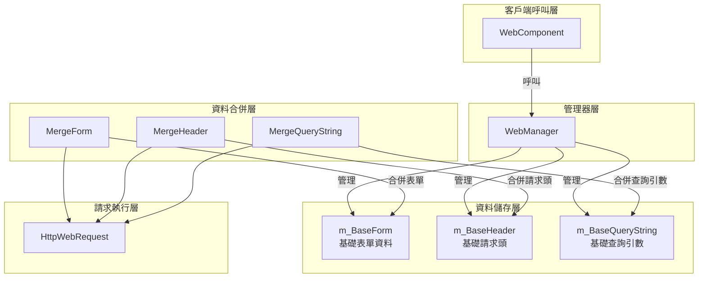
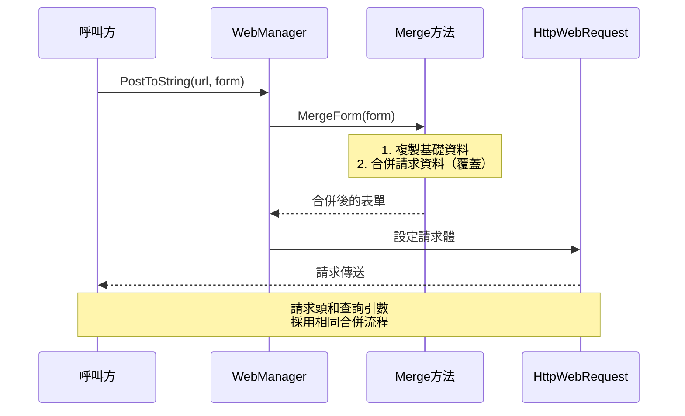
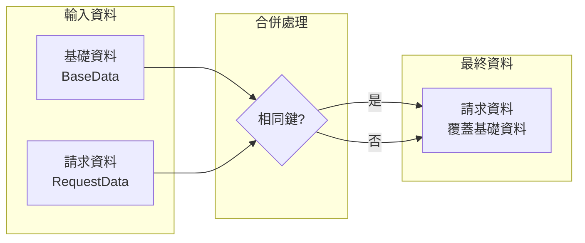

# 基礎資料配置

基礎資料配置功能允許開發者設定全域性通用的請求引數，這些引數會自動附加到所有HTTP請求中，無需在每次請求時重複設定。

## 概述

在使用 WebComponent 進行HTTP請求時，很多場景下需要為所有請求新增共同的引數，例如：

- **身份驗證**：API Token、使用者會話ID
- **應用資訊**：應用版本、裝置平臺、渠道標識
- **通用引數**：語言設定、地區編碼

基礎資料配置正是為解決這一需求而設計。透過預先配置基礎資料，開發者可以一次性設定這些通用引數，後續的所有請求都會自動包含這些資料，大大簡化了程式碼並減少了重複工作。

### 設計原理

基礎資料採用「合併而非替換」的策略：

1. **基礎資料**在初始化時設定一次，貫穿整個應用生命週期
2. **請求資料**在每次發起請求時單獨指定
3. **合併時**：如果請求資料中包含與基礎資料相同的鍵，請求資料會**覆蓋**基礎資料
4. 這種設計既保證了基礎資料的便利性，又保留了個別請求的靈活性

## 架構

基礎資料配置是 WebManager 的核心功能之一，與請求處理流程緊密整合。



### 各組件職責

| 組件 | 職責 |
|------|------|
| WebComponent | 提供Unity組件介面，代理IWebManager的呼叫 |
| WebManager | 實現基礎資料管理和請求合併邏輯 |
| m_BaseForm | 儲存全域性表單資料字典 |
| m_BaseHeader | 儲存全域性請求頭字典 |
| m_BaseQueryString | 儲存全域性查詢引數字典 |
| Merge* 方法 | 執行基礎資料與請求資料的合併 |

## 核心功能

WebManager 提供了三類基礎資料的管理功能：

### 1. 基礎表單資料（Base Form）

基礎表單資料會被新增到POST請求的請求體中，適用於需要隨請求傳送的通用業務引數。

```csharp
// 新增基礎表單資料
webComponent.AddBaseForm("app_version", "1.0.0");
webComponent.AddBaseForm("platform", "iOS");
webComponent.AddBaseForm("device_id", "ABC123");
```

> Source: [WebManager.cs](https://github.com/GameFrameX/com.gameframex.unity.web/blob/main/Runtime/Web/WebManager.cs#L591-L594)

### 2. 基礎請求頭資料（Base Header）

基礎請求頭資料會被新增到所有HTTP請求的請求頭中，常用於身份驗證和內容協商。

```csharp
// 新增基礎請求頭資料
webComponent.AddBaseHeader("Authorization", "Bearer token123");
webComponent.AddBaseHeader("Accept", "application/json");
webComponent.AddBaseHeader("X-Request-ID", Guid.NewGuid().ToString());
```

> Source: [WebManager.cs](https://github.com/GameFrameX/com.gameframex.unity.web/blob/main/Runtime/Web/WebManager.cs#L621-L624)

### 3. 基礎查詢引數資料（Base Query String）

基礎查詢引數會被附加到請求URL後面，適用於API版本、語言設定等常見引數。

```csharp
// 新增基礎查詢引數資料
webComponent.AddBaseQueryString("v", "2");
webComponent.AddBaseQueryString("lang", "zh-CN");
webComponent.AddBaseQueryString("timestamp", DateTimeOffset.Now.ToUnixTimeSeconds().ToString());
```

> Source: [WebManager.cs](https://github.com/GameFrameX/com.gameframex.unity.web/blob/main/Runtime/Web/WebManager.cs#L651-L654)

### 資料管理方法

每類基礎資料都提供三種管理方法：

| 方法 | 功能 | 說明 |
|------|------|------|
| Add* | 新增資料 | 鍵存在時覆蓋，不存在時新增 |
| Remove* | 移除資料 | 指定的鍵不存在時靜默忽略 |
| Clear* | 清空資料 | 一次性清除該型別所有基礎資料 |

```csharp
// 移除單個基礎資料
webComponent.RemoveBaseForm("device_id");

// 清空所有基礎表單資料
webComponent.ClearBaseForm();

// 清空所有基礎請求頭
webComponent.ClearBaseHeader();

// 清空所有基礎查詢引數
webComponent.ClearBaseQueryString();
```

> Source: [IWebManager.cs](https://github.com/GameFrameX/com.gameframex.unity.web/blob/main/Runtime/Web/IWebManager.cs#L147-L198)

## 資料合併流程

當發起HTTP請求時，基礎資料會與請求引數自動合併。理解合併機制有助於更好地使用該功能。



### 合併優先順序



**合併規則**：
- 如果請求資料中包含某個鍵，其值會**覆蓋**基礎資料中相同鍵的值
- 如果請求資料中不包含某個鍵，則使用基礎資料中的值
- 基礎資料本身不會被修改

### 合併實現示例

```csharp
/// <summary>
/// 合併表單資料
/// </summary>
private Dictionary<string, object> MergeForm(Dictionary<string, object> form)
{
    if (m_BaseForm.Count == 0)
    {
        return form;
    }

    // 複製基礎資料
    var result = new Dictionary<string, object>(m_BaseForm);

    // 覆蓋/新增外部資料
    if (form != null)
    {
        foreach (var kv in form)
        {
            result[kv.Key] = kv.Value;
        }
    }

    return result;
}
```

> Source: [WebManager.cs](https://github.com/GameFrameX/com.gameframex.unity.web/blob/main/Runtime/Web/WebManager.cs#L685-L705)

## 使用場景示例

### 場景一：應用啟動時初始化基礎資料

在遊戲或應用啟動時配置全域性引數：

```csharp
public class GameLauncher : MonoBehaviour
{
    private WebComponent _webComponent;

    private void Start()
    {
        _webComponent = GetComponent<WebComponent>();
        
        // 配置基礎查詢引數
        _webComponent.AddBaseQueryString("v", "2.0.0");
        _webComponent.AddBaseQueryString("platform", Application.platform.ToString());
        
        // 配置基礎請求頭
        _webComponent.AddBaseHeader("Authorization", $"Bearer {GetAuthToken()}");
        
        // 配置基礎表單資料
        _webComponent.AddBaseForm("app_id", GetAppId());
    }
    
    private string GetAuthToken() { /* 獲取Token */ return "token"; }
    private string GetAppId() { /* 獲取AppID */ return "app123"; }
}
```

### 場景二：API請求時自動攜帶基礎資料

配置完成後，後續請求無需再手動新增這些引數：

```csharp
// 後續請求會自動攜帶之前設定的基礎資料
// 最終請求: POST /api/user/info?v=2.0.0&platform=iOS 
//           Header: Authorization: Bearer token123
//           Body: {app_id: "app123", name: "test"}
var result = await _webComponent.PostToString(
    "https://api.example.com/api/user/info",
    new Dictionary<string, object> { { "name", "test" } }
);
```

### 場景三：臨時覆蓋基礎資料

在某些請求中需要使用不同值時，直接在請求中指定即可：

```csharp
// 即使基礎資料中設定了 v=2.0.0，此請求仍使用 v=3.0.0
var result = await _webComponent.PostToString(
    "https://api.example.com/api/v3/feature",
    new Dictionary<string, object> { { "name", "test" } },
    new Dictionary<string, string> { { "v", "3.0.0" } } // 覆蓋基礎查詢引數
);
```

### 場景四：使用者登入後更新Token

使用者登入成功後更新認證資訊：

```csharp
public async Task OnUserLogin(string newToken)
{
    // 移除舊Token
    _webComponent.RemoveBaseHeader("Authorization");
    
    // 新增新Token
    _webComponent.AddBaseHeader("Authorization", $"Bearer {newToken}");
}
```

### 場景五：切換API環境

在開發/生產環境間切換時：

```csharp
public void SwitchEnvironment(bool isProduction)
{
    string baseUrl = isProduction 
        ? "https://api.production.com" 
        : "https://api.dev.com";
    
    // 清空並重新設定基礎查詢引數
    _webComponent.ClearBaseQueryString();
    _webComponent.AddBaseQueryString("env", isProduction ? "prod" : "dev");
    _webComponent.AddBaseQueryString("debug", isProduction ? "false" : "true");
}
```

## API 參考

### IWebManager 介面方法

以下方法定義在 `IWebManager` 介面中，由 `WebManager` 類實現：

#### 表單資料管理

| 方法 | 描述 |
|------|------|
| `AddBaseForm(string key, object value)` | 新增基礎表單資料 |
| `RemoveBaseForm(string key)` | 移除指定的基礎表單資料 |
| `ClearBaseForm()` | 清空所有基礎表單資料 |

#### 請求頭管理

| 方法 | 描述 |
|------|------|
| `AddBaseHeader(string key, string value)` | 新增基礎請求頭資料 |
| `RemoveBaseHeader(string key)` | 移除指定的基礎請求頭資料 |
| `ClearBaseHeader()` | 清空所有基礎請求頭資料 |

#### 查詢引數管理

| 方法 | 描述 |
|------|------|
| `AddBaseQueryString(string key, string value)` | 新增基礎查詢引數資料 |
| `RemoveBaseQueryString(string key)` | 移除指定的基礎查詢引數資料 |
| `ClearBaseQueryString()` | 清空所有基礎查詢引數資料 |

> 完整的 IWebManager 介面定義請參見 [API 參考 - IWebManager 介面](./04.iwebmanager-interface)。

### WebComponent 代理方法

`WebComponent` 繼承自 `GameFrameworkComponent`，內部持有 `IWebManager` 例項，並代理所有基礎資料管理方法的呼叫。使用方式與直接呼叫 `IWebManager` 完全相同。

> WebComponent 的完整說明請參見 [API 參考 - WebComponent 組件](./08.web-component)。

## 相關連結

- [超時配置](./10.timeout-settings) - 配置請求超時時間
- [IWebManager 介面](./04.iwebmanager-interface) - Web管理器的完整介面定義
- [WebComponent 組件](./08.web-component) - Unity組件使用說明
- [請求結果型別](./06.result-types) - 瞭解請求返回的結果型別
