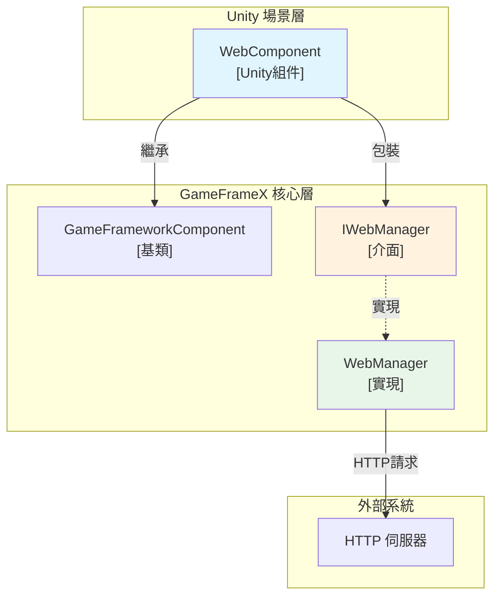
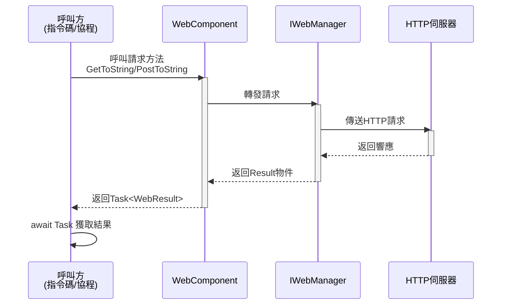
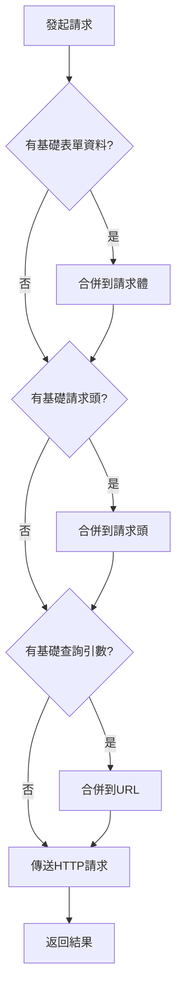

# WebComponent 組件

WebComponent 是 GameFrameX 框架提供的 Unity 組件，用於在 Unity 遊戲中簡化 HTTP 網路請求操作。該組件封裝了 IWebManager 介面，提供面向 Unity 友好的非同步請求方法。

## 概述

WebComponent 是一個繼承自 GameFrameworkComponent 的 Unity 組件，設計用於在 Unity 場景中提供 HTTP 網路請求功能。透過該組件，開發者可以方便地傳送 GET 和 POST 請求，並獲取字串或位元組陣列格式的響應結果。

**主要特性：**
- 支援 GET 和 POST 請求
- 支援返回字串和位元組陣列兩種響應格式
- 支援查詢引數、請求頭和表單資料的配置
- 提供超時控制機制
- 支援基礎資料配置，可為所有請求新增通用引數

## Architecture



**架構說明：**
- **WebComponent**: Unity 層面的組件，掛在 GameObject 上使用，提供簡潔的 API
- **IWebManager**: 定義網路請求功能的介面
- **WebManager**: IWebManager 的具體實現，處理實際的 HTTP 通訊

## 核心功能

### HTTP 請求方法

WebComponent 提供了豐富的 HTTP 請求方法，涵蓋 GET 和 POST 兩種請求型別：

#### GET 請求

```csharp
// 基礎 GET 請求 - 返回字串
Task<WebStringResult> GetToString(string url, object userData = null)

// 帶查詢引數的 GET 請求 - 返回字串
Task<WebStringResult> GetToString(string url, Dictionary<string, string> queryString, object userData = null)

// 帶查詢引數和請求頭的 GET 請求 - 返回字串
Task<WebStringResult> GetToString(string url, Dictionary<string, string> queryString, Dictionary<string, string> header, object userData = null)

// 基礎 GET 請求 - 返回位元組陣列
Task<WebBufferResult> GetToBytes(string url, object userData = null)

// 帶查詢引數的 GET 請求 - 返回位元組陣列
Task<WebBufferResult> GetToBytes(string url, Dictionary<string, string> queryString, object userData = null)

// 帶查詢引數和請求頭的 GET 請求 - 返回位元組陣列
Task<WebBufferResult> GetToBytes(string url, Dictionary<string, string> queryString, Dictionary<string, string> header, object userData = null)
```

#### POST 請求

```csharp
// 基礎 POST 請求 - 返回字串
Task<WebStringResult> PostToString(string url, Dictionary<string, object> from = null, object userData = null)

// 帶查詢引數的 POST 請求 - 返回字串
Task<WebStringResult> PostToString(string url, Dictionary<string, object> from, Dictionary<string, string> queryString, object userData = null)

// 帶查詢引數和請求頭的 POST 請求 - 返回字串
Task<WebStringResult> PostToString(string url, Dictionary<string, object> from, Dictionary<string, string> queryString, Dictionary<string, string> header, object userData = null)

// 基礎 POST 請求 - 返回位元組陣列
Task<WebBufferResult> PostToBytes(string url, Dictionary<string, object> from, object userData = null)

// 帶查詢引數的 POST 請求 - 返回位元組陣列
Task<WebBufferResult> PostToBytes(string url, Dictionary<string, object> from, Dictionary<string, string> queryString, object userData = null)

// 帶查詢引數和請求頭的 POST 請求 - 返回位元組陣列
Task<WebBufferResult> PostToBytes(string url, Dictionary<string, object> from, Dictionary<string, string> queryString, Dictionary<string, string> header, object userData = null)

// 傳送位元組陣列資料的 POST 請求 - 返回位元組陣列
Task<WebBufferResult> PostToBytes(string url, byte[] fromData, Dictionary<string, string> queryString, Dictionary<string, string> header, object userData = null)
```

### 基礎資料配置

WebComponent 支援配置基礎資料，這些資料會自動新增到所有請求中，適用於需要統一攜帶認證資訊、版本號等場景：

```csharp
// 表單資料管理
void AddBaseForm(string key, object value)
void RemoveBaseForm(string key)
void ClearBaseForm()

// 請求頭管理
void AddBaseHeader(string key, string value)
void RemoveBaseHeader(string key)
void ClearBaseHeader()

// 查詢引數管理
void AddBaseQueryString(string key, string value)
void RemoveBaseQueryString(string key)
void ClearBaseQueryString()
```

### 超時配置

```csharp
// 獲取或設定超時時間
public float Timeout
{
    get { return m_WebManager.Timeout; }
    set { m_WebManager.Timeout = m_Timeout = value; }
}
```

> Source: [WebComponent.cs](https://github.com/GameFrameX/com.gameframex.unity.web/blob/main/Runtime/Web/WebComponent.cs#L59-L70)

## Core Flow

### 請求處理流程



### 基礎資料應用流程



## 使用示例

### 基礎 GET 請求

```csharp
using UnityEngine;
using GameFrameX.Web.Runtime;

public class ExampleScript : MonoBehaviour
{
    private WebComponent webComponent;

    private void Start()
    {
        // 獲取 WebComponent 組件
        webComponent = GetComponent<WebComponent>();
        
        // 傳送簡單的 GET 請求
        _ = GetExample();
    }

    private async void GetExample()
    {
        var result = await webComponent.GetToString("https://api.example.com/data");
        if (!string.IsNullOrEmpty(result.Result))
        {
            Debug.Log($"GET 請求成功: {result.Result}");
        }
    }
}
```

> Source: [WebComponent.cs](https://github.com/GameFrameX/com.gameframex.unity.web/blob/main/Runtime/Web/WebComponent.cs#L98-L101)

### 帶引數的 GET 請求

```csharp
// 帶查詢引數的 GET 請求
private async void GetWithQueryParams()
{
    var queryParams = new Dictionary<string, string>
    {
        { "page", "1" },
        { "limit", "10" }
    };
    
    var result = await webComponent.GetToString(
        "https://api.example.com/users", 
        queryParams
    );
}

// 帶查詢引數和自定義請求頭
private async void GetWithHeaders()
{
    var queryParams = new Dictionary<string, string> { { "id", "123" } };
    var headers = new Dictionary<string, string>
    {
        { "Authorization", "Bearer token123" },
        { "Accept", "application/json" }
    };
    
    var result = await webComponent.GetToString(
        "https://api.example.com/protected",
        queryParams,
        headers
    );
}
```

> Source: [WebComponent.cs](https://github.com/GameFrameX/com.gameframex.unity.web/blob/main/Runtime/Web/WebComponent.cs#L110-L126)

### POST 請求示例

```csharp
// 傳送 POST 請求提交表單資料
private async void PostExample()
{
    var formData = new Dictionary<string, object>
    {
        { "username", "testuser" },
        { "password", "password123" }
    };
    
    var result = await webComponent.PostToString(
        "https://api.example.com/login",
        formData
    );
    
    Debug.Log($"POST 響應: {result.Result}");
}

// 帶完整引數的 POST 請求
private async void PostWithFullParams()
{
    var formData = new Dictionary<string, object>
    {
        { "title", "Hello World" },
        { "content", "This is a post content" }
    };
    
    var queryParams = new Dictionary<string, string>
    {
        { "format", "json" }
    };
    
    var headers = new Dictionary<string, string>
    {
        { "Content-Type", "application/x-www-form-urlencoded" }
    };
    
    var result = await webComponent.PostToString(
        "https://api.example.com/posts",
        formData,
        queryParams,
        headers
    );
}
```

> Source: [WebComponent.cs](https://github.com/GameFrameX/com.gameframex.unity.web/blob/main/Runtime/Web/WebComponent.cs#L175-L205)

### 使用基礎資料配置

```csharp
// 在 Start 中配置基礎資料
private void Start()
{
    // 新增基礎請求頭（如認證資訊）
    webComponent.AddBaseHeader("Authorization", "Bearer your-token");
    webComponent.AddBaseHeader("App-Version", "1.0.0");
    
    // 新增基礎查詢引數
    webComponent.AddBaseQueryString("platform", "android");
    webComponent.AddBaseQueryString("language", "zh-CN");
}

// 後續請求會自動攜帶這些基礎資料
private void MakeRequest()
{
    // 這個請求會自動包含:
    // - Authorization: Bearer your-token
    // - App-Version: 1.0.0
    // - platform: android
    // - language: zh-CN
    webComponent.GetToString("https://api.example.com/data");
}

// 清理基礎資料
private void OnDestroy()
{
    webComponent.ClearBaseHeader();
    webComponent.ClearBaseQueryString();
}
```

> Source: [WebComponent.cs](https://github.com/GameFrameX/com.gameframex.unity.web/blob/main/Runtime/Web/WebComponent.cs#L262-L341)

### 下載二進位制資料

```csharp
// 下載圖片或其他二進位制資料
private async void DownloadImage()
{
    var result = await webComponent.GetToBytes("https://example.com/image.png");
    
    if (result.Result != null && result.Result.Length > 0)
    {
        // 建立 Texture2D
        Texture2D texture = new Texture2D(2, 2);
        texture.LoadImage(result.Result);
        
        // 應用到 Sprite
        Sprite sprite = Sprite.Create(
            texture, 
            new Rect(0, 0, texture.width, texture.height), 
            Vector2.one * 0.5f
        );
        
        Debug.Log($"圖片下載成功: {texture.width}x{texture.height}");
    }
}
```

> Source: [WebComponent.cs](https://github.com/GameFrameX/com.gameframex.unity.web/blob/main/Runtime/Web/WebComponent.cs#L136-L139)

## 組件配置

### 在 Unity 編輯器中新增

1. 在 Unity 場景中建立一個空 GameObject 或選擇需要新增網路功能的 GameObject
2. 選擇 **Component → GameFrameX → Web** 選單項
3. WebComponent 組件將被新增到選中的 GameObject 上

### Inspector 配置

在 Inspector 面板中可以配置以下屬性：

| 屬性 | 型別 | 預設值 | 說明 |
|------|------|--------|------|
| Timeout | float | 5.0 | 請求超時時間，單位為秒 |

```csharp
// Inspector 中的超時設定範圍為 0-120 秒
// 在執行時修改
webComponent.Timeout = 10f;
```

> Source: [WebComponentInspector.cs](https://github.com/GameFrameX/com.gameframex.unity.web/blob/main/Editor/Inspector/WebComponentInspector.cs#L23-L34)

## API 參考

### 屬性

#### `Timeout`

```csharp
public float Timeout { get; set; }
```

獲取或設定請求超時時間。當請求超過此時間未完成時會自動終止。

**預設值：** 5.0 秒

**範圍：** 0 - 120 秒

### 方法

#### GET 請求方法

##### `GetToString(url, userData)`

```csharp
Task<WebStringResult> GetToString(string url, object userData = null)
```

傳送 GET 請求，返回字串結果。

**引數：**
- `url` (string): 請求地址
- `userData` (object, 可選): 使用者自定義資料，會在結果中原樣返回

**返回：** `Task<WebStringResult>` - 包含字串結果的非同步任務

---

##### `GetToString(url, queryString, userData)`

```csharp
Task<WebStringResult> GetToString(string url, Dictionary<string, string> queryString, object userData = null)
```

傳送帶查詢引數的 GET 請求，返回字串結果。

**引數：**
- `url` (string): 請求地址
- `queryString` (Dictionary<string, string>): URL 查詢引數字典
- `userData` (object, 可選): 使用者自定義資料

**返回：** `Task<WebStringResult>` - 包含字串結果的非同步任務

---

##### `GetToString(url, queryString, header, userData)`

```csharp
Task<WebStringResult> GetToString(string url, Dictionary<string, string> queryString, Dictionary<string, string> header, object userData = null)
```

傳送帶查詢引數和請求頭的 GET 請求，返回字串結果。

**引數：**
- `url` (string): 請求地址
- `queryString` (Dictionary<string, string>): URL 查詢引數字典
- `header` (Dictionary<string, string>): HTTP 請求頭字典
- `userData` (object, 可選): 使用者自定義資料

**返回：** `Task<WebStringResult>` - 包含字串結果的非同步任務

---

##### `GetToBytes(url, userData)`

```csharp
Task<WebBufferResult> GetToBytes(string url, object userData = null)
```

傳送 GET 請求，返回位元組陣列結果。適用於下載二進位制資料。

**引數：**
- `url` (string): 請求地址
- `userData` (object, 可選): 使用者自定義資料

**返回：** `Task<WebBufferResult>` - 包含位元組陣列的非同步任務

---

#### POST 請求方法

##### `PostToString(url, from, userData)`

```csharp
Task<WebStringResult> PostToString(string url, Dictionary<string, object> from = null, object userData = null)
```

傳送 POST 請求，返回字串結果。

**引數：**
- `url` (string): 請求地址
- `from` (Dictionary<string, object>, 可選): 表單資料字典
- `userData` (object, 可選): 使用者自定義資料

**返回：** `Task<WebStringResult>` - 包含字串結果的非同步任務

---

##### `PostToString(url, from, queryString, header, userData)`

```csharp
Task<WebStringResult> PostToString(string url, Dictionary<string, object> from, Dictionary<string, string> queryString, Dictionary<string, string> header, object userData = null)
```

傳送帶查詢引數和請求頭的 POST 請求，返回字串結果。

**引數：**
- `url` (string): 請求地址
- `from` (Dictionary<string, object>): 表單資料字典
- `queryString` (Dictionary<string, string>): URL 查詢引數字典
- `header` (Dictionary<string, string>): HTTP 請求頭字典
- `userData` (object, 可選): 使用者自定義資料

**返回：** `Task<WebStringResult>` - 包含字串結果的非同步任務

---

##### `PostToBytes(url, from, userData)`

```csharp
Task<WebBufferResult> PostToBytes(string url, Dictionary<string, object> from, object userData = null)
```

傳送 POST 請求，返回位元組陣列結果。

**引數：**
- `url` (string): 請求地址
- `from` (Dictionary<string, object>): 表單資料字典
- `userData` (object, 可選): 使用者自定義資料

**返回：** `Task<WebBufferResult>` - 包含位元組陣列的非同步任務

---

##### `PostToBytes(url, fromData, queryString, header, userData)`

```csharp
Task<WebBufferResult> PostToBytes(string url, byte[] fromData, Dictionary<string, string> queryString, Dictionary<string, string> header, object userData = null)
```

傳送位元組陣列 POST 請求，返回位元組陣列結果。適用於檔案上傳等場景。

**引數：**
- `url` (string): 請求地址
- `fromData` (byte[]): 要傳送的位元組陣列資料
- `queryString` (Dictionary<string, string>): URL 查詢引數字典
- `header` (Dictionary<string, string>): HTTP 請求頭字典
- `userData` (object, 可選): 使用者自定義資料

**返回：** `Task<WebBufferResult>` - 包含位元組陣列的非同步任務

---

#### 基礎資料管理方法

##### `AddBaseForm(key, value)`

```csharp
void AddBaseForm(string key, object value)
```

新增基礎表單資料，該資料會被新增到所有 POST 請求的表單中。

**引數：**
- `key` (string): 表單鍵
- `value` (object): 表單值

---

##### `RemoveBaseForm(key)`

```csharp
void RemoveBaseForm(string key)
```

移除指定的基礎表單資料。

**引數：**
- `key` (string): 表單鍵

---

##### `ClearBaseForm()`

```csharp
void ClearBaseForm()
```

清空所有基礎表單資料。

---

##### `AddBaseHeader(key, value)`

```csharp
void AddBaseHeader(string key, string value)
```

新增基礎請求頭，該請求頭會被新增到所有請求中。

**引數：**
- `key` (string): 請求頭鍵
- `value` (string): 請求頭值

---

##### `RemoveBaseHeader(key)`

```csharp
void RemoveBaseHeader(string key)
```

移除指定的基礎請求頭。

**引數：**
- `key` (string): 請求頭鍵

---

##### `ClearBaseHeader()`

```csharp
void ClearBaseHeader()
```

清空所有基礎請求頭。

---

##### `AddBaseQueryString(key, value)`

```csharp
void AddBaseQueryString(string key, string value)
```

新增基礎查詢引數，該引數會被附加到所有請求的 URL 後面。

**引數：**
- `key` (string): 查詢引數鍵
- `value` (string): 查詢引數值

---

##### `RemoveBaseQueryString(key)`

```csharp
void RemoveBaseQueryString(string key)
```

移除指定的基礎查詢引數。

**引數：**
- `key` (string): 查詢引數鍵

---

##### `ClearBaseQueryString()`

```csharp
void ClearBaseQueryString()
```

清空所有基礎查詢引數。

---

## 請求結果型別

### WebStringResult

用於封裝 HTTP 請求返回的字串資料。

```csharp
public sealed class WebStringResult
{
    // 請求返回的字串結果
    public string Result { get; }
    
    // 使用者自定義資料，在請求時傳入的資料會原樣返回
    public object UserData { get; }
}
```

> Source: [WebStringResult.cs](https://github.com/GameFrameX/com.gameframex.unity.web/blob/main/Runtime/Web/WebStringResult.cs#L1-L40)

### WebBufferResult

用於封裝 HTTP 請求返回的位元組陣列資料，適用於二進位制資料如圖片、檔案等。

```csharp
public sealed class WebBufferResult
{
    // 請求結果（位元組陣列）
    public byte[] Result { get; }
    
    // 使用者自定義資料
    public object UserData { get; }
}
```

> Source: [WebBufferResult.cs](https://github.com/GameFrameX/com.gameframex.unity.web/blob/main/Runtime/Web/WebBufferResult.cs#L1-L21)

## 常見問題

### 1. 如何處理請求超時？

可以透過設定 `Timeout` 屬性來調整超時時間：

```csharp
webComponent.Timeout = 30f; // 設定 30 秒超時
```

### 2. 如何傳遞自定義資料？

所有請求方法都支援 `userData` 引數，該引數會在結果中原樣返回，適用於在非同步回呼中識別請求：

```csharp
var result = await webComponent.GetToString(url, "myRequest");
Debug.Log(result.UserData); // 輸出: myRequest
```

### 3. 如何新增認證資訊？

可以使用基礎請求頭功能：

```csharp
webComponent.AddBaseHeader("Authorization", "Bearer your-token");
```

## 相關連結

- [IWebManager 介面](./04.iwebmanager-interface) - 網路請求管理器的介面定義
- [WebManager 架構](./05.web-manager) - WebManager 內部架構說明
- [請求結果型別](./06.result-types) - 詳細的結果型別說明
- [超時配置](./10.timeout-settings) - 超時配置詳細說明
- [基礎資料配置](./07.base-data) - 基礎資料配置說明
