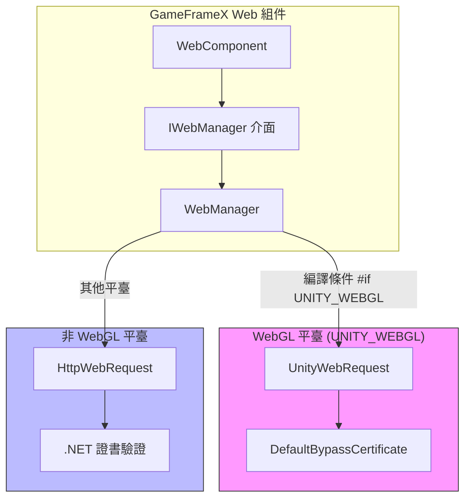
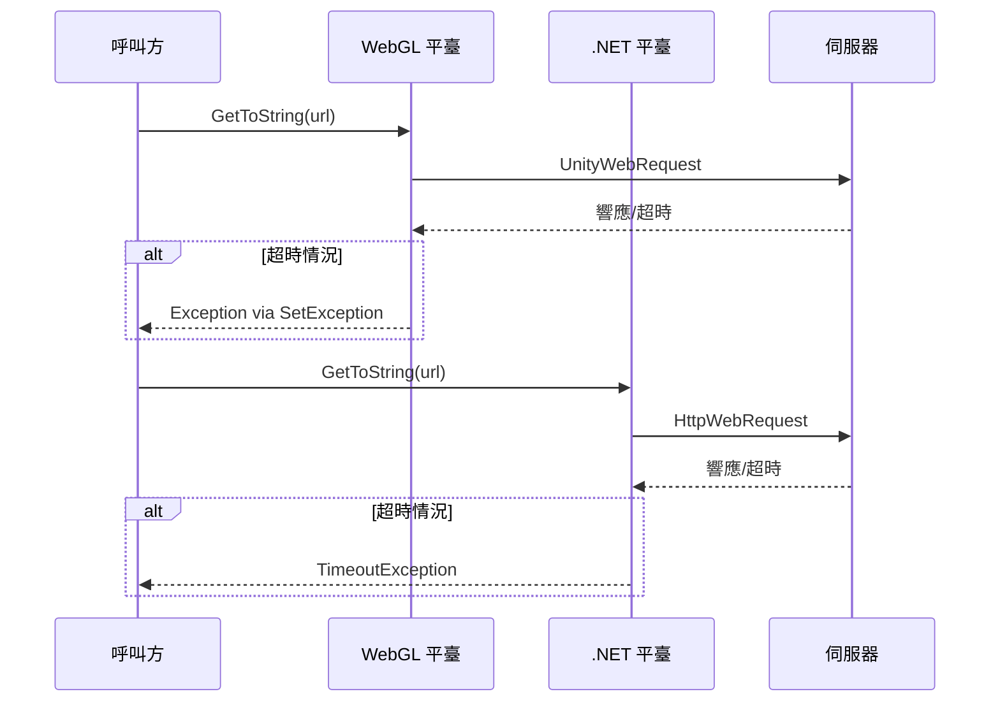

# 平臺差異說明

本文件詳細介紹 GameFrameX Web 組件在不同 Unity 平臺上的實現差異，幫助開發者理解各平臺的特點並正確使用組件。

## 概述

GameFrameX Web 組件支援三大平臺類別：

- **WebGL 平臺**：適用於瀏覽器環境釋出的 WebGL 構建
- **非 WebGL 平臺**：包括 PC（Windows、Mac、Linux）、iOS、Android 等原生平臺

這兩種平臺在網路請求實現機制上存在本質差異，主要體現在：

| 特性 | WebGL 平臺 | 非 WebGL 平臺 |
|------|------------|---------------|
| 網路庫 | UnityWebRequest | System.Net.HttpWebRequest |
| 非同步模式 | 回呼式（Callback） | 非同步等待（async/await） |
| 多執行緒支援 | 不支援 | 支援 |
| 證書處理 | 自定義 CertificateHandler | .NET 標準證書驗證 |

## 架構差異



### 設計意圖

外掛採用條件編譯（`#if UNITY_WEBGL`）實現平臺差異，這種設計帶來了以下優勢：

1. **統一介面**：上層呼叫程式碼無需關心底層實現細節
2. **效能最佳化**：每個平臺都能使用最適合的網路庫
3. **功能一致**：儘管實現不同，對外提供的 API 完全一致

## 核心實現差異

### 請求傳送方式

**WebGL 平臺實現：**

在 WebGL 平臺上，請求透過 `UnityWebRequest` 傳送，使用事件回呼處理完成通知。

```csharp
// Source: Runtime/Web/WebManager.cs#L213-L258
#if UNITY_WEBGL
UnityWebRequest unityWebRequest;
if (webJsonData.IsGet)
{
    unityWebRequest = UnityWebRequest.Get(webJsonData.URL);
}
else
{
    unityWebRequest = UnityWebRequest.Post(webJsonData.URL, string.Empty);
}

unityWebRequest.certificateHandler = new DefaultBypassCertificate();
unityWebRequest.timeout = (int)RequestTimeout.TotalSeconds;
// ... 設定請求頭和請求體

var asyncOperation = unityWebRequest.SendWebRequest();
asyncOperation.completed += (asyncOperation2) =>
{
    m_SendingNormalList.Remove(webJsonData);
    if (unityWebRequest.isNetworkError || unityWebRequest.isHttpError || unityWebRequest.error != null)
    {
        webJsonData.UniTaskCompletionStringSource.TrySetException(new Exception(unityWebRequest.error));
        return;
    }
    webJsonData.UniTaskCompletionStringSource.SetResult(new WebStringResult(webJsonData.UserData, unityWebRequest.downloadHandler.text));
};
#endif
```

**非 WebGL 平臺實現：**

在非 WebGL 平臺上，請求透過 `HttpWebRequest` 傳送，支援真正的非同步等待。

```csharp
// Source: Runtime/Web/WebManager.cs#L260-L328
#else
try
{
    HttpWebRequest request = WebRequest.CreateHttp(webJsonData.URL);
    request.Method = webJsonData.IsGet ? WebRequestMethods.Http.Get : WebRequestMethods.Http.Post;
    request.Timeout = (int)RequestTimeout.TotalMilliseconds;
    // ... 設定請求頭和請求體

    using (HttpWebResponse response = (HttpWebResponse)await request.GetResponseAsync())
    {
        using (StreamReader reader = new StreamReader(response.GetResponseStream()))
        {
            string content = await reader.ReadToEndAsync();
            webJsonData.UniTaskCompletionStringSource.SetResult(new WebStringResult(webJsonData.UserData, content));
        }
    }
}
catch (WebException e)
{
    if (e.Status == WebExceptionStatus.Timeout)
    {
        webJsonData.UniTaskCompletionStringSource.SetException(new TimeoutException(e.Message));
        return;
    }
    webJsonData.UniTaskCompletionStringSource.SetException(e);
}
finally
{
    m_SendingNormalList.Remove(webJsonData);
}
#endif
```

### 證書處理差異

**WebGL 平臺：**

WebGL 平臺使用自定義的證書處理器來繞過證書驗證，這對於開發除錯和自簽名證書環境非常有用。

```csharp
// Source: Runtime/Web/DefaultBypassCertificate.cs
public sealed class DefaultBypassCertificate : CertificateHandler
{
    protected override bool ValidateCertificate(byte[] certificateData)
    {
        return true;
    }
}
```

> Source: [DefaultBypassCertificate.cs](https://github.com/GameFrameX/com.gameframex.unity.web/blob/main/Runtime/Web/DefaultBypassCertificate.cs#L41-L44)

WebGL 平臺在建立請求時應用此證書處理器：

```csharp
// Source: Runtime/Web/WebManager.cs#L224
unityWebRequest.certificateHandler = new DefaultBypassCertificate();
```

**非 WebGL 平臺：**

非 WebGL 平臺使用 .NET 標準證書驗證機制，在生產環境中提供更安全的 HTTPS 保護。

### 超時處理差異



兩個平臺對超時異常的處理方式略有不同：

- **WebGL**：透過檢測 `unityWebRequest.error` 判斷超時和其他錯誤
- **非 WebGL**：透過捕獲 `WebExceptionStatus.Timeout` 異常並轉換為 `TimeoutException`

## 各平臺使用注意事項

### WebGL 平臺

1. **單執行緒限制**：WebGL 不支援多執行緒，所有網路請求都在主執行緒透過回呼處理
2. **跨域請求（CORS）**：瀏覽器環境強制執行同源策略，確保伺服器正確配置 CORS 頭
3. **HTTPS 證書**：使用預設的證書繞過處理器，生產環境需考慮替換
4. **非同步模式**：雖然介面返回 `Task`，但內部實現是回呼式的

### 非 WebGL 平臺（PC/iOS/Android）

1. **真非同步支援**：使用 .NET 的 `async/await` 模式，真正實現非阻塞
2. **標準證書驗證**：使用系統預設的證書驗證機制，更安全可靠
3. **超時精度**：使用毫秒級超時控制
4. **連線池管理**：透過 `MaxConnectionPerServer` 配置控制併發連線數

## 平臺檢測與條件編譯

在開發過程中，如果需要根據平臺執行不同邏輯，可以使用以下方式：

```csharp
#if UNITY_WEBGL
    // WebGL 平臺特定程式碼
    Debug.Log("Running on WebGL platform");
#else
    // 其他平臺程式碼
    Debug.Log("Running on native platform");
#endif
```

### 指令碼定義符號

外掛提供了兩個用於除錯的指令碼定義符號：

| 符號 | 說明 |
|------|------|
| `ENABLE_GAMEFRAMEX_WEB_SEND_LOG` | 啟用請求傳送日誌 |
| `ENABLE_GAMEFRAMEX_WEB_RECEIVE_LOG` | 啟用響應接收日誌 |

> Source: [WebLogScriptingDefineSymbols.cs](https://github.com/GameFrameX/com.gameframex.unity.web/blob/main/Editor/WebLogScriptingDefineSymbols.cs#L42-L43)

可以透過 Unity 選單 `GameFrameX/Scripting Define Symbols` 快速開關這些日誌。

## 常見平臺問題

### WebGL 平臺 CORS 錯誤

**問題**：瀏覽器控制檯顯示 "Access to fetch ... has been blocked by CORS policy"

**解決方案**：
1. 確保伺服器正確設定 CORS 響應頭：
   ```
   Access-Control-Allow-Origin: *
   Access-Control-Allow-Methods: GET, POST, OPTIONS
   Access-Control-Allow-Headers: Content-Type, Authorization
   ```
2. 伺服器需要處理 OPTIONS 預檢請求

### 超時設定不生效

**問題**：設定的超時時間在 WebGL 平臺似乎無效

**原因分析**：
- WebGL 平臺的 `UnityWebRequest.timeout` 屬性設定的是整秒數
- 非 WebGL 平臺使用毫秒級精度

**建議**：在 WebGL 平臺使用較長超時時間（建議 10 秒以上）

### HTTPS 證書警告

**問題**：WebGL 平臺請求 HTTPS 地址時出現證書警告

**原因**：使用了預設的證書繞過處理器

**解決方案**：生產環境建議實現自定義 `CertificateHandler` 進行實際證書驗證

## 相關連結

- [外掛介紹](./01.overview)
- [基礎用法](./03.getting-started)
- [WebComponent 組件](./08.web-component)
- [IWebManager 介面](./04.iwebmanager-interface)
- [超時配置](./10.timeout-settings)
- [常見問題](./11.troubleshooting)
