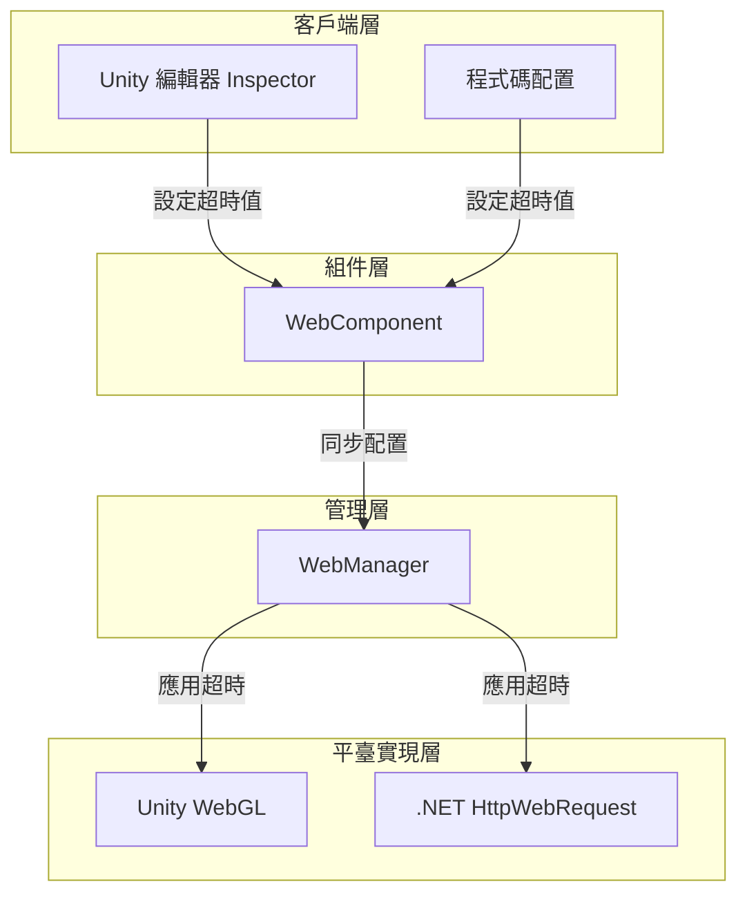
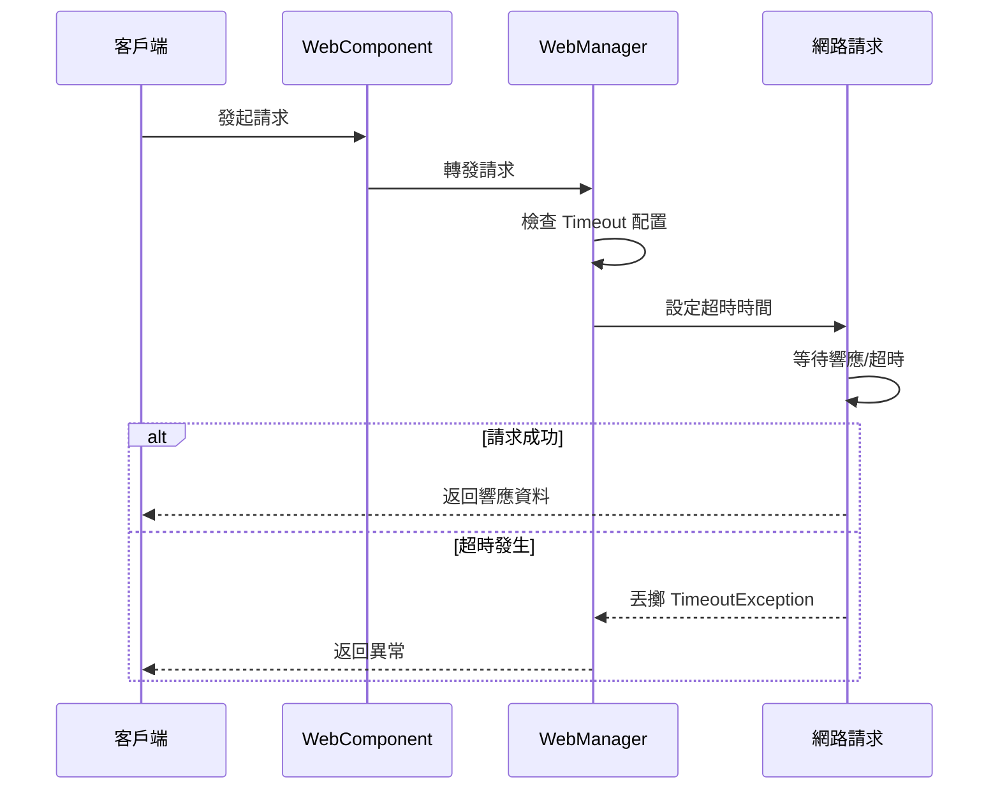

# 超時配置

配置 HTTP 請求的超時時間，控制網路請求的最大等待時長。

## 概述

超時配置是 Web 請求模組的重要組成部分，用於防止網路請求無限期等待。當請求超過指定時間未完成時，系統會自動終止請求並丟擲 `TimeoutException` 異常。

超時配置採用統一的時間單位（秒），在內部根據不同平臺自動轉換為相應的格式：
- Unity WebGL：轉換為整數秒
- .NET 平臺：轉換為整數毫秒

### 超時配置的核心作用

1. **防止無限等待**：當伺服器無響應時，避免客戶端永久阻塞
2. **提升使用者體驗**：快速失敗機制允許使用者進行其他操作
3. **資源保護**：及時釋放網路連線和其他資源

## 架構設計



### 各層職責

| 層級 | 組件 | 職責 |
|------|------|------|
| 客戶端層 | Inspector / Code | 提供超時配置的 UI 和程式碼介面 |
| 組件層 | WebComponent | 暴露 Timeout 屬性，同步配置到管理器 |
| 管理層 | WebManager | 儲存超時值，計算 RequestTimeout |
| 平臺實現層 | UnityWebRequest / HttpWebRequest | 實際應用超時到網路請求 |

## 配置方式

### 透過 Unity Inspector 配置

在 Unity 場景中新增 WebComponent 後，可以在 Inspector 面板中透過滑塊設定超時時間。

> Source: [WebComponentInspector.cs](https://github.com/GameFrameX/com.gameframex.unity.web/blob/main/Editor/Inspector/WebComponentInspector.cs#L22-L34)

```csharp
float timeout = EditorGUILayout.Slider("Timeout", m_Timeout.floatValue, 0f, 120f);
if (timeout != m_Timeout.floatValue)
{
    if (EditorApplication.isPlaying)
    {
        t.Timeout = timeout;
    }
    else
    {
        m_Timeout.floatValue = timeout;
    }
}
```

Inspector 配置特點：
- 範圍：0 到 120 秒
- 支援執行時動態修改
- 預覽模式下修改會儲存到序列化欄位

### 透過程式碼配置

#### 在 WebComponent 上配置

> Source: [WebComponent.cs](https://github.com/GameFrameX/com.gameframex.unity.web/blob/main/Runtime/Web/WebComponent.cs#L59-L70)

```csharp
[SerializeField] [Tooltip("超時時間.單位：秒")]
private float m_Timeout = 5f;

public float Timeout
{
    get { return m_WebManager.Timeout; }
    set { m_WebManager.Timeout = m_Timeout = value; }
}
```

使用示例：

```csharp
// 獲取 WebComponent 組件
var webComponent = GetComponent<WebComponent>();
// 設定超時為 10 秒
webComponent.Timeout = 10f;
```

#### 在 WebManager 上直接配置

> Source: [WebManager.cs](https://github.com/GameFrameX/com.gameframex.unity.web/blob/main/Runtime/Web/WebManager.cs#L55-L66)

```csharp
public float Timeout
{
    get { return m_Timeout; }
    set
    {
        m_Timeout = value;
        RequestTimeout = TimeSpan.FromSeconds(value);
    }
}
```

使用示例：

```csharp
// 透過 GameFrameworkEntry 獲取 WebManager
var webManager = GameFrameworkEntry.GetModule<IWebManager>();
// 設定超時為 10 秒
webManager.Timeout = 10f;
```

## 超時處理機制

### 請求處理流程



### 超時異常處理

#### .NET 平臺

> Source: [WebManager.cs](https://github.com/GameFrameX/com.gameframex.unity.web/blob/main/Runtime/Web/WebManager.cs#L298-L305)

```csharp
catch (WebException e)
{
    // 捕獲超時異常
    if (e.Status == WebExceptionStatus.Timeout)
    {
        webJsonData.UniTaskCompletionStringSource.SetException(new TimeoutException(e.Message));
        return;
    }
    // 處理其他異常...
}
```

#### Unity WebGL 平臺

Unity WebGL 平臺透過 `UnityWebRequest.isNetworkError` 屬性判斷超時：

```csharp
if (unityWebRequest.isNetworkError || unityWebRequest.isHttpError || unityWebRequest.error != null)
{
    // 超時也會被歸類為網路錯誤
    webJsonData.UniTaskCompletionStringSource.TrySetException(new Exception(unityWebRequest.error));
    return;
}
```

### 超時異常捕獲示例

```csharp
try
{
    var result = await webComponent.GetToString("https://api.example.com/data");
    Debug.Log($"請求成功: {result.Text}");
}
catch (TimeoutException ex)
{
    Debug.LogError($"請求超時: {ex.Message}");
    // 可以在這裡進行重試邏輯
}
catch (Exception ex)
{
    Debug.LogError($"請求失敗: {ex.Message}");
}
```

## 配置選項

| 選項 | 型別 | 預設值 | 說明 |
|------|------|--------|------|
| `Timeout` | float | 5f | 超時時間，單位為秒。設定為 0 表示不超時（使用系統預設值） |
| `RequestTimeout` | TimeSpan | 00:00:05 | 內部使用的 TimeSpan 格式超時時間 |

### 超時時間建議

| 場景 | 推薦超時時間 | 說明 |
|------|-------------|------|
| 常規 REST API | 10-30 秒 | 考慮網路延遲和伺服器處理時間 |
| 檔案上傳/下載 | 60-120 秒 | 大檔案需要更長的時間 |
| 實時通訊 | 5-10 秒 | 需要快速響應 |
| 本地除錯 | 5 秒 | 快速失敗，快速重試 |

### 不同超時值的影響

```mermaid
flowchart TD
    Start[設定超時值] --> Check{超時值大小?}

    Check -->|過短 (<3s)| TooShort[可能導致:<br/>- 正常請求被誤終止<br/>- 行動網路請求失敗率高]
    Check -->|適中 (5-30s)| Optimal[最佳平衡:<br/>- 給予足夠響應時間<br/>- 不會過度等待]
    Check -->|過長 (>60s)| TooLong[可能導致:<br/>- 使用者體驗下降<br/>- 資源佔用增加<br/>- 難以發現問題]

    TooShort --> End1[建議調整]
    Optimal --> End2[推薦使用]
    TooLong --> End3[建議調整]
```

## 平臺差異

### Unity WebGL

```csharp
// 超時設定為整數秒
unityWebRequest.timeout = (int)RequestTimeout.TotalSeconds;
```

特點：
- 超時值必須是整數
- 最小值為 1 秒
- 值為 0 表示使用 Unity 預設超時

### .NET 平臺

```csharp
// 超時設定為整數毫秒
request.Timeout = (int)RequestTimeout.TotalMilliseconds;
```

特點：
- 超時值以毫秒為單位
- 最小值為 1 毫秒，但建議不低於 500 毫秒

## 最佳實踐

### 1. 合理設定超時時間

根據實際業務場景和網路環境設定合適的超時時間：

```csharp
// 根據環境調整超時
#if UNITY_ANDROID
// 行動網路環境，超時稍長
webComponent.Timeout = 30f;
#else
// WiFi 環境，可以使用較短超時
webComponent.Timeout = 10f;
#endif
```

### 2. 實現重試機制

配合超時實現請求重試：

```csharp
private async Task<WebStringResult> RequestWithRetry(string url, int maxRetries = 3)
{
    for (int i = 0; i < maxRetries; i++)
    {
        try
        {
            return await webComponent.GetToString(url);
        }
        catch (TimeoutException)
        {
            if (i == maxRetries - 1) throw;
            Debug.LogWarning($"請求超時，正在重試 ({i + 1}/{maxRetries})...");
            await Task.Delay(1000 * (i + 1)); // 指數退避
        }
    }
    throw new Exception("重試次數耗盡");
}
```

### 3. 執行時動態調整

可以在執行時根據需要調整超時：

```csharp
// 針對特定請求調整超時
var originalTimeout = webComponent.Timeout;
try
{
    // 大檔案下載需要更長超時
    webComponent.Timeout = 120f;
    var result = await webComponent.GetToBytes("https://example.com/largefile.zip");
}
finally
{
    // 恢復原始超時
    webComponent.Timeout = originalTimeout;
}
```

## 相關連結

- [WebComponent 組件](./08.web-component)
- [IWebManager 介面](./04.iwebmanager-interface)
- [WebManager 架構](./05.web-manager)
- [基礎資料配置](./07.base-data)
- [平臺差異說明](./09.platform-differences)
