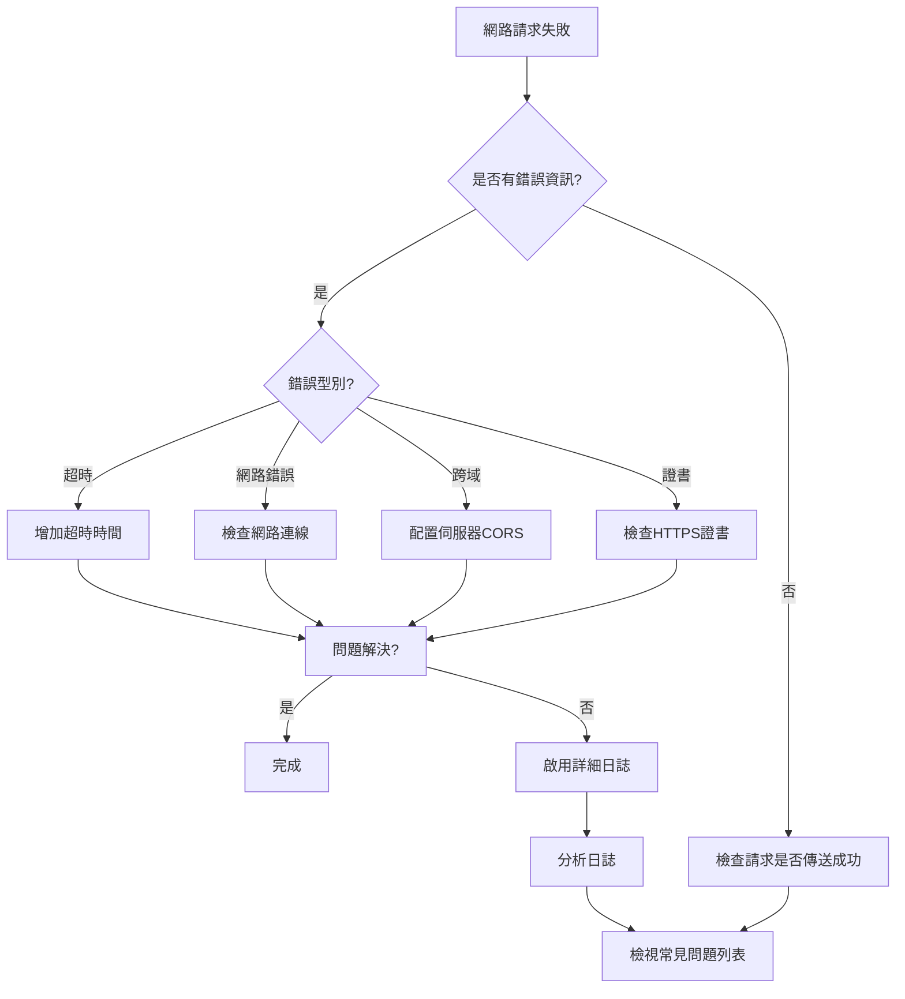

# 常見問題

本文件彙總了 GameFrameX Unity Web 外掛在使用過程中常見的 問題、原因分析以及對應的解決方案。

## 概述

GameFrameX Web 組件是一個高效能的 Unity HTTP 網路請求庫，支援 GET、POST 請求，可處理字串、JSON、二進位制資料等多種格式。在實際使用過程中，開發者經常會遇到一些問題，本文件將幫助你快速定位和解決這些問題。

## 常見問題列表

### 1. WebGL 平臺請求失敗

**問題描述**：
在 WebGL 平臺上傳送網路請求時，請求沒有響應或直接報錯。

**可能原因**：
- WebGL 平臺存在跨域限制
- 伺服器未正確配置 CORS 頭資訊
- WebGL 不支援多執行緒，所有請求在主執行緒處理

**解決方案**：

1. **確保伺服器配置 CORS**
   伺服器需要返回以下 CORS 響應頭：
   ```http
   Access-Control-Allow-Origin: *
   Access-Control-Allow-Methods: GET, POST, OPTIONS
   Access-Control-Allow-Headers: Content-Type, Authorization
   ```

2. **處理 OPTIONS 預檢請求**
   對於非簡單請求（帶自定義頭或 Content-Type 不是 application/x-www-form-urlencoded），伺服器必須支援 OPTIONS 預檢請求。

3. **使用非同步等待而非阻塞呼叫**
   WebGL 不支援多執行緒，建議使用 `await` 非同步等待而不是 `.Wait()` 或 `.Result` 阻塞呼叫：

   ```csharp
   // ✅ 推薦：非同步等待
   private async void Start()
   {
       var webManager = GameFrameworkEntry.GetModule<IWebManager>();
       var result = await webManager.GetToString("https://api.example.com/data");
       Debug.Log(result.Result);
   }
   
   // ❌ 避免：阻塞呼叫（WebGL 上會卡死）
   private void Start()
   {
       var webManager = GameFrameworkEntry.GetModule<IWebManager>();
       var result = webManager.GetToString("https://api.example.com/data").Result; // 會導致死鎖
   }
   ```

---

### 2. 請求超時

**問題描述**：
網路請求長時間沒有響應，最終丟擲超時異常。

**可能原因**：
- 網路連線不穩定或網路不可達
- 伺服器響應緩慢
- 超時時間設定過短

**解決方案**：

1. **調整超時時間**
   
   ```csharp
   // 方法一：透過 WebComponent 組件設定超時
   var webComponent = gameObject.GetOrAddComponent<WebComponent>();
   webComponent.Timeout = 60f; // 設定為 60 秒
   
   // 方法二：透過 IWebManager 介面設定超時
   var webManager = GameFrameworkEntry.GetModule<IWebManager>();
   webManager.Timeout = 60f; // 設定為 60 秒
   ```

   > Source: [WebComponent.cs](https://github.com/GameFrameX/com.gameframex.unity.web/blob/main/Runtime/Web/WebComponent.cs#L66-L70)

2. **實現重試機制**
   
   ```csharp
   public async Task<T> RetryRequest<T>(Func<Task<T>> requestFunc, int maxRetries = 3)
   {
       for (int i = 0; i < maxRetries; i++)
       {
           try
           {
               return await requestFunc();
           }
           catch (TimeoutException)
           {
               if (i == maxRetries - 1) throw;
               await Task.Delay(1000 * (i + 1)); // 指數退避
           }
       }
       throw new Exception("重試次數耗盡");
   }
   ```

3. **啟用詳細日誌排查**
   開啟日誌有助於定位超時原因：

   - 在 Unity 選單中選擇 **GameFrameX → Scripting Define Symbols → Enable Web Send Logs** 開啟傳送日誌
   - 選擇 **GameFrameX → Scripting Define Symbols → Enable Web Receive Logs** 開啟接收日誌

---

### 3. HTTPS 證書驗證失敗

**問題描述**：
在移動裝置上傳送 HTTPS 請求時，出現證書驗證失敗錯誤。

**可能原因**：
- 裝置時間不正確
- 伺服器證書過期或無效
- 自簽名證書
- 證書鏈不完整

**解決方案**：

1. **使用預設證書繞過（僅用於開發測試）**
   
   外掛已內建 `DefaultBypassCertificate` 類用於繞過證書驗證：
   
   ```csharp
   // 外掛已自動處理，非必要無需手動配置
   unityWebRequest.certificateHandler = new DefaultBypassCertificate();
   ```
   
   > Source: [WebManager.cs](https://github.com/GameFrameX/com.gameframex.unity.web/blob/main/Runtime/Web/WebManager.cs#L224)

2. **生產環境建議**
   - 確保伺服器使用受信任 CA 簽發的有效證書
   - 移動裝置時間設定正確
   - 在正式釋出時移除證書繞過程式碼

---

### 4. 請求佇列阻塞

**問題描述**：
傳送多個請求後，部分請求一直處於等待狀態，長時間沒有響應。

**可能原因**：
- 併發連線數限制（`MaxConnectionPerServer` 預設值為 8）
- 請求佇列已滿
- 前面的請求出現阻塞

**解決方案**：

1. **調整併發連線數**
   
   ```csharp
   var webManager = GameFrameworkEntry.GetModule<IWebManager>();
   // 設定為 16 個併發連線
   ((WebManager)webManager).MaxConnectionPerServer = 16;
   ```
   
   > Source: [WebManager.cs](https://github.com/GameFrameX/com.gameframex.unity.web/blob/main/Runtime/Web/WebManager.cs#L71)

2. **合理設計請求**
   - 區分高優先順序和低優先順序請求
   - 大檔案下載使用單獨的連線
   - 批次請求時分批傳送

---

### 5. 基礎資料未生效

**問題描述**：
透過 `AddBaseForm`、`AddBaseHeader` 等方法設定的基礎資料，在實際請求中沒有被包含。

**可能原因**：
- 基礎資料在請求傳送前未正確新增
- 新增後被清空
- 合併邏輯問題

**解決方案**：

1. **確保在請求前新增基礎資料**
   
   ```csharp
   var webManager = GameFrameworkEntry.GetModule<IWebManager>();
   
   // 新增基礎請求頭（每次請求都會自動包含）
   webManager.AddBaseHeader("Authorization", "Bearer your-token");
   webManager.AddBaseHeader("X-App-Version", "1.0.0");
   
   // 新增基礎表單資料
   webManager.AddBaseForm("platform", "android");
   webManager.AddBaseForm("deviceId", SystemInfo.deviceUniqueIdentifier);
   
   // 新增基礎查詢引數
   webManager.AddBaseQueryString("lang", "zh-CN");
   
   // 傳送請求
   var result = await webManager.GetToString("https://api.example.com/data");
   ```
   
   > Source: [IWebManager.cs](https://github.com/GameFrameX/com.gameframex.unity.web/blob/main/Runtime/Web/IWebManager.cs#L147-L198)

2. **檢查資料是否被意外清空**
   
   確保沒有呼叫以下方法：
   - `ClearBaseForm()` - 清空基礎表單
   - `ClearBaseHeader()` - 清空基礎請求頭
   - `ClearBaseQueryString()` - 清空基礎查詢引數

---

### 6. 返回結果解析錯誤

**問題描述**：
請求成功返回，但解析響應資料時出現異常。

**可能原因**：
- 響應資料格式與預期不符
- JSON 序列化/反序列化失敗
- 資料為空或 null

**解決方案**：

1. **正確處理返回結果**
   
   ```csharp
   var webManager = GameFrameworkEntry.GetModule<IWebManager>();
   var result = await webManager.GetToString("https://api.example.com/data");
   
   // 檢查是否有錯誤
   if (result != null && !string.IsNullOrEmpty(result.Result))
   {
       try
       {
           var data = JsonUtility.FromJson<MyDataClass>(result.Result);
           Debug.Log($"解析成功: {data.name}");
       }
       catch (Exception e)
       {
           Debug.LogError($"JSON解析失敗: {e.Message}");
       }
   }
   else
   {
       Debug.LogWarning("響應資料為空");
   }
   ```
   
   > Source: [WebStringResult.cs](https://github.com/GameFrameX/com.gameframex.unity.web/blob/main/Runtime/Web/WebStringResult.cs#L15-L38)

2. **使用位元組陣列接收二進位制資料**
   
   ```csharp
   var bufferResult = await webManager.GetToBytes("https://api.example.com/file");
   if (bufferResult != null && bufferResult.Result != null)
   {
       byte[] data = bufferResult.Result;
       Debug.Log($"接收資料大小: {data.Length} bytes");
   }
   ```
   
   > Source: [WebBufferResult.cs](https://github.com/GameFrameX/com.gameframex.unity.web/blob/main/Runtime/Web/WebBufferResult.cs#L1-L20)

---

### 7. 平臺差異導致的行為不一致

**問題描述**：
同一個請求在 Editor/PC 上正常工作，但在 WebGL 或移動平臺上失敗。

**可能原因**：
- 不同平臺使用不同的網路庫
- WebGL 使用 `UnityWebRequest`，其他平臺使用 `HttpWebRequest`
- 平臺特定的功能限制

**解決方案**：

1. **理解平臺差異**
   
   ```csharp
   // WebGL 平臺使用 UnityWebRequest
   #if UNITY_WEBGL
       UnityWebRequest unityWebRequest;
       // WebGL 特定實現
   #else
       // 其他平臺使用 HttpWebRequest
       HttpWebRequest request = WebRequest.CreateHttp(url);
   #endif
   ```
   
   > Source: [WebManager.cs](https://github.com/GameFrameX/com.gameframex.unity.web/blob/main/Runtime/Web/WebManager.cs#L213-L329)

2. **使用條件編譯處理平臺特定程式碼**
   
   ```csharp
   public async Task<string> GetDataAsync(string url)
   {
       try
       {
           return await webManager.GetToString(url);
       }
       catch (Exception e)
       {
   #if UNITY_WEBGL
           // WebGL 特定錯誤處理
           Debug.LogError($"WebGL錯誤: {e.Message}");
   #else
           // 其他平臺錯誤處理
           Debug.LogError($"網路錯誤: {e.Message}");
   #endif
           throw;
       }
   }
   ```

---

### 8. 除錯技巧

**問題描述**：
需要排查網路請求問題，但不知道如何獲取詳細資訊。

**解決方案**：

1. **啟用詳細日誌**
   
   在 Unity 編輯器中：
   - 選單：**GameFrameX → Scripting Define Symbols → Enable Web Send Logs**
   - 選單：**GameFrameX → Scripting Define Symbols → Enable Web Receive Logs**

   日誌宏定義：
   ```csharp
   // 傳送日誌
   #if ENABLE_GAMEFRAMEX_WEB_SEND_LOG
       Log.Debug($"Web Request: {webJsonData.URL} \n Header: {...}");
   #endif
   
   // 接收日誌
   #if ENABLE_GAMEFRAMEX_WEB_RECEIVE_LOG
       Log.Debug($"Web Response: {webJsonData.URL} \n Content: {...}");
   #endif
   ```
   
   > Source: [WebLogScriptingDefineSymbols.cs](https://github.com/GameFrameX/com.gameframex.unity.web/blob/main/Editor/WebLogScriptingDefineSymbols.cs#L42-L79)

2. **在 Player Settings 中啟用除錯**
   - 開啟 **Edit → Project Settings → Player**
   - 勾選 **Development Build**
   - 勾選 **Script Debugging**

3. **使用 Unity Profiler 監控網路**
   - 開啟 **Window → Analysis → Profiler**
   - 新增 **Network** 面板監控網路請求

---

### 9. 請求返回異常型別

**問題描述**：
不清楚請求失敗時會丟擲哪些異常型別。

**解決方案**：

外掛會根據不同錯誤情況丟擲以下異常：

| 異常型別 | 觸發條件 | 處理建議 |
|---------|---------|---------|
| `TimeoutException` | 請求超時 | 增加超時時間或檢查網路 |
| `WebException` | 網路錯誤 | 檢查網路連線和伺服器狀態 |
| `IOException` | IO 錯誤 | 檢查資料讀寫問題 |
| `Exception` | 其他錯誤 | 檢視具體錯誤資訊 |

```csharp
try
{
    var result = await webManager.GetToString(url);
}
catch (TimeoutException ex)
{
    Debug.LogError($"請求超時: {ex.Message}");
}
catch (WebException ex)
{
    Debug.LogError($"網路錯誤: {ex.Message}, 狀態: {ex.Status}");
}
catch (IOException ex)
{
    Debug.LogError($"IO錯誤: {ex.Message}");
}
catch (Exception ex)
{
    Debug.LogError($"未知錯誤: {ex.Message}");
}
```
> Source: [WebManager.cs](https://github.com/GameFrameX/com.gameframex.unity.web/blob/main/Runtime/Web/WebManager.cs#L298-L324)

---

## 診斷流程圖



---

## 相關連結

- [外掛介紹](./01.overview)
- [安裝方式](./02.installation)
- [基礎用法](./03.getting-started)
- [使用 WebComponent](./08.web-component)
- [WebManager 架構](./05.web-manager)
- [請求結果型別](./06.result-types)
- [IWebManager 介面](./04.iwebmanager-interface)
- [WebComponent 組件](./08.web-component)
- [超時配置](./10.timeout-settings)
- [基礎資料配置](./07.base-data)
- [平臺差異說明](./09.platform-differences)
