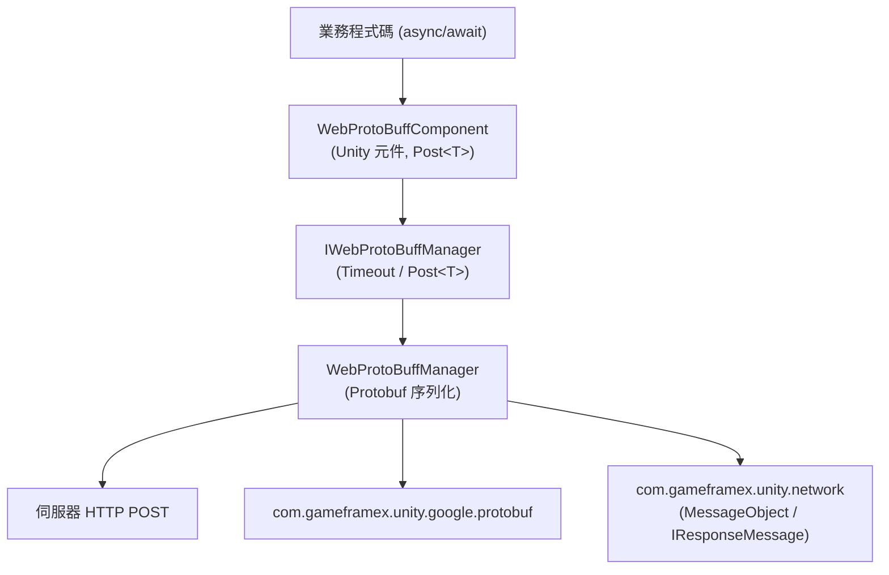

# Web ProtoBuff 元件簡介:它能幫你做什麼

Web ProtoBuff 是 GameFrameX 的 HTTP Protobuf 請求元件:它讓你用一行 `await` 就能把 Protocol Buffer 訊息透過 HTTP POST 傳送給伺服器,並把回應直接反序列化為指定型別的 `T`(繼承 `MessageObject` 並實作 `IResponseMessage`)。它基於 `Task<T>` 非同步 API,支援自訂逾時，相容 Unity WebGL 及其他原生平台。

## 快速開始

1. **安裝套件**。編輯 Unity 專案的 `Packages/manifest.json`,新增 `scopedRegistries` 並宣告相依套件:

   ```json
   {
     "scopedRegistries": [
       {
         "name": "GameFrameX",
         "url": "https://gameframex.upm.alianblank.uk",
         "scopes": [
           "com.gameframex"
         ]
       }
     ],
     "dependencies": {
       "com.gameframex.unity.web.protobuff": "1.1.3"
     }
   }
   ```

   Source: [README.zh-CN.md](https://github.com/GameFrameX/com.gameframex.unity.web.protobuff/blob/main/README.zh-CN.md#L47-L63)

   也可以改用 Git URL 方式:`"com.gameframex.unity.web.protobuff": "https://github.com/gameframex/com.gameframex.unity.web.protobuff.git"`,或在 Package Manager 中透過 Git URL 新增。

2. **新增巨集定義**。在 Unity 的 **Player Settings** → **Scripting Define Symbols** 中加入:

   `ENABLE_GAME_FRAME_X_WEB_PROTOBUF_NETWORK`

   未啟用該巨集時,`Post<T>` 相關 API 不會編譯進專案。

3. **掛載元件並呼叫**。在場景中的 GameFramework 物件上新增 **GameFrameX/Web ProtoBuff** 元件(`WebProtoBuffComponent`,預設逾時 5 秒),然後傳送請求:

   ```csharp
   using GameFrameX.Web.ProtoBuff.Runtime;

   // 傳送請求並等待結果
   LoginResponse response = await WebComponent.Post<LoginResponse>(url, request);
   ```

   Source: [README.zh-CN.md](https://github.com/GameFrameX/com.gameframex.unity.web.protobuff/blob/main/README.zh-CN.md#L108-L113)

## 核心 API

元件暴露的請求入口與管理器介面如下:

```csharp
public Task<T> Post<T>(string url, GameFrameX.Network.Runtime.MessageObject message)
    where T : GameFrameX.Network.Runtime.MessageObject, GameFrameX.Network.Runtime.IResponseMessage
```

Source: [WebProtoBuffComponent.cs](https://github.com/GameFrameX/com.gameframex.unity.web.protobuff/blob/main/Runtime/Web/WebProtoBuffComponent.cs#L105-L108)

| 名稱 | 簽名/型別 | 說明 |
|------|-----------|------|
| `Post<T>` | `Task<T> Post<T>(string url, MessageObject message)` | 傳送 Protobuf POST 請求並把回應解析為 `T`;`T` 必須繼承 `MessageObject` 且實作 `IResponseMessage`,僅在 `ENABLE_GAME_FRAME_X_WEB_PROTOBUF_NETWORK` 巨集下可用 |
| `Timeout` | `float { get; set; }` | POST 請求逾時時間(秒),預設 5 秒,可在 Inspector 中設定 |
| `WebProtoBuffComponent` | Unity 元件 | 元件選單 `GameFrameX/Web ProtoBuff`,單一物件僅允許一個,需 `GameFrameXWebProtoBuffCroppingHelper` |
| `IWebProtoBuffManager` | 介面 | 管理器介面,`WebProtoBuffComponent` 內部透過 `GameFrameworkEntry.GetModule<IWebProtoBuffManager>()` 取得實作 |

Source: [IWebProtoBuffManager.cs](https://github.com/GameFrameX/com.gameframex.unity.web.protobuff/blob/main/Runtime/Web/IWebProtoBuffManager.cs#L9-L29)

執行階段相依兩個套件,安裝時由 UPM 自動解析:

| 相依套件 | 版本 |
|--------|------|
| `com.gameframex.unity.network` | 2.6.10 |
| `com.gameframex.unity.google.protobuf` | 3.4.2 |

Source: [package.json](https://github.com/GameFrameX/com.gameframex.unity.web.protobuff/blob/main/package.json#L25-L26)

## 工作原理速覽

呼叫鏈很簡單：你呼叫元件上的 `Post<T>`,元件把請求交給管理器，管理器負責 Protobuf 序列化/反序列化與 HTTP 傳送。



## 常見錯誤

- **`Post<T>` 不存在 / 編譯報錯**：未在 Scripting Define Symbols 中新增 `ENABLE_GAME_FRAME_X_WEB_PROTOBUF_NETWORK`。該 API 由 `#if ENABLE_GAME_FRAME_X_WEB_PROTOBUF_NETWORK` 條件編譯控制。
- **泛型約束不滿足**:`T` 必須同時繼承 `MessageObject` 並實作 `IResponseMessage`,請求訊息參數必須繼承 `MessageObject`。
- **請求長時間無回應卡住**：檢查元件 Inspector 上的逾時時間(單位秒，預設 5),或透過 `Timeout` 屬性調整。

## 接下來

- 官方文件：https://gameframex.doc.alianblank.com
- 傳送請求與處理回應的具體用法，見本站任務頁
- 版本歷史，見 [CHANGELOG.md](https://github.com/GameFrameX/com.gameframex.unity.web.protobuff/blob/main/CHANGELOG.md)
- 多語言 README:[簡體中文](https://github.com/GameFrameX/com.gameframex.unity.web.protobuff/blob/main/README.zh-CN.md) · [English](https://github.com/GameFrameX/com.gameframex.unity.web.protobuff/blob/main/README.md)