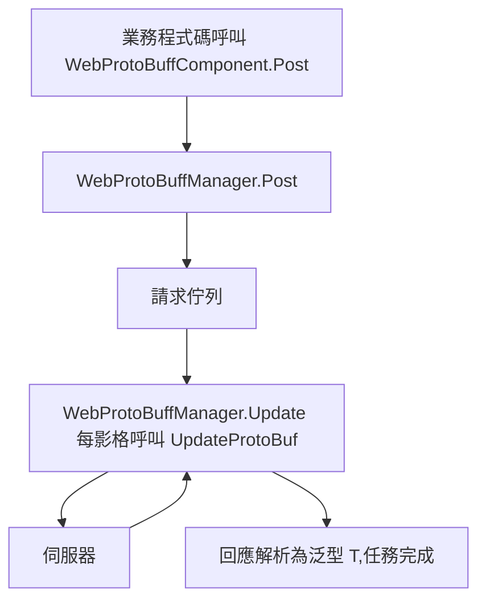

# 運作原理:元件、管理器與請求管線

本頁解釋 `WebProtoBuffComponent`(Unity 元件入口)與 `WebProtoBuffManager`(框架模組)如何協作完成一次 Protobuf HTTP 請求：元件在 `Awake` 中從 `GameFrameworkEntry` 取出 `IWebProtoBuffManager` 模組並同步逾時設定，業務程式碼呼叫 `Post<T>` 後由管理器處理請求佇列，並在每影格 `Update` 中推進佇列直到回應被解析為泛型 `T`。

## 元件與管理器：職責一覽

| 類型 | 角色 | 關鍵成員/說明 |
|------|------|---------------|
| `WebProtoBuffComponent` | Unity 場景入口元件(MonoBehaviour) | `Post<T>(url, message)`、`Timeout`;掛載選單 `GameFrameX/Web ProtoBuff`,自動相依 `GameFrameXWebProtoBuffCroppingHelper` |
| `IWebProtoBuffManager` | 管理器介面 | `Task<T> Post<T>(string url, MessageObject message)`(需巨集 `ENABLE_GAME_FRAME_X_WEB_PROTOBUF_NETWORK`)、`float Timeout { get; set; }` |
| `WebProtoBuffManager` | 框架模組實作(partial 類別) | 建構時 `MaxConnectionPerServer = 8`、`Timeout = 5f`;每影格 `Update` 呼叫 `UpdateProtoBuf` 處理請求佇列;`Shutdown` 呼叫 `ShutdownProtoBuf` |

`WebProtoBuffManager` 是 partial 類別,`UpdateProtoBuf` / `ShutdownProtoBuf` 等 Protobuf 相關實作分佈在部分類別檔案 [WebProtoBuffManager.ProtoBuf.cs](https://github.com/GameFrameX/com.gameframex.unity.web.protobuff/blob/main/Runtime/Web/WebProtoBuffManager.ProtoBuf.cs) 與 [WebProtoBuffManager.WebProtoBufData.cs](https://github.com/GameFrameX/com.gameframex.unity.web.protobuff/blob/main/Runtime/Web/WebProtoBuffManager.WebProtoBufData.cs) 中。

## 請求管線



按執行順序拆解：

1. **業務層呼叫元件**:`WebProtoBuffComponent.Post<T>(url, message)` 直接把參數轉交給 `m_WebProtoBuffManager.Post<T>(url, message)`,元件本身不做任何網路處理。此方法與介面方法一樣，僅在定義了 `ENABLE_GAME_FRAME_X_WEB_PROTOBUF_NETWORK` 巨集時編譯。
2. **管理器接收請求**:`WebProtoBuffManager` 實作 `IWebProtoBuffManager.Post<T>`;根據介面文件，請求訊息主體由參數 `message` 提供，回應會被解析為指定的泛型類型 `T`(約束為 `MessageObject` 且實作 `IResponseMessage`)。
3. **每影格驅動佇列**：框架模組的 `Update(elapseSeconds, realElapseSeconds)` 在 `lock (m_StringBuilder)` 保護下呼叫 `UpdateProtoBuf`,註解明確指出其職責是「更新處理請求佇列」。
4. **逾時控制**:`Timeout`(秒)賦值時會同步換算 `RequestTimeout = TimeSpan.FromSeconds(value)`,逾時即生效。
5. **關閉清理**:`Shutdown()` 呼叫 `ShutdownProtoBuf()` 清理資源。

## 初始化與生命週期

元件 `Awake` 的關鍵動作(讀取原始碼原文)：

```csharp
protected override void Awake()
{
    ImplementationComponentType = Utility.Assembly.GetType(componentType);
    InterfaceComponentType = typeof(IWebProtoBuffManager);
    base.Awake();
    m_WebProtoBuffManager = GameFrameworkEntry.GetModule<IWebProtoBuffManager>();
    if (m_WebProtoBuffManager == null)
    {
        Log.Fatal("Web manager is invalid.");
        return;
    }

    m_WebProtoBuffManager.Timeout = m_Timeout;
}
```

Source: [WebProtoBuffComponent.cs](https://github.com/GameFrameX/com.gameframex.unity.web.protobuff/blob/main/Runtime/Web/WebProtoBuffComponent.cs#L77-L90)

要點：

- 管理器實例不是元件自己 new 的，而是透過 `GameFrameworkEntry.GetModule<IWebProtoBuffManager>()` 取得；取不到時直接 `Log.Fatal("Web manager is invalid.")` 並傳回。
- Inspector 上設定的 `m_Timeout`(預設 `5f`,Tooltip「逾時時間.單位：秒」)在 `Awake` 結尾同步給管理器。
- 元件帶有 `[RequireComponent(typeof(GameFrameXWebProtoBuffCroppingHelper))]`,掛載時會自動附加裁剪輔助元件；同時是 `[DisallowMultipleComponent]`,同一 GameObject 只能有一個。

## 介面契約速查

| 成員 | 簽章 | 說明 |
|------|------|------|
| `Post<T>` | `Task<T> Post<T>(string url, GameFrameX.Network.Runtime.MessageObject message) where T : MessageObject, IResponseMessage` | 傳送 Protobuf 訊息的 POST 請求，回應解析為 `T`;僅在 `ENABLE_GAME_FRAME_X_WEB_PROTOBUF_NETWORK` 巨集下可用 |
| `Timeout` | `float Timeout { get; set; }` | POST 請求逾時時間(秒)，元件預設 `5f` |

介面原文參考 [IWebProtoBuffManager.cs](https://github.com/GameFrameX/com.gameframex.unity.web.protobuff/blob/main/Runtime/Web/IWebProtoBuffManager.cs#L9-L29):

```csharp
public interface IWebProtoBuffManager
{
#if ENABLE_GAME_FRAME_X_WEB_PROTOBUF_NETWORK
    Task<T> Post<T>(string url, GameFrameX.Network.Runtime.MessageObject message) where T : GameFrameX.Network.Runtime.MessageObject, GameFrameX.Network.Runtime.IResponseMessage;
#endif
    float Timeout { get; set; }
}
```

Source: [IWebProtoBuffManager.cs](https://github.com/GameFrameX/com.gameframex.unity.web.protobuff/blob/main/Runtime/Web/IWebProtoBuffManager.cs#L9-L29)

`WebProtoBuffManager` 自身的公開設定項：

| 成員 | 類型/預設值 | 說明 |
|------|-------------|------|
| `MaxConnectionPerServer` | `int`,建構時設為 `8` | 每個伺服器的最大連線數 |
| `RequestTimeout` | `TimeSpan` | 請求逾時時間，由 `Timeout`(秒)換算而來 |

```csharp
public WebProtoBuffManager()
{
    MaxConnectionPerServer = 8;
    Timeout = 5f;
}
```

Source: [WebProtoBuffManager.cs](https://github.com/GameFrameX/com.gameframex.unity.web.protobuff/blob/main/Runtime/Web/WebProtoBuffManager.cs#L26-L31)

## 背景

- **元件/模組分離**:`WebProtoBuffComponent` 只做參數轉發與 Inspector 序列化(逾時值)，真正的佇列驅動在 `WebProtoBuffManager.Update` 中完成——這就是為什麼請求能在 Unity 主迴圈裡被逐影格推進，而業務端取得的卻是 `Task<T>` 非同步結果。
- **URL 組裝**:`UrlHandler(string url, Dictionary<string, string> queryString)` 負責把查詢參數字典串接到 URL 上，鍵值經 `Uri.EscapeDataString` 逸出；重複使用一個 `StringBuilder(256)` 減少 GC。
- 原始碼中未找到 `UpdateProtoBuf` / `ShutdownProtoBuf` 部分實作的更多細節(讀取預算限制，且部分檔案未展開)，需要時可直接檢視 [WebProtoBuffManager.ProtoBuf.cs](https://github.com/GameFrameX/com.gameframex.unity.web.protobuff/blob/main/Runtime/Web/WebProtoBuffManager.ProtoBuf.cs)。

## 相關連結

- [WebProtoBuffComponent.cs](https://github.com/GameFrameX/com.gameframex.unity.web.protobuff/blob/main/Runtime/Web/WebProtoBuffComponent.cs) — Unity 元件入口,`Awake` 初始化與 `Post<T>` 轉發
- [IWebProtoBuffManager.cs](https://github.com/GameFrameX/com.gameframex.unity.web.protobuff/blob/main/Runtime/Web/IWebProtoBuffManager.cs) — 管理器介面契約
- [WebProtoBuffManager.cs](https://github.com/GameFrameX/com.gameframex.unity.web.protobuff/blob/main/Runtime/Web/WebProtoBuffManager.cs) — 管理器主要部分類別：逾時、每影格 `Update`、URL 標準化
- [WebProtoBuffManager.ProtoBuf.cs](https://github.com/GameFrameX/com.gameframex.unity.web.protobuff/blob/main/Runtime/Web/WebProtoBuffManager.ProtoBuf.cs) — Protobuf 請求佇列實作部分類別
- [WebProtoBuffManager.WebProtoBufData.cs](https://github.com/GameFrameX/com.gameframex.unity.web.protobuff/blob/main/Runtime/Web/WebProtoBuffManager.WebProtoBufData.cs) — 請求/回應資料結構部分類別
- [GameFrameXWebProtoBuffCroppingHelper.cs](https://github.com/GameFrameX/com.gameframex.unity.web.protobuff/blob/main/Runtime/GameFrameXWebProtoBuffCroppingHelper.cs) — 元件自動相依的裁剪輔助類別
- 官方文件：https://gameframex.doc.alianblank.com/