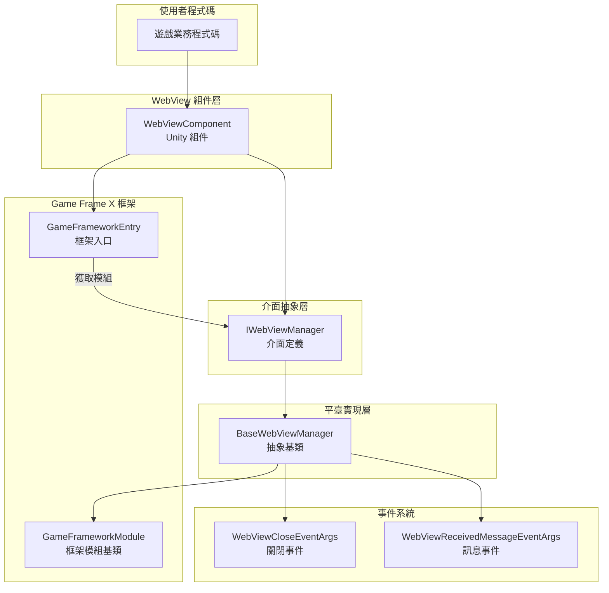
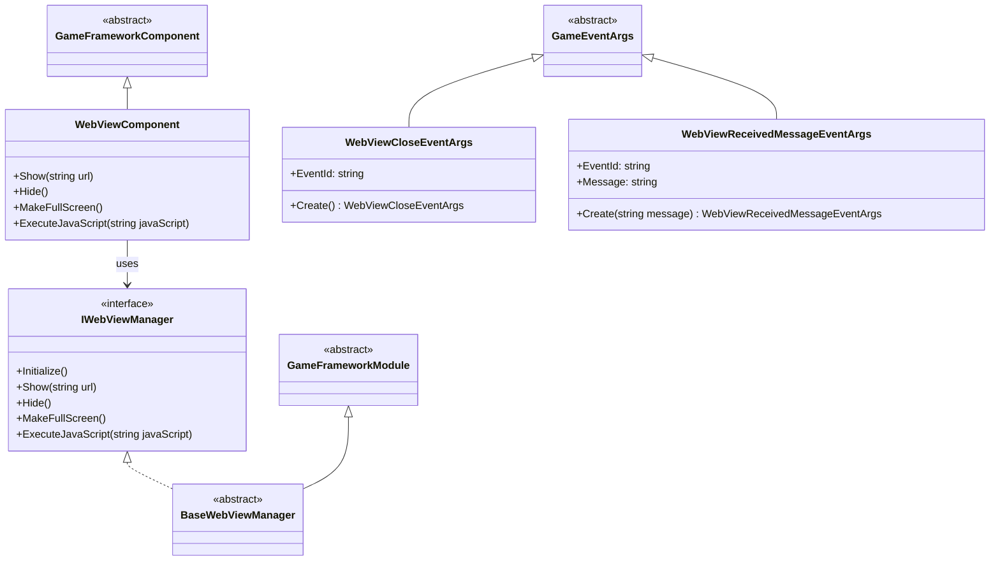
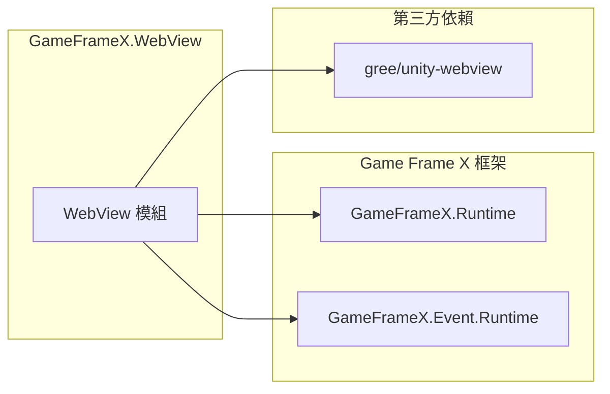

# 概述

`Game Frame X Web View` 是 Game Frame X 遊戲框架的 WebView 組件，為 Unity 遊戲提供嵌入式網頁顯示功能。該組件基於 [gree/unity-webview](https://github.com/gree/unity-webview) 進行封裝，提供了更簡潔的 API 和更便捷的整合方式。

## 專案簡介

GameFrameX WebView 是 Game Frame X 遊戲框架生態的一部分，專門用於解決 Unity 遊戲內嵌入網頁內容的需求。透過該組件，開發者可以：

- 在 Unity 遊戲中顯示外部網頁內容
- 實現 C# 與 JavaScript 的雙向通訊
- 支援 Android 和 iOS 主流移動平臺
- 與 Game Frame X 框架其他模組無縫整合

## 核心功能

| 功能 | 說明 |
|------|------|
| 網頁顯示 | 在 Unity 場景中嵌入並顯示 Web 頁面 |
| JavaScript 互動 | 支援 C# 與網頁 JavaScript 程式碼雙向呼叫 |
| 全屏顯示 | 提供全屏模式支援 |
| 平臺適配 | 自動適配 Android 和 iOS 平臺 |
| 事件系統 | 提供 WebView 關閉和訊息接收事件 |

## 系統架構

### 架構說明

1. **WebViewComponent**: Unity 組件層，提供面向使用者的 API。開發者透過掛載此組件到 GameObject 上來使用 WebView 功能。

2. **IWebViewManager**: 介面層，定義了 WebView 管理器的標準操作，包括初始化、顯示、隱藏、全屏和 JavaScript 執行等方法。

3. **BaseWebViewManager**: 抽象基類，繼承自 GameFrameworkModule，提供平臺相關的具體實現模板。平臺實現類（如 AndroidWebViewManager、iOSWebViewManager）繼承此類。

4. **GameFrameworkModule**: Game Frame X 框架的模組基類，提供模組生命週期管理和框架整合能力。

5. **事件系統**: 透過 GameFrameX 的事件系統分發 WebView 相關事件，包括關閉事件和訊息接收事件。

## 模組設計

## 平臺支援

| 平臺 | 支援狀態 | 說明 |
|------|----------|------|
| Android | ✅ 支援 | 透過 unity-webview Android 外掛實現 |
| iOS | ✅ 支援 | 透過 unity-webview iOS 外掛實現 |
| Windows | ⚠️ 基礎支援 | 僅編輯器環境支援 |
| macOS | ⚠️ 基礎支援 | 僅編輯器環境支援 |
| WebGL | ❌ 不支援 | WebGL 平臺無法巢狀 WebView |

## 依賴關係

根據 `package.json` 的配置，本模組依賴以下組件：

- **GameFrameX.Runtime** (`com.gameframex.unity: 1.0.0`): 框架核心執行時
- **GameFrameX.Event.Runtime**: 框架事件系統
- **gree/unity-webview**: 底層 WebView 實現（需單獨安裝）

## 使用場景

GameFrameX WebView 適用於以下場景：

1. **遊戲內公告**: 使用 WebView 顯示遊戲公告、活動頁面
2. **登入驗證**: 整合第三方登入或 SDK 的 Web 頁面
3. **商店展示**: 在遊戲內展示虛擬商品商店
4. **幫助文件**: 顯示遊戲幫助或教程網頁
5. **社群功能**: 整合論壇或社群頁面
6. **廣告展示**: 顯示 Web 形式的廣告內容

## 相關連結

- [安裝指南](./2-installation) - 詳細安裝步驟
- [快速入門](./3-getting-started) - 快速上手教程
- [API 參考](./4-api-reference) - 完整 API 文件
- [平臺配置](./5-platforms) - Android 和 iOS 平臺配置
- [事件系統](./6-events) - 事件系統詳解
- [常見問題](./7-troubleshooting) - 常見問題解答
- [Game Frame X 官網](https://gameframex.doc.alianblank.com)
- [gree/unity-webview](https://github.com/gree/unity-webview)
