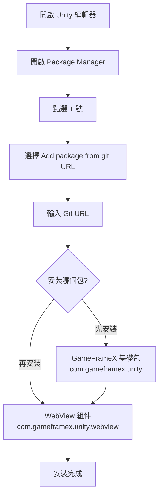

# 安裝

GameFrameX WebView 組件的安裝指南。本節將詳細介紹如何正確安裝和配置 WebView 外掛。

## 概述

GameFrameX WebView 是 GameFrameX 遊戲框架的 Web 檢視組件，基於 [gree/unity-webview](https://github.com/gree/unity-webview) 進行封裝，提供更簡潔的 API 和更便捷的整合方式。該組件允許在 Unity 遊戲中嵌入和顯示 Web 內容，支援在 Android 和 iOS 平臺上執行。

## 環境要求

在安裝 WebView 組件之前，請確保您的開發環境滿足以下要求：

| 要求項 | 最低版本 | 說明 |
|--------|----------|------|
| Unity 編輯器 | 2019.4 | LTS 版本推薦 |
| .NET Framework | 4.6.1 | Unity 指令碼執行時 |
| GameFrameX 基礎包 | 1.0.0 | 必須先安裝 |

## 安裝步驟

### 步驟 1：安裝 GameFrameX 基礎包

在安裝 WebView 組件之前，必須先安裝 GameFrameX 基礎框架包。這是所有 GameFrameX 組件的依賴基礎。

1. 在 Unity 編輯器中開啟 `Package Manager`（選單：`Window` → `Package Manager`）
2. 點選左上角的 `+` 號，選擇 `Add package from git URL...`
3. 輸入 GameFrameX 基礎包地址：

```
https://github.com/GameFrameX/com.gameframex.unity.git
```

4. 點選 `Add` 等待安裝完成

### 步驟 2：安裝 WebView 組件

GameFrameX 基礎包安裝完成後，按照以下步驟安裝 WebView 組件：

1. 在 Unity 編輯器中開啟 `Package Manager`（選單：`Window` → `Package Manager`）
2. 確保 `Package` 下拉選單選擇的是 `My Packages` 或 `In Project`
3. 點選左上角的 `+` 號，選擇 `Add package from git URL...`
4. 輸入 WebView 組件的 Git 地址：

```
https://github.com/GameFrameX/com.gameframex.unity.webview.git
```

5. 點選 `Add` 等待安裝完成



### 步驟 3：驗證安裝

安裝完成後，請按照以下步驟驗證 WebView 組件是否正確安裝：

1. 在 Unity 編輯器中，點選選單 `GameObject` → `Create Empty` 建立一個空遊戲物件
2. 點選該空遊戲物件，在 Inspector 面板中點選 `Add Component` 按鈕
3. 在組件搜尋框中輸入 `WebView`
4. 確認 `WebView Component` 出現在搜尋結果中

```csharp
// 驗證方式二：透過程式碼檢查
using GameFrameX.WebView.Runtime;
using UnityEngine;

public class WebViewCheck : MonoBehaviour
{
    void Start()
    {
        // 嘗試獲取 WebView 組件
        var webView = FindObjectOfType<WebViewComponent>();
        if (webView != null)
        {
            Debug.Log("WebView 組件安裝成功！");
        }
    }
}
```

## 包結構說明

安裝完成後，WebView 組件會在您的 Unity 專案中建立以下檔案結構：

| 目錄/檔案 | 說明 |
|-----------|------|
| `Editor/` | 編輯器相關程式碼，包括組件檢查器 |
| `Runtime/` | 執行時核心程式碼 |
| `Runtime/WebViewComponent.cs` | WebView 核心組件 |
| `Runtime/IWebViewManager.cs` | WebView 管理器介面 |
| `Runtime/BaseWebViewManager.cs` | WebView 管理器基類 |
| `Runtime/EventArgs/` | 事件引數定義 |

## 平臺配置

安裝完成後，根據目標平臺可能需要進行額外配置：

### Android 平臺

WebView 組件對 Android 平臺的支援依賴於底層的 unity-webview 外掛。通常情況下無需額外配置，但如果遇到問題，請參考 [平臺配置](./5-platforms) 文件。

### iOS 平臺

iOS 平臺同樣依賴於 unity-webview 外掛。如需配置，請參考 [平臺配置](./5-platforms) 文件中的 iOS 部分。

## 常見安裝問題

### 問題 1：無法從 Git URL 安裝

**原因：** Unity 版本過低或網路問題

**解決方案：**
- 確保 Unity 版本為 2019.4 或更高
- 檢查網路連線
- 嘗試使用 CNPM 映象源

### 問題 2：依賴包未找到

**原因：** GameFrameX 基礎包未安裝

**解決方案：**
- 首先安裝 `com.gameframex.unity` 基礎包
- 確保基礎包版本為 1.0.0 或更高

### 問題 3：編譯錯誤

**原因：** 程式集定義引用缺失

**解決方案：**
- 重新開啟 Unity 專案
- 在 Package Manager 中檢查所有依賴包是否正確安裝
- 檢視 Console 視窗的具體錯誤資訊

## 解除安裝 WebView 組件

如需解除安裝 WebView 組件：

1. 在 Unity 編輯器中開啟 `Package Manager`
2. 在包列表中找到 `Game Frame X Web View`
3. 點選該包，在右側面板點選 `Remove` 按鈕

> **注意：** 解除安裝前請確保專案中沒有使用 WebView 功能的程式碼。

## 相關連結

- [快速入門](./3-getting-started) - 學習如何使用 WebView 組件
- [API 參考](./4-api-reference) - 完整的 API 文件
- [事件系統](./6-events) - WebView 事件詳解
- [常見問題](./7-troubleshooting) - 常見問題與解決方案
- [GameFrameX 官網](https://gameframex.doc.alianblank.com) - 框架文件
- [unity-webview 倉庫](https://github.com/gree/unity-webview) - 底層外掛
