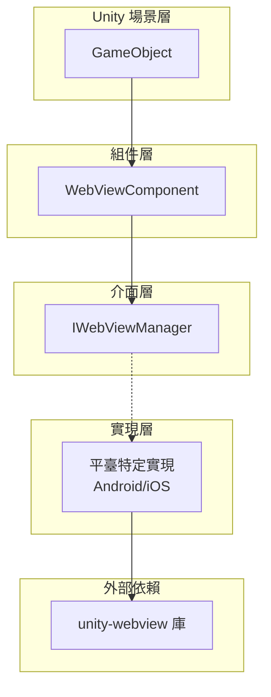
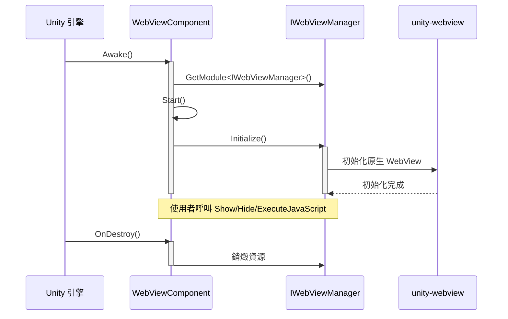

# 快速入門

本指南將幫助您快速上手 Game Frame X Web View 組件，瞭解如何在 Unity 專案中整合和使用 WebView 功能。

## 概述

Game Frame X Web View 是對 [gree/unity-webview](https://github.com/gree/unity-webview) 的封裝，提供了更簡潔的 API 和更方便的整合方式。透過本組件，您可以在 Unity 遊戲中輕鬆嵌入 Web 頁面，並實現 C# 與 JavaScript 的雙向通訊。

## 核心概念

在開始之前，瞭解以下核心組件的角色非常重要：



- **WebViewComponent**: Unity 組件，需要掛載到場景中的 GameObject 上
- **IWebViewManager**: 定義 WebView 操作的統一介面
- **平臺實現**: 根據執行平臺自動選擇合適的實現（Android/iOS）

## 基本使用流程

### 步驟 1: 在場景中新增 WebView 組件

1. 在 Unity 編輯器中，開啟您的場景
2. 建立一個新的空 GameObject（右鍵 → Create Empty）
3. 選中該 GameObject，點選 Inspector 面板的 "Add Component"
4. 搜尋並新增 "WebView" 組件

```csharp
// 組件路徑: Game Framework → WebView
// Source: [WebViewComponent.cs](https://github.com/GameFrameX/com.gameframex.unity.webview/blob/main/Runtime/WebViewComponent.cs#L10-L14)
[DisallowMultipleComponent]
[AddComponentMenu("Game Framework/WebView")]
[UnityEngine.Scripting.Preserve]
public partial class WebViewComponent : GameFrameworkComponent
{
```

### 步驟 2: 配置組件（可選）

在 Inspector 面板中，您可以配置以下選項：

| 配置項 | 型別 | 說明 |
|--------|------|------|
| Implementation Component Type | string | 平臺特定的 IWebViewManager 實現型別 |

> **注意**: 預設情況下，框架會自動根據執行平臺選擇合適的實現，無需手動配置。

### 步驟 3: 在程式碼中獲取並使用 WebView

以下是在程式碼中使用 WebViewComponent 的基本方式：

```csharp
using GameFrameX.WebView.Runtime;
using UnityEngine;

public class Example : MonoBehaviour
{
    private WebViewComponent _webView;

    void Start()
    {
        // 獲取 WebViewComponent 例項
        _webView = FindObjectOfType<WebViewComponent>();
        
        if (_webView != null)
        {
            // 顯示 WebView 並載入指定 URL
            _webView.Show("https://gameframex.doc.alianblank.com");
        }
    }
}
```
> Source: [README.md](https://github.com/GameFrameX/com.gameframex.unity.webview/blob/main/README.md#L31-L43)

## 常用操作示例

### 顯示 Web 頁面

```csharp
// 顯示 WebView 並載入 URL
webView.Show("https://example.com");
```

### 隱藏 WebView

```csharp
// 隱藏 WebView（不銷燬，只是不可見）
webView.Hide();
```

### 全屏顯示

```csharp
// 將 WebView 設定為全屏模式
webView.MakeFullScreen();
```

### 執行 JavaScript

```csharp
// 在當前載入的 Web 頁面上執行 JavaScript 程式碼
webView.ExecuteJavaScript("document.title = 'Hello from Unity!'");
```

```csharp
// 從 JavaScript 呼叫 C# 後再執行其他 JavaScript
webView.ExecuteJavaScript("Unity.call('messageFromJS');");
```

## 高階使用場景

### 場景 1: 使用者登入介面

在遊戲中整合第三方登入（如 Google 登入、Apple 登入）時，WebView 是常用的解決方案：

```csharp
public class LoginManager : MonoBehaviour
{
    private WebViewComponent _webView;

    void Start()
    {
        _webView = FindObjectOfType<WebViewComponent>();
    }

    public void ShowLogin(string provider)
    {
        // 顯示登入頁面
        string loginUrl = $"https://example.com/login?provider={provider}";
        _webView.Show(loginUrl);
    }

    public void OnLoginSuccess(string token)
    {
        // 處理登入成功
        Debug.Log($"Login successful, token: {token}");
        
        // 隱藏 WebView
        _webView.Hide();
        
        // 載入使用者資料等後續操作...
    }

    public void OnLoginFailed(string error)
    {
        Debug.LogError($"Login failed: {error}");
        _webView.Hide();
    }
}
```

### 場景 2: 隱私政策與使用者協議

遊戲上線前需要展示隱私政策，使用 WebView 可以方便地展示 HTML 內容：

```csharp
public class PrivacyPolicyController : MonoBehaviour
{
    private WebViewComponent _webView;

    void Awake()
    {
        _webView = FindObjectOfType<WebViewComponent>();
    }

    public void ShowPrivacyPolicy()
    {
        // 載入本地 HTML 檔案
        _webView.Show(Application.dataPath + "/PrivacyPolicy.html");
    }

    public void ShowTermsOfService()
    {
        // 載入線上服務條款
        _webView.Show("https://example.com/terms");
    }
}
```

### 場景 3: 遊戲內瀏覽器

有些遊戲提供內建瀏覽器功能，讓玩家檢視攻略或社群：

```csharp
public class InGameBrowser : MonoBehaviour
{
    [SerializeField] private WebViewComponent _webView;
    [SerializeField] private string _defaultUrl = "https://gameframex.doc.alianblank.com";

    void Start()
    {
        // 開啟遊戲官網
        _webView.Show(_defaultUrl);
    }

    public void NavigateTo(string url)
    {
        _webView.Show(url);
    }

    public void Refresh()
    {
        // 重新整理當前頁面
        _webView.ExecuteJavaScript("location.reload();");
    }

    public void CloseBrowser()
    {
        _webView.Hide();
    }

    public void ToggleFullScreen()
    {
        _webView.MakeFullScreen();
    }
}
```

### 場景 4: C# 與 JavaScript 雙向通訊

```csharp
public class JSBridgeExample : MonoBehaviour
{
    private WebViewComponent _webView;

    void Start()
    {
        _webView = FindObjectOfType<WebViewComponent>();
        
        // 註冊 JavaScript 訊息回呼
        // 注意: 具體回呼方式取決於底層 unity-webview 實現
    }

    // 呼叫 JavaScript 獲取資料
    public void GetUserData()
    {
        string jsCode = @"
            var userData = {
                name: 'Player1',
                level: 10,
                gold: 1000
            };
            JSON.stringify(userData);
        ";
        _webView.ExecuteJavaScript(jsCode);
    }

    // 向 JavaScript 傳送訊息
    public void SendMessageToJS(string message)
    {
        _webView.ExecuteJavaScript($"console.log('Unity says: {message}');");
    }
}
```

## 生命週期管理



**生命週期說明：**

1. **Awake()**: 獲取 IWebViewManager 例項
2. **Start()**: 呼叫 Initialize() 初始化 WebView
3. **使用者操作**: 呼叫 Show/Hide/MakeFullScreen/ExecuteJavaScript
4. **OnDestroy()**: 銷燬時自動釋放資源

## 平臺注意事項

- **Android**: 需要配置 AndroidManifest.xml 許可權
- **iOS**: 需要配置 iOS 平臺設定

> 具體平臺配置請參閱 [平臺配置](./5-platforms) 文件。

## 常見問題

1. **WebView 不顯示？**
   - 檢查是否正確新增了 WebViewComponent
   - 確認平臺實現是否正確配置

2. **無法載入 URL？**
   - 檢查網路許可權是否配置
   - 確認 URL 是否有效

3. **JavaScript 執行無效？**
   - 確認 WebView 已正確初始化
   - 檢查 JavaScript 語法是否正確

## 相關連結

- [概述](./1-overview) - 瞭解更多關於 WebView 組件的整體設計
- [安裝](./2-installation) - 詳細的安裝指南
- [API 參考](./4-api-reference) - 完整的 API 文件
- [平臺配置](./5-platforms) - Android 和 iOS 平臺特定配置
- [事件系統](./6-events) - 瞭解事件機制
- [常見問題](./7-troubleshooting) - 常見問題與解決方案
