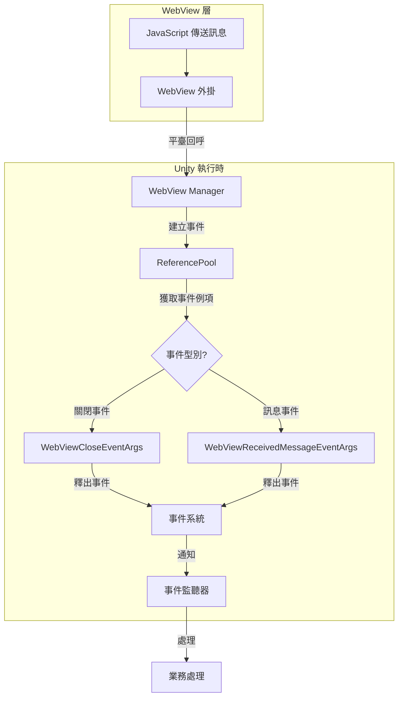

# 事件系統

本文件介紹 GameFrameX WebView 組件的事件系統，解釋事件型別、資料結構以及如何在專案中使用這些事件。

## 概述

GameFrameX WebView 組件採用事件驅動架構，透過事件系統實現 WebView 與 Unity 應用程式之間的通訊。該事件系統基於 GameFrameX 核心框架的 `GameEventArgs` 類構建，支援物件池化以最佳化效能。

事件系統主要提供兩類事件：
- **WebView 關閉事件** - 當 WebView 關閉時觸發
- **WebView 訊息接收事件** - 當從 WebView 收到訊息時觸發

## 架構設計

```mermaid
classDiagram
    class GameEventArgs {
        <<abstract>>
        +string Id { get; }
        +void Clear()
    }

    class WebViewCloseEventArgs {
        +static string EventId
        +static WebViewCloseEventArgs Create()
    }

    class WebViewReceivedMessageEventArgs {
        +static string EventId
        +string Message { get; }
        +static WebViewReceivedMessageEventArgs Create(string message)
    }

    class ReferencePool {
        +static T Acquire~T~()
        +static void Release(T instance)
    }

    GameEventArgs <|-- WebViewCloseEventArgs
    GameEventArgs <|-- WebViewReceivedMessageEventArgs
    WebViewCloseEventArgs --> ReferencePool : uses
    WebViewReceivedMessageEventArgs --> ReferencePool : uses
```

### 組件說明

| 組件 | 說明 |
|------|------|
| `GameEventArgs` | 事件引數基類，來自 GameFrameX 核心執行時 |
| `WebViewCloseEventArgs` | WebView 關閉事件引數 |
| `WebViewReceivedMessageEventArgs` | WebView 訊息接收事件引數 |
| `ReferencePool` | 物件池，用於事件物件的複用 |

## 事件型別詳解

### WebViewCloseEventArgs

`WebViewCloseEventArgs` 表示 WebView 關閉事件，當 WebView 視窗關閉時觸發。

```csharp
// Source: Runtime/EventArgs/WebViewCloseEventArgs.cs#L15-L41
public sealed class WebViewCloseEventArgs : GameEventArgs
{
    /// <summary>
    /// WebView訊息關閉事件ID
    /// </summary>
    public static readonly string EventId = typeof(WebViewCloseEventArgs).FullName;

    public override void Clear()
    {
    }

    public override string Id
    {
        get { return EventId; }
    }

    /// <summary>
    /// 建立WebView訊息關閉事件
    /// </summary>
    /// <returns></returns>
    public static WebViewCloseEventArgs Create()
    {
        var eventArgs = ReferencePool.Acquire<WebViewCloseEventArgs>();
        return eventArgs;
    }
}
```

**特點：**
- 無額外資料載荷
- 使用物件池管理例項，避免頻繁 GC

### WebViewReceivedMessageEventArgs

`WebViewReceivedMessageEventArgs` 表示從 WebView 收到的訊息事件，當 JavaScript 與 Unity 通訊時觸發。

```csharp
// Source: Runtime/EventArgs/WebViewReceivedMessageEventArgs.cs#L9-L42
public sealed class WebViewReceivedMessageEventArgs : GameEventArgs
{
    /// <summary>
    /// WebView訊息接收事件ID
    /// </summary>
    public static readonly string EventId = typeof(WebViewReceivedMessageEventArgs).FullName;

    public override void Clear()
    {
    }

    public override string Id
    {
        get { return EventId; }
    }

    /// <summary>
    /// 建立WebView訊息接收事件
    /// </summary>
    /// <param name="message">訊息內容</param>
    /// <returns></returns>
    public static WebViewReceivedMessageEventArgs Create(string message)
    {
        var eventArgs = ReferencePool.Acquire<WebViewReceivedMessageEventArgs>();
        eventArgs.Message = message;
        return eventArgs;
    }

    /// <summary>
    /// 事件訊息
    /// </summary>
    public string Message { get; private set; }
}
```

**屬性說明：**
| 屬性 | 型別 | 說明 |
|------|------|------|
| Message | string | 從 WebView 接收到的訊息內容 |

## 事件流轉流程



## 訂閱與處理事件

要訂閱 GameFrameX WebView 事件，您需要使用 GameFrameX 核心框架的事件系統。以下是訂閱事件的基本模式：

### 訂閱 WebView 關閉事件

```csharp
// 訂閱事件
EventCenter.EventSystem.Subscribe(WebViewCloseEventArgs.EventId, OnWebViewClosed);

// 事件處理方法
private void OnWebViewClosed(object sender, GameEventArgs e)
{
    var args = e as WebViewCloseEventArgs;
    // 處理關閉事件
    Debug.Log("WebView 已關閉");
}

// 取消訂閱
EventCenter.EventSystem.Unsubscribe(WebViewCloseEventArgs.EventId, OnWebViewClosed);
```

### 訂閱 WebView 訊息接收事件

```csharp
// 訂閱事件
EventCenter.EventSystem.Subscribe(WebViewReceivedMessageEventArgs.EventId, OnMessageReceived);

// 事件處理方法
private void OnMessageReceived(object sender, GameEventArgs e)
{
    var args = e as WebViewReceivedMessageEventArgs;
    if (args != null)
    {
        // 處理接收到的訊息
        Debug.Log($"收到 WebView 訊息: {args.Message}");
    }
}

// 取消訂閱
EventCenter.EventSystem.Unsubscribe(WebViewReceivedMessageEventArgs.EventId, OnMessageReceived);
```

## 物件池機制

GameFrameX WebView 事件系統使用 `ReferencePool` 進行物件池化管理，這是為了最佳化效能而設計的：

1. **事件建立**：透過 `Create()` 方法從物件池獲取例項
2. **事件處理**：處理完成後，事件例項會被自動回收
3. **優勢**：減少垃圾回收壓力，提高遊戲效能

```csharp
// 從物件池獲取事件例項
var eventArgs = ReferencePool.Acquire<WebViewReceivedMessageEventArgs>();
eventArgs.Message = "Hello Unity";

// 使用後自動回收 - 由事件系統處理
```

## 事件 ID 引用

| 事件型別 | EventId |
|----------|---------|
| WebViewCloseEventArgs | `GameFrameX.WebView.Runtime.WebViewCloseEventArgs` |
| WebViewReceivedMessageEventArgs | `GameFrameX.WebView.Runtime.WebViewReceivedMessageEventArgs` |

## 相關連結

- [API 參考](./4-api-reference) - WebView 完整 API 文件
- [快速入門](./3-getting-started) - WebView 基礎使用教程
- [平臺配置](./5-platforms) - Android 和 iOS 平臺配置
- [GameFrameX 核心框架](https://gameframex.doc.alianblank.com) - 事件系統底層實現
