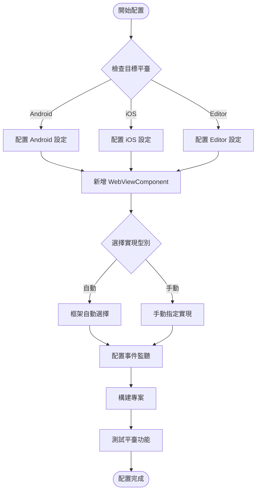

# 平臺配置

本文件介紹 GameFrameX WebView 組件在不同平臺上的配置方法，包括平臺選擇機制、可用的平臺實現以及配置選項。

## 概述

GameFrameX WebView 組件採用平臺無關的架構設計，透過 `IWebViewManager` 介面定義統一的 WebView 操作 API。框架根據執行時平臺自動選擇合適的實現，也支援手動配置特定平臺的管理器。

### 支援的平臺

| 平臺 | 支援狀態 | 說明 |
|------|----------|------|
| Android | ✅ 支援 | 基於 gree/unity-webview 的 Android 實現 |
| iOS | ✅ 支援 | 基於 gree/unity-webview 的 iOS 實現 |
| WebGL | ⚠️ 有限支援 | WebGL 平臺上的 WebView 功能受限 |
| Windows/Mac Editor | ✅ 支援 | 編輯器環境下可進行除錯 |

## 架構設計

```mermaid
flowchart TD
    subgraph Client["客戶端層"]
        WC[WebViewComponent]
    end

    subgraph Interface["介面層"]
        IWM[IWebViewManager 介面]
    end

    subgraph Abstract["抽象層"]
        BWM[BaseWebViewManager]
    end

    subgraph Implementations["平臺實現層"]
        AndroidWM[AndroidWebViewManager]
        iOSWM[iOSWebViewManager]
        EditorWM[EditorWebViewManager]
    end

    subgraph Native["原生層"]
        AndroidNative[Android WebView]
        iOSNative[UIWebView/WKWebView]
    end

    WC --> IWM
    IWM <|.. BWM
    BWM <|-- AndroidWM
    BWM <|-- iOSWM
    BWM <|-- EditorWM
    AndroidWM --> AndroidNative
    iOSWM --> iOSNative
```

### 組件職責

| 組件 | 職責 |
|------|------|
| `WebViewComponent` | Unity 組件入口，處理生命週期並轉發呼叫 |
| `IWebViewManager` | 定義 WebView 操作的統一介面 |
| `BaseWebViewManager` | 提供抽象基類，繼承 GameFrameworkModule |
| 平臺實現類 | 實現特定平臺的 WebView 功能 |

## 平臺選擇機制

### 自動選擇

框架透過 GameFrameX 的模組系統自動選擇平臺實現。當呼叫 `GameFrameworkEntry.GetModule<IWebViewManager>()` 時，框架會根據當前執行時平臺查詢並載入對應的實現。

```csharp
// Runtime/WebViewComponent.cs
_webViewManager = GameFrameworkEntry.GetModule<IWebViewManager>();
```
> Source: [WebViewComponent.cs](https://github.com/GameFrameX/com.gameframex.unity.webview/blob/main/Runtime/WebViewComponent.cs#L28)

### 手動配置

在某些場景下，您可能需要手動指定特定的平臺實現。透過 Unity Editor 的 Inspector 面板可以配置：

1. 在場景中建立包含 `WebViewComponent` 的 GameObject
2. 在 Inspector 中找到 **Implementation Type** 下拉選單
3. 選擇 desired 的平臺實現類

```csharp
// WebViewComponent 繼承自 GameFrameworkComponent
// componentType 屬性儲存使用者選擇的實現型別
ImplementationComponentType = Utility.Assembly.GetType(componentType);
```
> Source: [WebViewComponent.cs](https://github.com/GameFrameX/com.gameframex.unity.webview/blob/main/Runtime/WebViewComponent.cs#L24-L25)

## 平臺特定配置

### Android 平臺配置

Android 平臺使用原生 WebView 組件，需要確保以下配置：

**AndroidManifest.xml 許可權：**
```xml
<!-- 需要新增網路許可權 -->
<uses-permission android:name="android.permission.INTERNET" />
```

**gradle 配置：**
```groovy
// 在 PlayerSettings > Publishing Settings > Build
// 確保已包含 unity-webview 的 Android 庫
```

### iOS 平臺配置

iOS 平臺使用 `WKWebView`（iOS 13+）或 `UIWebView`（相容性模式）：

**Info.plist 配置：**
```xml
<!-- 允許載入任意 URL（根據需求配置） -->
<key>NSAppTransportSecurity</key>
<dict>
    <key>NSAllowsArbitraryLoads</key>
    <true/>
</dict>
```

**PlayerSettings 配置：**
- **Resolution and Presentation**: 設定合適的 WebView 渲染模式
- **Other Settings**: 確保 IL2CPP 和 ABI 配置正確

### 編輯器除錯配置

在 Unity Editor 環境下執行時，可以使用編輯器專用的 WebView 實現進行除錯：

```csharp
// 編輯器實現提供了模擬的 WebView 環境
// 方便在開發階段進行功能測試
```

## 配置流程



## 事件系統配置

WebView 組件透過事件系統通知應用程式各種狀態變化。不同平臺的事件行為一致：

| 事件 | 說明 | 適用平臺 |
|------|------|----------|
| `WebViewCloseEventArgs` | WebView 關閉事件 | 所有平臺 |
| `WebViewReceivedMessageEventArgs` | 收到 JavaScript 訊息 | 所有平臺 |

### 事件配置示例

```csharp
using GameFrameX.Event.Runtime;
using GameFrameX.WebView.Runtime;

// 訂閱 WebView 關閉事件
EventManager.Register<WebViewCloseEventArgs>(OnWebViewClosed);

// 訂閱收到訊息事件
EventManager.Register<WebViewReceivedMessageEventArgs>(OnMessageReceived);

private void OnWebViewClosed(object sender, WebViewCloseEventArgs e)
{
    Debug.Log("WebView 已關閉");
}

private void OnMessageReceived(object sender, WebViewReceivedMessageEventArgs e)
{
    Debug.Log($"收到訊息: {e.Message}");
}
```
> Source: [WebViewReceivedMessageEventArgs.cs](https://github.com/GameFrameX/com.gameframex.unity.webview/blob/main/Runtime/EventArgs/WebViewReceivedMessageEventArgs.cs#L30-L35)

## API 參考

### IWebViewManager 介面

所有平臺實現都遵循統一的介面規範：

```csharp
public interface IWebViewManager
{
    /// <summary>
    /// 初始化 WebView 管理器
    /// </summary>
    void Initialize();

    /// <summary>
    /// 顯示 WebView 並載入指定 URL
    /// </summary>
    /// <param name="url">要載入的網頁地址</param>
    void Show(string url);

    /// <summary>
    /// 將 WebView 設定為全屏模式
    /// </summary>
    void MakeFullScreen();

    /// <summary>
    /// 執行 JavaScript 程式碼
    /// </summary>
    /// <param name="javaScript">要執行的 JavaScript 程式碼</param>
    void ExecuteJavaScript(string javaScript);

    /// <summary>
    /// 隱藏 WebView
    /// </summary>
    void Hide();
}
```
> Source: [IWebViewManager.cs](https://github.com/GameFrameX/com.gameframex.unity.webview/blob/main/Runtime/IWebViewManager.cs#L12-L40)

### 基礎抽象類

```csharp
public abstract partial class BaseWebViewManager : GameFrameworkModule, IWebViewManager
{
    /// <summary>
    /// 初始化
    /// </summary>
    public abstract void Initialize();

    /// <summary>
    /// 顯示WebView
    /// </summary>
    /// <param name="url">載入的url</param>
    public abstract void Show(string url);

    /// <summary>
    /// 全屏
    /// </summary>
    public abstract void MakeFullScreen();

    /// <summary>
    /// 執行JavaScript
    /// </summary>
    /// <param name="javaScript">javaScript程式碼</param>
    public abstract void ExecuteJavaScript(string javaScript);

    /// <summary>
    /// 隱藏
    /// </summary>
    public abstract void Hide();
}
```
> Source: [BaseWebViewManager.cs](https://github.com/GameFrameX/com.gameframex.unity.webview/blob/main/Runtime/BaseWebViewManager.cs#L11-L39)

## 常見問題

### Q: 如何為特定平臺使用不同的 WebView 實現？

A: 在 Inspector 面板中手動選擇實現型別，或透過程式碼在執行時動態切換：

```csharp
// 執行時動態設定實現型別
var webView = GetComponent<WebViewComponent>();
// 透過反射或配置系統設定 componentType
```

### Q: WebView 在真機上顯示空白怎麼辦？

A: 檢查以下配置：
1. 確認已新增 INTERNET 許可權（Android）
2. 檢查 Info.plist 中的 App Transport Security 配置
3. 確保 URL 可公開訪問

### Q: 如何在不同平臺使用不同的 URL？

A: 使用平臺條件編譯或執行時檢測：

```csharp
#if UNITY_ANDROID
webView.Show("https://android.example.com");
#elif UNITY_IOS
webView.Show("https://ios.example.com");
#else
webView.Show("https://default.example.com");
#endif
```

## 相關連結

- [概述](./1-overview) - 專案整體介紹
- [快速入門](./3-getting-started) - 快速開始使用
- [API 參考](./4-api-reference) - 完整的 API 文件
- [事件系統](./6-events) - 事件機制詳解
- [常見問題](./7-troubleshooting) - 問題排查指南
- [GameFrameX 官網](https://gameframex.doc.alianblank.com)
- [gree/unity-webview](https://github.com/gree/unity-webview) - 原生 WebView 外掛
