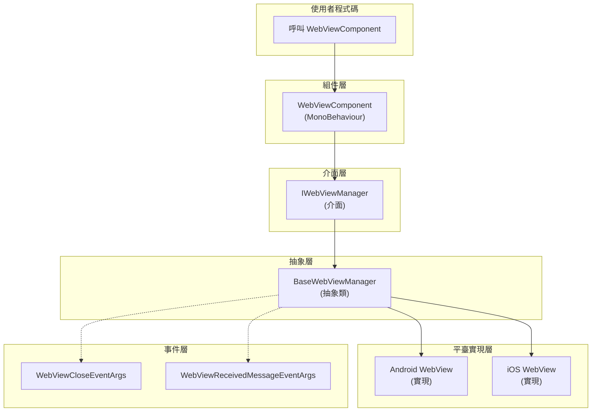

# API 參考

本文件詳細介紹 GameFrameX WebView 組件的完整 API 介面，包括介面定義、組件方法、事件引數等內容。

## 概述

GameFrameX WebView 組件提供了在 Unity 遊戲中嵌入和顯示 Web 內容的完整解決方案。API 設計遵循 GameFrameX 框架規範，透過介面抽象實現平臺無關的核心功能，由各平臺具體實現（基於 gree/unity-webview）提供原生支援。

主要 API 分為以下幾個部分：
- **IWebViewManager 介面** - 定義 WebView 管理的核心抽象
- **WebViewComponent 組件** - Unity 層面的使用者互動入口
- **事件系統** - WebView 狀態變化的通知機制
- **事件引數** - 事件攜帶的資料結構

## 架構



### 架構說明

1. **使用者程式碼層**：透過 `WebViewComponent` 與系統互動
2. **組件層**：`WebViewComponent` 繼承自 `GameFrameworkComponent`，是 Unity 層面的入口點
3. **介面層**：`IWebViewManager` 定義了統一的抽象介面
4. **抽象層**：`BaseWebViewManager` 提供了所有實現的公共基類
5. **平臺實現層**：具體平臺（Android、iOS）的 WebView 實現

## IWebViewManager 介面

`IWebViewManager` 是 WebView 功能的核心介面，定義了所有 WebView 操作的標準抽象。由框架根據執行平臺自動選擇合適的實現。

> Source: [IWebViewManager.cs](https://github.com/GameFrameX/com.gameframex.unity.webview/blob/main/Runtime/IWebViewManager.cs#L1-L41)

### 方法列表

| 方法 | 描述 |
|------|------|
| `Initialize()` | 初始化 WebView 系統 |
| `Show(string url)` | 顯示 WebView 並載入指定 URL |
| `MakeFullScreen()` | 將 WebView 設定為全屏模式 |
| `ExecuteJavaScript(string javaScript)` | 在 WebView 中執行 JavaScript 程式碼 |
| `Hide()` | 隱藏 WebView |

### `Initialize(): void`

初始化 WebView 系統。此方法在組件啟動時自動呼叫，也可以手動呼叫進行重新初始化。

**實現程式碼：**

```csharp
/// <summary>
/// 初始化
/// </summary>
void Initialize();
```

> Source: [IWebViewManager.cs](https://github.com/GameFrameX/com.gameframex.unity.webview/blob/main/Runtime/IWebViewManager.cs#L14-L17)

---

### `Show(url: string): void`

顯示 WebView 並載入指定的 URL。呼叫此方法後，WebView 將變為可見狀態並開始載入網頁內容。

**引數：**
- `url` (string): 要載入的網頁 URL地址，支援 http:// 和 https:// 協議

**實現程式碼：**

```csharp
/// <summary>
/// 顯示WebView
/// </summary>
/// <param name="url">載入的url</param>
void Show(string url);
```

> Source: [IWebViewManager.cs](https://github.com/GameFrameX/com.gameframex.unity.webview/blob/main/Runtime/IWebViewManager.cs#L19-L23)

---

### `MakeFullScreen(): void`

將 WebView 設定為全屏模式。在全屏模式下，WebView 將覆蓋整個螢幕區域。

**實現程式碼：**

```csharp
/// <summary>
/// 全屏
/// </summary>
void MakeFullScreen();
```

> Source: [IWebViewManager.cs](https://github.com/GameFrameX/com.gameframex.unity.webview/blob/main/Runtime/IWebViewManager.cs#L25-L28)

---

### `ExecuteJavaScript(javaScript: string): void`

在當前載入的 Web 頁面上執行 JavaScript 程式碼。這使得 Unity 應用可以與 Web 頁面進行雙向通訊。

**引數：**
- `javaScript` (string): 要執行的 JavaScript 程式碼字串

**實現程式碼：**

```csharp
/// <summary>
/// 執行JavaScript
/// </summary>
/// <param name="javaScript">javaScript程式碼</param>
void ExecuteJavaScript(string javaScript);
```

> Source: [IWebViewManager.cs](https://github.com/GameFrameX/com.gameframex.unity.webview/blob/main/Runtime/IWebViewManager.cs#L30-L34)

---

### `Hide(): void`

隱藏 WebView。隱藏後 WebView 將不可見但仍然存在於記憶體中，可以隨時透過 `Show()` 方法再次顯示。

**實現程式碼：**

```csharp
/// <summary>
/// 隱藏
/// </summary>
void Hide();
```

> Source: [IWebViewManager.cs](https://github.com/GameFrameX/com.gameframex.unity.webview/blob/main/Runtime/IWebViewManager.cs#L36-L39)

---

## BaseWebViewManager 抽象類

`BaseWebViewManager` 是所有平臺特定實現的抽象基類，繼承自 `GameFrameworkModule` 並實現 `IWebViewManager` 介面。

> Source: [BaseWebViewManager.cs](https://github.com/GameFrameX/com.gameframex.unity.webview/blob/main/Runtime/BaseWebViewManager.cs#L1-L40)

### 類定義

```csharp
public abstract partial class BaseWebViewManager : GameFrameworkModule, IWebViewManager
```

> Source: [BaseWebViewManager.cs](https://github.com/GameFrameX/com.gameframex.unity.webview/blob/main/Runtime/BaseWebViewManager.cs#L11)

### 抽象方法

所有 `IWebViewManager` 介面中的方法在 `BaseWebViewManager` 中都被宣告為抽象方法，由各平臺實現類具體實現：

| 方法 | 簽名 |
|------|------|
| Initialize | `public abstract void Initialize();` |
| Show | `public abstract void Show(string url);` |
| MakeFullScreen | `public abstract void MakeFullScreen();` |
| ExecuteJavaScript | `public abstract void ExecuteJavaScript(string javaScript);` |
| Hide | `public abstract void Hide();` |

> Source: [BaseWebViewManager.cs](https://github.com/GameFrameX/com.gameframex.unity.webview/blob/main/Runtime/BaseWebViewManager.cs#L11-L39)

---

## WebViewComponent 組件

`WebViewComponent` 是使用者在 Unity 場景中直接使用的組件，繼承自 `GameFrameworkComponent`。它封裝了 `IWebViewManager` 的呼叫，提供了更友好的 Unity API。

> Source: [WebViewComponent.cs](https://github.com/GameFrameX/com.gameframex.unity.webview/blob/main/Runtime/WebViewComponent.cs#L1-L76)

### 組件特性

```csharp
[DisallowMultipleComponent]
[AddComponentMenu("Game Framework/WebView")]
[UnityEngine.Scripting.Preserve]
public partial class WebViewComponent : GameFrameworkComponent
```

- `DisallowMultipleComponent`：禁止在同一 GameObject 上新增多個例項
- `AddComponentMenu`：在 Unity 選單中新增快捷建立入口
- `Scripting.Preserve`：確保程式碼在釋出時不被混淆

> Source: [WebViewComponent.cs](https://github.com/GameFrameX/com.gameframex.unity.webview/blob/main/Runtime/WebViewComponent.cs#L10-L12)

### 生命週期方法

#### Awake()

組件初始化時呼叫，獲取並配置 `IWebViewManager` 模組例項。

```csharp
protected override void Awake()
{
    ImplementationComponentType = Utility.Assembly.GetType(componentType);
    InterfaceComponentType = typeof(IWebViewManager);
    base.Awake();

    _webViewManager = GameFrameworkEntry.GetModule<IWebViewManager>();
    if (_webViewManager == null)
    {
        Log.Fatal("Web View manager is invalid.");
        return;
    }
}
```

> Source: [WebViewComponent.cs](https://github.com/GameFrameX/com.gameframex.unity.webview/blob/main/Runtime/WebViewComponent.cs#L22-L34)

#### Start()

場景啟動時呼叫，初始化 WebView 系統。

```csharp
private void Start()
{
    _webViewManager.Initialize();
}
```

> Source: [WebViewComponent.cs](https://github.com/GameFrameX/com.gameframex.unity.webview/blob/main/Runtime/WebViewComponent.cs#L36-L39)

### 公共方法

#### `Show(url: string): void`

顯示 WebView 並載入指定 URL。

```csharp
/// <summary>
/// 顯示WebView
/// </summary>
/// <param name="url">載入的url</param>
public void Show(string url)
{
    _webViewManager.Show(url);
}
```

> Source: [WebViewComponent.cs](https://github.com/GameFrameX/com.gameframex.unity.webview/blob/main/Runtime/WebViewComponent.cs#L42-L49)

**使用示例：**

```csharp
var webView = FindObjectOfType<WebViewComponent>();
webView.Show("https://gameframex.doc.alianblank.com");
```

---

#### `MakeFullScreen(): void`

將 WebView 設定為全屏模式。

```csharp
/// <summary>
/// 全屏
/// </summary>
public void MakeFullScreen()
{
    _webViewManager.MakeFullScreen();
}
```

> Source: [WebViewComponent.cs](https://github.com/GameFrameX/com.gameframex.unity.webview/blob/main/Runtime/WebViewComponent.cs#L51-L57)

**使用示例：**

```csharp
var webView = FindObjectOfType<WebViewComponent>();
webView.MakeFullScreen();
```

---

#### `ExecuteJavaScript(javaScript: string): void`

在當前載入的 Web 頁面上執行 JavaScript 程式碼。

```csharp
/// <summary>
/// 執行JavaScript
/// </summary>
/// <param name="javaScript">javaScript程式碼</param>
public void ExecuteJavaScript(string javaScript)
{
    _webViewManager.ExecuteJavaScript(javaScript);
}
```

> Source: [WebViewComponent.cs](https://github.com/GameFrameX/com.gameframex.unity.webview/blob/main/Runtime/WebViewComponent.cs#L59-L66)

**使用示例：**

```csharp
var webView = FindObjectOfType<WebViewComponent>();
// 呼叫 JavaScript 函式
webView.ExecuteJavaScript("alert('Hello from Unity!')");
// 獲取 JavaScript 變數值
webView.ExecuteJavaScript("unityCallback(document.title)");
```

---

#### `Hide(): void`

隱藏 WebView。

```csharp
/// <summary>
/// 隱藏
/// </summary>
public void Hide()
{
    _webViewManager.Hide();
}
```

> Source: [WebViewComponent.cs](https://github.com/GameFrameX/com.gameframex.unity.webview/blob/main/Runtime/WebViewComponent.cs#L68-L74)

**使用示例：**

```csharp
var webView = FindObjectOfType<WebViewComponent>();
webView.Hide();
```

---

## 事件系統

GameFrameX WebView 組件提供了完善的事件系統，用於通知 WebView 狀態變化。

### WebViewCloseEventArgs

當 WebView 關閉時觸發的事件引數。

> Source: [WebViewCloseEventArgs.cs](https://github.com/GameFrameX/com.gameframex.unity.webview/blob/main/Runtime/EventArgs/WebViewCloseEventArgs.cs#L1-L42)

#### 屬性

| 屬性 | 型別 | 描述 |
|------|------|------|
| EventId | string | 事件唯一識別符號：`GameFrameX.WebView.Runtime.WebViewCloseEventArgs` |
| Id | string | 獲取事件識別符號（實現 GameEventArgs） |

#### 方法

| 方法 | 返回型別 | 描述 |
|------|----------|------|
| Create() | `static WebViewCloseEventArgs` | 從物件池獲取或建立新的事件例項 |
| Clear() | `void` | 清理事件資料（實現 GameEventArgs） |

#### 使用示例

```csharp
// 訂閱事件
EventComponent eventComponent = GameEntry.GetComponent<EventComponent>();
eventComponent.Subscribe(WebViewCloseEventArgs.EventId, OnWebViewClosed);

// 事件處理方法
private void OnWebViewClosed(object sender, GameEventArgs e)
{
    // WebView 已關閉，進行相應處理
}
```

---

### WebViewReceivedMessageEventArgs

當從 WebView 收到訊息時觸發的事件引數。此事件用於實現 Unity 與 Web 頁面的雙向通訊。

> Source: [WebViewReceivedMessageEventArgs.cs](https://github.com/GameFrameX/com.gameframex.unity.webview/blob/main/Runtime/EventArgs/WebViewReceivedMessageEventArgs.cs#L1-L42)

#### 屬性

| 屬性 | 型別 | 描述 |
|------|------|------|
| EventId | string | 事件唯一識別符號：`GameFrameX.WebView.Runtime.WebViewReceivedMessageEventArgs` |
| Message | string | 從 WebView 收到的訊息內容 |
| Id | string | 獲取事件識別符號（實現 GameEventArgs） |

#### 方法

| 方法 | 返回型別 | 描述 |
|------|----------|------|
| Create(string message) | `static WebViewReceivedMessageEventArgs` | 建立帶有訊息內容的事件例項 |
| Clear() | `void` | 清理事件資料（實現 GameEventArgs） |

#### 使用示例

```csharp
// 訂閱事件
EventComponent eventComponent = GameEntry.GetComponent<EventComponent>();
eventComponent.Subscribe(WebViewReceivedMessageEventArgs.EventId, OnMessageReceived);

// 事件處理方法
private void OnMessageReceived(object sender, GameEventArgs e)
{
    var args = e as WebViewReceivedMessageEventArgs;
    Debug.Log($"Received message from WebView: {args.Message}");
}

// 在 JavaScript 端，可以透過以下方式傳送訊息到 Unity
// unityWebView.postMessage('message from JS');
```

---

## 完整使用示例

以下是一個完整的 WebView 使用示例，展示瞭如何初始化、顯示、執行 JavaScript 以及處理事件：

```csharp
using GameFrameX.WebView.Runtime;
using GameFrameX.Runtime;
using UnityEngine;

public class WebViewExample : MonoBehaviour
{
    private WebViewComponent _webView;

    private void Start()
    {
        // 獲取 WebViewComponent 例項
        _webView = FindObjectOfType<WebViewComponent>();
        
        if (_webView != null)
        {
            // 訂閱關閉事件
            var eventComponent = GameEntry.GetComponent<EventComponent>();
            eventComponent.Subscribe(WebViewCloseEventArgs.EventId, OnWebViewClosed);
            
            // 訂閱訊息接收事件
            eventComponent.Subscribe(WebViewReceivedMessageEventArgs.EventId, OnMessageReceived);
        }
    }

    public void ShowWebView()
    {
        // 顯示 WebView 並載入 URL
        _webView.Show("https://gameframex.doc.alianblank.com");
    }

    public void MakeWebViewFullScreen()
    {
        // 設定為全屏
        _webView.MakeFullScreen();
    }

    public void ExecuteJs()
    {
        // 執行 JavaScript
        _webView.ExecuteJavaScript("document.title");
    }

    public void HideWebView()
    {
        // 隱藏 WebView
        _webView.Hide();
    }

    private void OnWebViewClosed(object sender, GameEventArgs e)
    {
        Debug.Log("WebView has been closed");
    }

    private void OnMessageReceived(object sender, GameEventArgs e)
    {
        var args = e as WebViewReceivedMessageEventArgs;
        Debug.Log($"Message received: {args.Message}");
    }

    private void OnDestroy()
    {
        // 取消訂閱事件
        if (_webView != null)
        {
            var eventComponent = GameEntry.GetComponent<EventComponent>();
            if (eventComponent != null)
            {
                eventComponent.Unsubscribe(WebViewCloseEventArgs.EventId, OnWebViewClosed);
                eventComponent.Unsubscribe(WebViewReceivedMessageEventArgs.EventId, OnMessageReceived);
            }
        }
    }
}
```

> Sources:
> - [WebViewComponent.cs](https://github.com/GameFrameX/com.gameframex.unity.webview/blob/main/Runtime/WebViewComponent.cs#L1-L76)
> - [WebViewCloseEventArgs.cs](https://github.com/GameFrameX/com.gameframex.unity.webview/blob/main/Runtime/EventArgs/WebViewCloseEventArgs.cs#L1-L42)
> - [WebViewReceivedMessageEventArgs.cs](https://github.com/GameFrameX/com.gameframex.unity.webview/blob/main/Runtime/EventArgs/WebViewReceivedMessageEventArgs.cs#L1-L42)

---

## Unity-JavaScript 通訊

### 從 Unity 呼叫 JavaScript

使用 `ExecuteJavaScript` 方法可以在 WebView 中執行任意 JavaScript 程式碼：

```csharp
webView.ExecuteJavaScript("alert('Hello from Unity!');");
webView.ExecuteJavaScript("document.getElementById('myButton').click();");
webView.ExecuteJavaScript("JSON.stringify({name: 'test', value: 123});");
```

### 從 JavaScript 呼叫 Unity

WebView 支援從 JavaScript 向 Unity 傳送訊息。在 HTML 頁面中可以使用 `unityWebView.postMessage()` 方法：

```javascript
// 傳送訊息到 Unity
unityWebView.postMessage('Hello Unity!');

// 傳送 JSON 資料
unityWebView.postMessage(JSON.stringify({action: 'update', score: 100}));
```

> 注意：JavaScript 到 Unity 的通訊需要在平臺特定的 WebView 實現中啟用，詳細資訊請參考 [平臺配置](./5-platforms) 文件。

---

## 相關連結

- [概述](./1-overview) - WebView 組件簡介和功能概述
- [快速入門](./3-getting-started) - 快速開始使用 WebView
- [平臺配置](./5-platforms) - Android 和 iOS 平臺特定配置
- [事件系統](./6-events) - 詳細的事件系統說明
- [常見問題](./7-troubleshooting) - 常見問題排查指南
