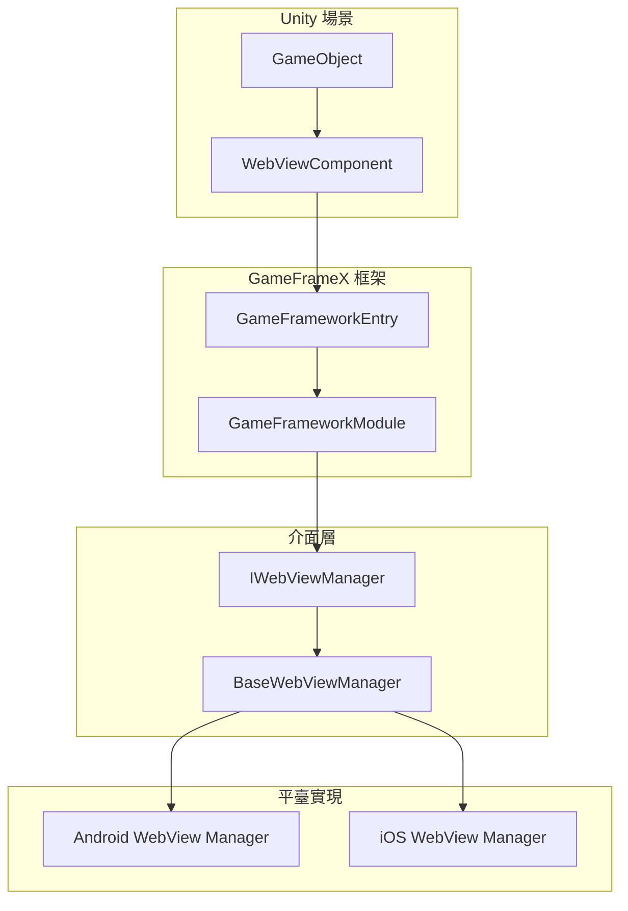
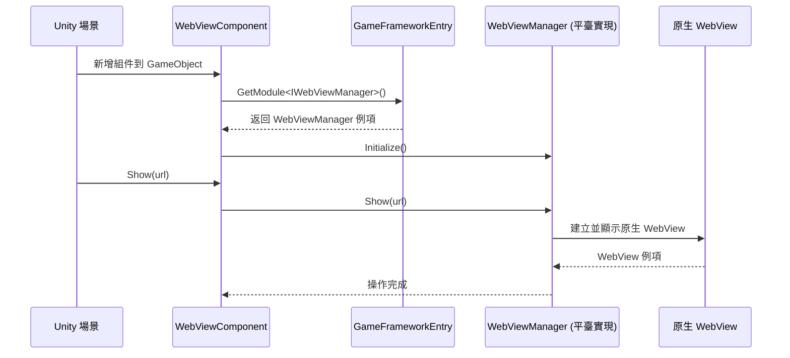

# 常見問題

本文件收集了使用 GameFrameX WebView 組件時可能遇到的常見問題及其解決方案。

## Overview

GameFrameX WebView 組件是一個 Unity WebView 封裝庫，基於 [gree/unity-webview](https://github.com/gree/unity-webview) 實現。該組件採用介面設計模式，透過 `IWebViewManager` 介面提供跨平臺的 WebView 功能。

> **注意**：本包僅提供 WebView 的介面定義和 Unity 組件，具體的平臺實現（如 Android/iOS WebView）需要額外安裝對應的實現包。

## 常見問題與解決方案

### 問題 1：WebView 不顯示

#### 症狀
新增 WebViewComponent 到場景後，呼叫 `Show(url)` 方法但 WebView 沒有顯示。

#### 可能原因
1. 平臺實現包未安裝
2. WebViewManager 未正確初始化
3. URL 格式不正確

#### 解決方案
```csharp
// 確保正確獲取 WebViewComponent 例項
var webView = FindObjectOfType<WebViewComponent>();
if (webView != null)
{
    // 使用有效的 HTTPS URL
    webView.Show("https://gameframex.doc.alianblank.com");
}
else
{
    Debug.LogError("WebViewComponent 未在場景中找到！");
}
```

> Source: [WebViewComponent.cs](https://github.com/GameFrameX/com.gameframex.unity.webview/blob/main/Runtime/WebViewComponent.cs#L36-L49)

---

### 問題 2：Fatal: Web View manager is invalid

#### 症狀
執行時控制檯輸出 `Log.Fatal("Web View manager is invalid.")` 錯誤。

#### 可能原因
1. **核心依賴包未安裝**：本組件依賴 `com.gameframex.unity` 包
2. **平臺實現包缺失**：沒有安裝對應平臺的 WebView 實現包
3. **模組註冊失敗**：WebViewManager 模組未正確註冊到框架

#### 解決方案

1. **安裝核心依賴包**：
   ```
   透過 Unity Package Manager 新增：https://github.com/gameframex/com.gameframex.unity.git
   ```

2. **安裝平臺實現包**：根據目標平臺安裝對應的 WebView 實現包（如果存在）

3. **檢查模組註冊**：確保在遊戲啟動時正確初始化了 GameFrameX 框架

---

### 問題 3：iOS/Android 平臺 WebView 空白

#### 症狀
在 iOS 或 Android 平臺上 WebView 顯示為空白，頁面無法載入。

#### 可能原因
1. 網路許可權未配置
2. HTTPS 證書問題
3. 平臺特定配置缺失

#### 解決方案

**對於 iOS**：
- 在 `Info.plist` 中新增網路許可權：
```xml
<key>NSAppTransportSecurity</key>
<dict>
    <key>NSAllowsArbitraryLoads</key>
    <true/>
</dict>
```

**對於 Android**：
- 確保在 `AndroidManifest.xml` 中新增了 Internet 許可權：
```xml
<uses-permission android:name="android.permission.INTERNET" />
```

---

### 問題 4：JavaScript 互動無響應

#### 症狀
呼叫 `ExecuteJavaScript()` 方法後，JavaScript 程式碼沒有執行或沒有效果。

#### 可能原因
1. WebView 未完全載入
2. JavaScript 程式碼語法錯誤
3. 呼叫時機過早

#### 解決方案
```csharp
// 建議在 WebView 載入完成後再執行 JavaScript
// 可以透過訂閱事件來監聽載入完成狀態
var webView = FindObjectOfType<WebViewComponent>();
webView.Show("https://example.com");

// 延遲執行 JavaScript，確保頁面已載入
Invoke(nameof(ExecuteCustomJavaScript), 2.0f);

void ExecuteCustomJavaScript()
{
    webView.ExecuteJavaScript("console.log('Hello from Unity!');");
}
```

> Source: [WebViewComponent.cs](https://github.com/GameFrameX/com.gameframex.unity.webview/blob/main/Runtime/WebViewComponent.cs#L59-L66)

---

### 問題 5：WebView 全屏顯示異常

#### 症狀
呼叫 `MakeFullScreen()` 方法後，WebView 顯示位置或大小不正確。

#### 解決方案
```csharp
var webView = FindObjectOfType<WebViewComponent>();
webView.Show("https://example.com");
// 等待頁面載入完成後，再設定為全屏
Invoke(nameof(MakeFullScreen), 1.0f);

void MakeFullScreen()
{
    webView.MakeFullScreen();
}
```

> Source: [WebViewComponent.cs](https://github.com/GameFrameX/com.gameframex.unity.webview/blob/main/Runtime/WebViewComponent.cs#L54-L57)

---

### 問題 6：多個 WebView 例項衝突

#### 症狀
場景中有多個 WebViewComponent 時，出現顯示混亂或事件錯亂。

#### 解決方案
- 建議場景中只保留一個 WebViewComponent 例項
- 使用單例模式管理 WebView：
```csharp
public class WebViewManager : MonoBehaviour
{
    private static WebViewManager _instance;
    public static WebViewManager Instance => _instance;
    
    private WebViewComponent _webView;
    
    private void Awake()
    {
        _instance = this;
        _webView = GetComponent<WebViewComponent>();
    }
    
    public void ShowWebView(string url)
    {
        _webView.Show(url);
    }
}
```

---

### 問題 7：Unity 編輯器中無法測試

#### 症狀
在 Unity 編輯器模式下執行，WebView 不顯示或報錯。

#### 原因說明
WebView 功能需要在真機或對應平臺的模擬器上測試，Unity 編輯器本身不支援原生 WebView 顯示。

#### 解決方案
- 將專案構建到目標平臺（iOS/Android）進行測試
- 使用平臺相關的模擬器

---

## 診斷步驟

### 基礎診斷流程

```mermaid
flowchart TD
    Start([開始診斷]) --> Step1{控制檯有錯誤?}
    Step1 -->|是| Step2{錯誤資訊為"Web View manager is invalid"?}
    Step1 -->|否| Step3{檢查程式碼呼叫}
    
    Step2 -->|是| Step4[檢查核心依賴包]
    Step2 -->|否| Step5[根據具體錯誤排查]
    
    Step4 --> Step6{依賴包已安裝?}
    Step6 -->|否| Step7[安裝 com.gameframex.unity]
    Step6 -->|是| Step8[檢查平臺實現包]
    
    Step7 --> Step9[重新構建專案]
    Step8 --> Step9
    Step9 --> End1([結束])
    
    Step3 --> Step10{URL 有效?}
    Step10 -->|否| Step11[使用有效 HTTPS URL]
    Step10 -->|是| Step12[檢查平臺許可權配置]
    
    Step5 --> End1
    Step11 --> End1
    Step12 --> End1
```

### 除錯檢查清單

| 檢查項 | 操作方法 |
|--------|----------|
| 核心包依賴 | 檢查 Package Manager 中是否安裝 `com.gameframex.unity` |
| 場景配置 | 確認 GameObject 上正確新增了 WebViewComponent |
| 程式碼呼叫 | 確認在 Start() 或之後呼叫 Show() 方法 |
| URL 有效性 | 確認使用有效的 HTTPS URL |
| 平臺許可權 | 檢查各平臺的許可權配置檔案 |
| 事件監聽 | 新增事件監聽檢視是否有錯誤事件觸發 |

---

## 架構說明

### 組件關係



### 工作流程



---

## 相關連結

- [概述](./1-overview) - WebView 組件概述與功能介紹
- [安裝](./2-installation) - 詳細安裝指南
- [快速入門](./3-getting-started) - 快速開始使用 WebView
- [API 參考](./4-api-reference) - 完整的 API 方法說明
- [平臺配置](./5-platforms) - 各平臺特定配置說明
- [事件系統](./6-events) - WebView 事件系統詳解
- [GameFrameX 核心框架](https://github.com/GameFrameX/com.gameframex.unity) - 核心框架倉庫
- [gree/unity-webview](https://github.com/gree/unity-webview) - 原始 WebView 外掛
