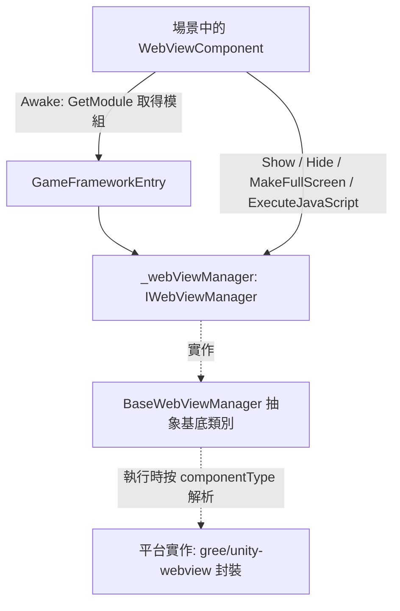

# 運作原理：元件如何驅動 WebView

`WebViewComponent` 是掛在場景上的 GameFrameworkComponent 殼，它在 `Awake` 中透過 `GameFrameworkEntry.GetModule<IWebViewManager>()` 取得管理器，並把 `Show` / `Hide` / `MakeFullScreen` / `ExecuteJavaScript` 全部轉發給它。本套件只定義介面(`IWebViewManager`)、抽象基底類別(`BaseWebViewManager`)和元件殼；具體平台實作是對 [gree/unity-webview](https://github.com/gree/unity-webview) 的封裝，執行時按 `componentType` 解析裝配。

## 元件分層

| 層 | 真實型別 | 所在檔案 | 職責 |
|----|----------|----------|------|
| 元件殼 | `WebViewComponent : GameFrameworkComponent` | `Runtime/WebViewComponent.cs` | Unity 場景進入點，負責裝配模組並轉發呼叫 |
| 介面 | `IWebViewManager` | `Runtime/IWebViewManager.cs` | 定義 `Initialize` / `Show` / `MakeFullScreen` / `ExecuteJavaScript` / `Hide` 五個方法 |
| 抽象基底類別 | `BaseWebViewManager : GameFrameworkModule, IWebViewManager` | `Runtime/BaseWebViewManager.cs` | 平台實作的基底類別，五個方法均為 `abstract` |
| 具體實作 | 執行時按 `componentType` 解析(不在本儲存庫) | — | 基於 gree/unity-webview 的平台 Web View 能力 |

## 呼叫鏈



## 啟動時序

1. `Awake` 設定實作型別與介面型別，再從 `GameFrameworkEntry` 取得模組；取不到則記錄 Fatal 日誌並放棄後續初始化：

```csharp
protected override void Awake()
{
    ImplementationComponentType = Utility.Assembly.GetType(componentType);
    InterfaceComponentType = typeof(IWebViewManager);
    base.Awake();
    if (!IsRuntimeComponentReady)
    {
        return;
    }

    _webViewManager = GameFrameworkEntry.GetModule<IWebViewManager>();
    if (_webViewManager == null)
    {
        Log.Fatal("Web View manager is invalid.");
        return;
    }
}
```

Source: [WebViewComponent.cs](https://github.com/GameFrameX/com.gameframex.unity.webview/blob/main/Runtime/WebViewComponent.cs#L22-L38)

2. `Start` 裡呼叫一次 `_webViewManager.Initialize()`,完成管理器初始化；若 `Awake` 未能取得模組，這裡直接傳回：

```csharp
private void Start()
{
    if (_webViewManager == null)
    {
        return;
    }

    _webViewManager.Initialize();
}
```

Source: [WebViewComponent.cs](https://github.com/GameFrameX/com.gameframex.unity.webview/blob/main/Runtime/WebViewComponent.cs#L40-L48)

## 對外 API 如何轉發

元件的四個公開方法都是一行轉發，不包含任何平台邏輯：

```csharp
public void Show(string url)
{
    _webViewManager.Show(url);
}

public void MakeFullScreen()
{
    _webViewManager.MakeFullScreen();
}

public void ExecuteJavaScript(string javaScript)
{
    _webViewManager.ExecuteJavaScript(javaScript);
}

public void Hide()
{
    _webViewManager.Hide();
}
```

Source: [WebViewComponent.cs](https://github.com/GameFrameX/com.gameframex.unity.webview/blob/main/Runtime/WebViewComponent.cs#L51-L83)

管理器一側的契約(`BaseWebViewManager` 將其宣告為 `abstract`,由平台子類別實作)：

```csharp
public interface IWebViewManager
{
    void Initialize();
    void Show(string url);
    void MakeFullScreen();
    void ExecuteJavaScript(string javaScript);
    void Hide();
}
```

Source: [IWebViewManager.cs](https://github.com/GameFrameX/com.gameframex.unity.webview/blob/main/Runtime/IWebViewManager.cs#L12-L40)

## 使用者程式碼如何觸達元件

按 README 提供的用法，在場景中放置 `WebViewComponent` 後直接呼叫：

```csharp
using GameFrameX.WebView.Runtime;
using UnityEngine;

public class Example : MonoBehaviour
{
    void Start()
    {
        var webView = FindObjectOfType<WebViewComponent>();
        webView.Show("https://gameframex.doc.alianblank.com");
    }
}
```

Source: [README.zh-CN.md](https://github.com/GameFrameX/com.gameframex.unity.webview/blob/main/README.zh-CN.md#L102-L116)

## 原始碼檔案速查

| 檔案 | 說明 |
|------|------|
| [WebViewComponent.cs](https://github.com/GameFrameX/com.gameframex.unity.webview/blob/main/Runtime/WebViewComponent.cs) | 元件殼:裝配模組、初始化、轉發四個公開方法;`[DisallowMultipleComponent]` + `[AddComponentMenu("Game Framework/WebView")]` |
| [IWebViewManager.cs](https://github.com/GameFrameX/com.gameframex.unity.webview/blob/main/Runtime/IWebViewManager.cs) | 管理器介面，五個方法的契約 |
| [BaseWebViewManager.cs](https://github.com/GameFrameX/com.gameframex.unity.webview/blob/main/Runtime/BaseWebViewManager.cs) | 抽象基底類別，繼承 `GameFrameworkModule` 並實作介面 |
| [WebViewComponentInspector.cs](https://github.com/GameFrameX/com.gameframex.unity.webview/blob/main/Editor/WebViewComponentInspector.cs) | Editor 目錄下的元件 Inspector(本頁未展開其實作) |
| [WebViewCloseEventArgs.cs](https://github.com/GameFrameX/com.gameframex.unity.webview/blob/main/Runtime/EventArgs/WebViewCloseEventArgs.cs) / [WebViewReceivedMessageEventArgs.cs](https://github.com/GameFrameX/com.gameframex.unity.webview/blob/main/Runtime/EventArgs/WebViewReceivedMessageEventArgs.cs) | Runtime/EventArgs 下的關閉 / 收到訊息事件參數定義(欄位細節請查看原始碼) |
| [GameFrameXWebViewCroppingHelper.cs](https://github.com/GameFrameX/com.gameframex.unity.webview/blob/main/Runtime/GameFrameXWebViewCroppingHelper.cs) | Runtime 目錄下的裁切輔助類別(本頁未展開其實作) |

## 相關連結

- [README.zh-CN.md](https://github.com/GameFrameX/com.gameframex.unity.webview/blob/main/README.zh-CN.md) — 安裝方式、使用範例與相依性說明(相依 `com.gameframex.unity` 1.0.0)
- [Game Frame X 官方文件](https://gameframex.doc.alianblank.com)
- [gree/unity-webview](https://github.com/gree/unity-webview) — 本元件封裝的底層 Web View 實作，支援 Android 與 iOS