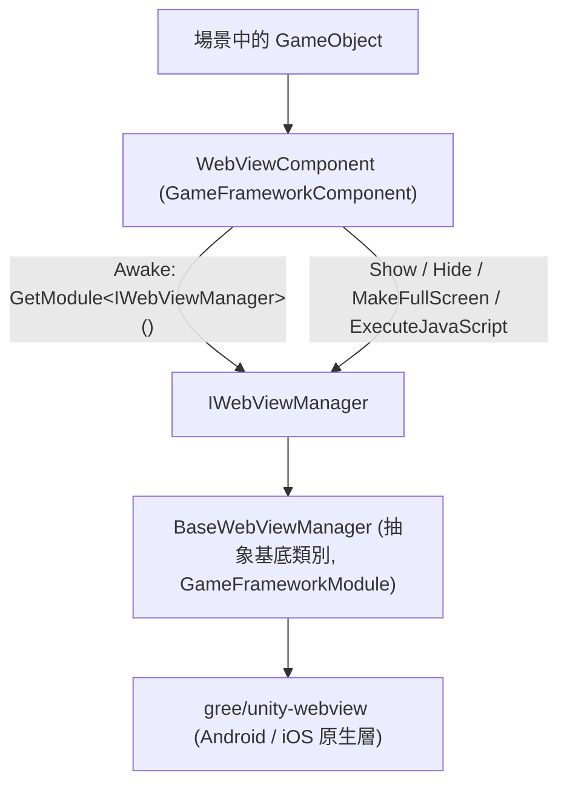

# 專案概述：Unity 內嵌網頁元件

Game Frame X Web View 是 Game Frame X 框架下的 Unity 內嵌網頁元件，封裝了 [gree/unity-webview](https://github.com/gree/unity-webview),讓你在 Android / iOS 遊戲中用一個元件即可展示網頁、執行 JavaScript,並透過統一介面 `IWebViewManager` 接入框架的模組體系。

## 快速開始

### 1. 安裝套件

任選一種方式把 `com.gameframex.unity.webview` 加入 Unity 專案：

**方式 A:scoped registry(推薦)** —— 編輯 `Packages/manifest.json`:

```json
{
  "scopedRegistries": [
    {
      "name": "GameFrameX",
      "url": "https://gameframex.upm.alianblank.uk",
      "scopes": [
        "com.gameframex"
      ]
    }
  ],
  "dependencies": {
    "com.gameframex.unity.webview": "1.0.0"
  }
}
```

**方式 B:Git URL** —— `manifest.json` 的 `dependencies` 中直接寫：

```json
{
  "dependencies": {
    "com.gameframex.unity.webview": "https://github.com/gameframex/com.gameframex.unity.webview.git"
  }
}
```

Source: [README.md](https://github.com/GameFrameX/com.gameframex.unity.webview/blob/main/README.md#L43-L70)

也可以在 Unity **Package Manager** 中用 **Add package from git URL** 輸入 `https://github.com/gameframex/com.gameframex.unity.webview.git`,或直接把儲存庫複製到 `Packages` 目錄自動載入。

> 相依性:`com.gameframex.unity` 1.0.0 需一併可用(見 [README.md](https://github.com/GameFrameX/com.gameframex.unity.webview/blob/main/README.md#L126-L131))。

### 2. 掛載元件

在場景中的 GameFramework 物件(或任意物件)上透過 **Add Component → Game Framework → WebView** 新增 `WebViewComponent`。元件會在 `Start` 時自動完成管理器初始化：

```csharp
private void Start()
{
    if (_webViewManager == null)
    {
        return;
    }

    _webViewManager.Initialize();
}
```

Source: [WebViewComponent.cs](https://github.com/GameFrameX/com.gameframex.unity.webview/blob/main/Runtime/WebViewComponent.cs#L40-L48)

### 3. 顯示網頁

```csharp
using GameFrameX.WebView.Runtime;
using UnityEngine;

public class Example : MonoBehaviour
{
    void Start()
    {
        var webView = FindObjectOfType<WebViewComponent>();
        webView.Show("https://gameframex.doc.alianblank.com");
    }
}
```

Source: [README.md](https://github.com/GameFrameX/com.gameframex.unity.webview/blob/main/README.md#L102-L116)

### 4. 常用 API 一覽

| 名稱 | 簽章 | 說明 |
|------|------|------|
| 顯示網頁 | `Show(string url)` | 顯示 WebView 並載入指定 URL |
| 隱藏 | `Hide()` | 隱藏 WebView |
| 全螢幕 | `MakeFullScreen()` | 將 WebView 設為全螢幕 |
| 執行腳本 | `ExecuteJavaScript(string javaScript)` | 在網頁中執行 JavaScript 程式碼 |

以上方法均為 `WebViewComponent` 上的公開方法，直接轉發給 `IWebViewManager` 實作(見 [WebViewComponent.cs](https://github.com/GameFrameX/com.gameframex.unity.webview/blob/main/Runtime/WebViewComponent.cs#L51-L83) 與 [IWebViewManager.cs](https://github.com/GameFrameX/com.gameframex.unity.webview/blob/main/Runtime/IWebViewManager.cs#L12-L40))。

## 運作原理速覽

元件分層很簡單：場景中的 `WebViewComponent`(繼承自 `GameFrameworkComponent`)只做轉發，真正的行為由實作 `IWebViewManager` 的管理器(`BaseWebViewManager` 為抽象基底類別)完成，底層由封裝的 gree/unity-webview 承擔原生 WebView 渲染。



關鍵呼叫鏈(原始碼核實)：

1. `WebViewComponent.Awake()` 透過 `GameFrameworkEntry.GetModule<IWebViewManager>()` 取得模組實例，失敗則 `Log.Fatal("Web View manager is invalid.")`([WebViewComponent.cs](https://github.com/GameFrameX/com.gameframex.unity.webview/blob/main/Runtime/WebViewComponent.cs#L22-L38))。
2. `Start()` 中呼叫 `_webViewManager.Initialize()` 完成初始化([WebViewComponent.cs](https://github.com/GameFrameX/com.gameframex.unity.webview/blob/main/Runtime/WebViewComponent.cs#L40-L48))。
3. `BaseWebViewManager` 以抽象方法形式宣告 `Initialize / Show / MakeFullScreen / ExecuteJavaScript / Hide`([BaseWebViewManager.cs](https://github.com/GameFrameX/com.gameframex.unity.webview/blob/main/Runtime/BaseWebViewManager.cs#L11-L39))。

儲存庫還包含 `Runtime/EventArgs/` 下的 `WebViewCloseEventArgs`、`WebViewReceivedMessageEventArgs` 事件參數，以及 `Editor/WebViewComponentInspector.cs` 自訂 Inspector、`GameFrameXWebViewCroppingHelper.cs` 裁剪輔助類別，用於訊息回呼與編輯器擴充。

## 接下來

- 使用細節與文件站:[Game Frame X Documentation](https://gameframex.doc.alianblank.com)([README.md](https://github.com/GameFrameX/com.gameframex.unity.webview/blob/main/README.md#L132-L134))
- 各介面完整簽章:[IWebViewManager.cs](https://github.com/GameFrameX/com.gameframex.unity.webview/blob/main/Runtime/IWebViewManager.cs#L12-L40)
- 元件生命週期與轉發實作:[WebViewComponent.cs](https://github.com/GameFrameX/com.gameframex.unity.webview/blob/main/Runtime/WebViewComponent.cs#L13-L84)
- 抽象基底類別擴充點:[BaseWebViewManager.cs](https://github.com/GameFrameX/com.gameframex.unity.webview/blob/main/Runtime/BaseWebViewManager.cs#L11-L39)
- 版本歷程:[CHANGELOG.md](https://github.com/GameFrameX/com.gameframex.unity.webview/blob/main/CHANGELOG.md) 與 [Releases](https://github.com/GameFrameX/gameframex/com.gameframex.unity.webview/releases)