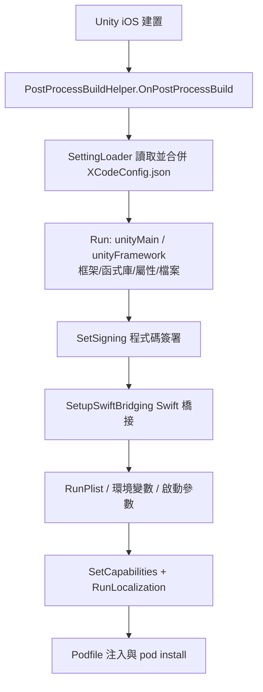

# Xcode 打包設定套件概覽

GameFrameX Xcode 設定套件(com.gameframex.unity.xcode)讓你用一份 `XCodeConfig.json` 就能自動完成 iOS 打包後的 Xcode 專案設定:Info.plist、系統框架/函式庫、Build Settings、Capabilities、在地化、CocoaPods、程式碼簽署、Swift 橋接等，全部無需手動修改 Xcode 專案。Unity 建置 iOS 平台後，它會透過 `PostProcessBuild` 回呼自動執行，適合本機與 CI 自動化建置。

## 快速開始

### 1. 安裝套件

編輯 Unity 專案的 `Packages/manifest.json`,新增 scoped registry 並宣告相依性(目前版本 `1.11.1`):

```json
{
  "scopedRegistries": [
    {
      "name": "GameFrameX",
      "url": "https://gameframex.upm.alianblank.uk",
      "scopes": [
        "com.gameframex"
      ]
    }
  ],
  "dependencies": {
    "com.gameframex.unity.xcode": "1.11.1"
  }
}
```

Source: [README.zh-CN.md](https://github.com/GameFrameX/com.gameframex.unity.xcode/blob/main/README.zh-CN.md#L49-L63)

也可以不建立 registry,直接在 `dependencies` 下填入 Git 位址 `https://github.com/gameframex/com.gameframex.unity.xcode.git`,或用 Package Manager 的 `Git URL` 方式新增，或把儲存庫下載後放進 `Packages` 目錄。

### 2. 建立設定檔

在專案中新增 `XCodeConfig.json`——檔名固定，可放在專案任意位置，支援多個檔案並存(自動深度遞迴合併)，還支援 `XCodeConfig.{渠道名}.json` 渠道專屬設定最後覆蓋合併。

```json
{
  "swiftBridging": true,
  "signing": {},
  "plist": {},
  "environmentVariables": {},
  "launcherArgs": [],
  "podSource": [],
  "podfile": "",
  "podInstall": true,
  "localizations": [],
  "capabilities": {},
  "unityFramework": {},
  "unityMain": {}
}
```

Source: [README.zh-CN.md](https://github.com/GameFrameX/com.gameframex.unity.xcode/blob/main/README.zh-CN.md#L81-L96)

| 欄位 | 類型 | 說明 |
| :--- | :--- | :--- |
| `swiftBridging` | bool | Swift 橋接標頭檔自動產生(預設 `true`) |
| `signing` | object | 程式碼簽署：Team ID、Bundle ID、簽署身分、描述檔 |
| `plist` | object | Info.plist 鍵值對，值支援字串/布林/整數/陣列/字典並遞迴寫入 |
| `environmentVariables` | object | XcScheme 環境變數 |
| `launcherArgs` | string[] | XcScheme 啟動參數 |
| `podSource` | string[] | CocoaPods 來源位址，替換 Podfile 預設來源 |
| `podfile` | string | 自訂 Podfile 路徑(優先順序高於 `pods` 欄位) |
| `podInstall` | bool | Podfile 處理完自動執行 `pod install`(預設 `true`) |
| `localizations` | array | 自動產生 `.lproj/InfoPlist.strings` |
| `capabilities` | object | 內購、Game Center、推播、Sign In with Apple 等 13 項能力 |
| `unityFramework` | object | UnityFramework target 設定 |
| `unityMain` | object | Unity-iPhone(主)target 設定 |

### 3. 撰寫最常用的設定

`unityMain` / `unityFramework` 結構相同，`libs` 用 `+`/`-` 增刪系統函式庫，`frameworks` 增刪框架，`properties` 用 `=`/`+`/`-` 設定、附加、移除 Build Settings:

```json
{
  "unityMain": {
    "libs": {
      "+": ["libz.tbd", "libicucore.tbd"],
      "-": ["libstdc++.tbd"]
    },
    "frameworks": {
      "+": ["WebKit.framework", "UserNotifications.framework"],
      "-": []
    },
    "properties": {
      "=": { "ENABLE_BITCODE": "NO" },
      "+": { "OTHER_CFLAGS": ["-flag1", "-flag2"] },
      "-": { "UNUSED_FLAG": [""] }
    }
  },
  "signing": {
    "teamId": "XXXXXXXXXX",
    "bundleId": "com.company.app",
    "codeSignIdentity": "Apple Development",
    "codeSignStyle": "Automatic",
    "provisioningProfileSpecifier": ""
  }
}
```

Sources: [README.zh-CN.md](https://github.com/GameFrameX/com.gameframex.unity.xcode/blob/main/README.zh-CN.md#L133-L140) · [README.zh-CN.md](https://github.com/GameFrameX/com.gameframex.unity.xcode/blob/main/README.zh-CN.md#L245-L255)

### 4. 建置 iOS 並驗證

在 Unity 中執行 iOS 平台建置。建置結束時套件內的 `PostProcessBuildHelper.OnPostProcessBuild`(`[PostProcessBuild(888)]`)會自動執行：找不到任何設定檔會輸出 `未找到任何 XCodeConfig 相关配置文件, 跳过设置`;正常時按檔案輸出 `[MergeConfig] 正在合并配置: {路径}`,再依序輸出 `[PBXProject] 正在应用最终合并配置...`、`[OtherSettings] 正在应用最终合并配置...`。在 Console 中看到這些日誌即表示設定已寫入 Xcode 專案：

```csharp
[PostProcessBuild(888)]
public static void OnPostProcessBuild(BuildTarget target, string path)
{
    if (target != BuildTarget.iOS)
    {
        return;
    }
    //讀取設定檔
    var jsonPaths = SettingLoader.LoadSettingsData("XCodeConfig.json");
    // 如果沒有找到任何符合的檔案，直接返回
    if (jsonPaths.Count == 0)
    {
        LogHelper.Error("未找到任何 XCodeConfig 相关配置文件, 跳过设置");
        return;
    }
```

Source: [Editor/PostProcessBuildHelper.cs](https://github.com/GameFrameX/com.gameframex.unity.xcode/blob/main/Editor/PostProcessBuildHelper.cs#L14-L31)

## 運作原理速覽

整個流程由 `OnPostProcessBuild` 驅動：合併設定 → 寫入 PBXProject → 寫入 plist/scheme/capabilities/在地化 → 處理 Podfile。



兩階段處理說明:`unityMain`/`unityFramework`/`signing`/`swiftBridging` 會先寫入並儲存 `project.pbxproj`;隨後 Plist、環境變數、啟動參數、Capabilities、在地化、Podfile 於第二階段套用。Capabilities 由 `ProjectCapabilityManager` 獨立寫入磁碟，因此會重新讀取專案檔後再繼續，以確保其修改不被覆蓋：

```csharp
// 儲存 PBXProject
File.WriteAllText(projectPath, project.WriteToString());
// 第二階段：套用其他設定 (Plist, Env, Args, Pod, Capabilities)
LogHelper.Log("[OtherSettings] 正在应用最终合并配置...");
```

Source: [Editor/PostProcessBuildHelper.cs](https://github.com/GameFrameX/com.gameframex.unity.xcode/blob/main/Editor/PostProcessBuildHelper.cs#L103-L107)

設定合併的優先順序是：渠道設定(`XCodeConfig.{channel}.json`)> 普通 `XCodeConfig.json` > 空，多個普通檔案按掃描順序依序深度合併。套件內實作按功能拆分為多個 partial 檔案，便於按需閱讀原始碼。

## 常見錯誤

| 現象 | 原因 | 修復 |
|------|------|------|
| Console 報 `未找到任何 XCodeConfig 相关配置文件, 跳过设置` | 設定檔未命名為 `XCodeConfig.json` 或不在專案內 | 確認檔名與位置；渠道檔案須為 `XCodeConfig.{渠道名}.json` |
| 某設定項沒生效 | 存在多個 `XCodeConfig.json` 或渠道檔案覆蓋了它 | 後合併者覆蓋同鍵值；檢查合併日誌 `[MergeConfig]` 中各檔案順序 |
| `folders` 複製時報錯 | 目標資料夾在 Xcode 專案中已存在(`folders` 不做覆蓋) | 改用 `files` 單檔複製，或先清除建置輸出目錄 |
| Swift 混編在 CI 上彈出視窗 | 未啟用 Swift 橋接 | 保持 `swiftBridging: true`(預設)，自動建立橋接標頭並設定 `SWIFT_VERSION` 為 `5.0` |

## 接下來

- 設定檔全部欄位與各子項寫法，見儲存庫 [README.zh-CN.md](https://github.com/GameFrameX/com.gameframex.unity.xcode/blob/main/README.zh-CN.md#L75-L484) 的「設定檔結構」章節。
- 版本歷史見 [CHANGELOG.md](https://github.com/GameFrameX/com.gameframex.unity.xcode/blob/main/CHANGELOG.md)。
- 原始碼入口:`Editor/PostProcessBuildHelper.cs`(主流程)、`Editor/PostProcessBuildHelper.BuildProperties.cs`(Build Settings)、`Editor/PostProcessBuildHelper.Capabilities.cs`(Capabilities)、`Editor/PostProcessBuildHelper.File.cs`(檔案複製)。
- 官方文件與交流群見 [README.zh-CN.md](https://github.com/GameFrameX/com.gameframex.unity.xcode/blob/main/README.zh-CN.md#L16)。