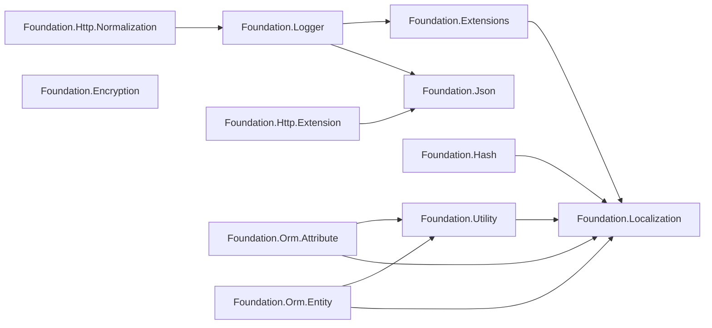

# 套件概觀與相依關係

GameFrameX.Foundation 是按職責劃分的 .NET 類別庫集合。每個子目錄都是一個獨立的 NuGet 套件，套件之間透過 `ProjectReference` 連結。本頁面將列出所有套件的一覽、相依關係的方向，以及應從哪個套件開始導入的判斷標準。

## 套件一覽

位於儲存庫根目錄下的每個第一層資料夾各對應一個 NuGet 套件，所有套件統一使用 `../Version.props` 的版本號，並以 `../gameframex.key.snk` 賦予強式名稱。

| 套件名稱 | 主要職責 | 主要第三方相依 |
|------|----------|----------------|
| GameFrameX.Foundation.Encryption | 加密與解密（AES、RSA 等） | — |
| GameFrameX.Foundation.Extensions | 常用擴充方法集合 | Localization |
| GameFrameX.Foundation.Hash | 雜湊演算法（xxHash、BCrypt、BouncyCastle） | Standart.Hash.xxHash 4.0.5、BouncyCastle.Cryptography 2.7.0、BCrypt.Net-Next.StrongName 4.2.1 |
| GameFrameX.Foundation.Http.Extension | HTTP 用戶端的統一介面（GET/POST） | Json |
| GameFrameX.Foundation.Http.Normalization | HTTP 請求/回應的正規化 | Logger |
| GameFrameX.Foundation.Json | JSON 序列化/反序列化的統一介面 | — |
| GameFrameX.Foundation.Localization | 多語系本地化抽象 | Microsoft.Extensions.Localization.Abstractions 10.0.11 |
| GameFrameX.Foundation.Logger | Serilog 結構化日誌，支援 Loki、MongoDB | MongoDB.Driver 3.11.0、Serilog.AspNetCore 10.0.0、Serilog.Sinks.Grafana.Loki 9.0.2、Serilog.Sinks.MongoDB 7.2.0 |
| GameFrameX.Foundation.Options | 組態選項擴充 | — |
| GameFrameX.Foundation.Orm.Attribute | ORM 實體屬性（Attribute） | Utility、Localization |
| GameFrameX.Foundation.Orm.Entity | ORM 實體基底類別 | Utility、Localization |
| GameFrameX.Foundation.Utility | 通用工具類別 | Localization |

來源: [GameFrameX.Foundation.Http.Extension.csproj](https://github.com/GameFrameX/GameFrameX.Foundation/blob/main/GameFrameX.Foundation.Http.Extension/GameFrameX.Foundation.Http.Extension.csproj#L24-L26),[GameFrameX.Foundation.Json.csproj](https://github.com/GameFrameX/GameFrameX.Foundation/blob/main/GameFrameX.Foundation.Json/GameFrameX.Foundation.Json.csproj#L1-L26),[GameFrameX.Foundation.Hash.csproj](https://github.com/GameFrameX/GameFrameX.Foundation/blob/main/GameFrameX.Foundation.Hash/GameFrameX.Foundation.Hash.csproj#L14-L33),[GameFrameX.Foundation.Localization.csproj](https://github.com/GameFrameX/GameFrameX.Foundation/blob/main/GameFrameX.Foundation.Localization/GameFrameX.Foundation.Localization.csproj#L29-L32),[GameFrameX.Foundation.Logger.csproj](https://github.com/GameFrameX/GameFrameX.Foundation/blob/main/GameFrameX.Foundation.Logger/GameFrameX.Foundation.Logger.csproj#L26-L36)

## 相依關係圖



來源： [GameFrameX.Foundation.Extensions.csproj](https://github.com/GameFrameX/GameFrameX.Foundation/blob/main/GameFrameX.Foundation.Extensions/GameFrameX.Foundation.Extensions.csproj#L15-L17),[GameFrameX.Foundation.Hash.csproj](https://github.com/GameFrameX/GameFrameX.Foundation/blob/main/GameFrameX.Foundation.Hash/GameFrameX.Foundation.Hash.csproj#L14-L16),[GameFrameX.Foundation.Utility.csproj](https://github.com/GameFrameX/GameFrameX.Foundation/blob/main/GameFrameX.Foundation.Utility/GameFrameX.Foundation.Utility.csproj#L15-L17),[GameFrameX.Foundation.Orm.Entity.csproj](https://github.com/GameFrameX/GameFrameX.Foundation/blob/main/GameFrameX.Foundation.Orm.Entity/GameFrameX.Foundation.Orm.Entity.csproj#L23-L32),[GameFrameX.Foundation.Logger.csproj](https://github.com/GameFrameX/GameFrameX.Foundation/blob/main/GameFrameX.Foundation.Logger/GameFrameX.Foundation.Logger.csproj#L34-L36),[GameFrameX.Foundation.Http.Extension.csproj](https://github.com/GameFrameX/GameFrameX.Foundation/blob/main/GameFrameX.Foundation.Http.Extension/GameFrameX.Foundation.Http.Extension.csproj#L24-L26),[GameFrameX.Foundation.Http.Normalization.csproj](https://github.com/GameFrameX/GameFrameX.Foundation/blob/main/GameFrameX.Foundation.Http.Normalization/GameFrameX.Foundation.Http.Normalization.csproj#L23-L25)

## 快速開始

1. **找出所需的功能，僅導入對應的套件**——請勿引入所有 Foundation 套件。例如僅需要 JSON 序列化時，只需參考 `GameFrameX.Foundation.Json`。
2. **使用擴充方法、工具類別、ORM 等時，Localization 會作為傳遞相依被引入**——`Microsoft.Extensions.Localization.Abstractions 10.0.11` 也會同時被導入，因此需要透過 DI 註冊本地化服務。
3. **使用日誌套件時**——除了 Serilog 的主套件外，還會導入 MongoDB.Driver 3.11.0，因此請確認 MongoDB 驅動程式的版本不會與業務端的版本衝突。
4. **使用 Hash 套件時**——xxHash、BouncyCastle、BCrypt 三個第三方程式庫會一併導入，因此可視需要刪除不需要的 `using`。
5. **使用強式名稱組件**——所有套件都以 `gameframex.key.snk` 簽署，因此使用端專案必須允許使用強式名稱，或與專案自身的簽署保持一致。

## 入口套件的選擇方式

| 使用情境 | 推薦套件 |
|------|--------|
| 僅讀寫 JSON | GameFrameX.Foundation.Json |
| 僅 HTTP 呼叫 | GameFrameX.Foundation.Http.Extension |
| 結構化日誌 + 遠端彙整 | GameFrameX.Foundation.Logger |
| 密碼/資料雜湊 | GameFrameX.Foundation.Hash |
| 加密/解密 | GameFrameX.Foundation.Encryption |
| ORM 實體與屬性 | GameFrameX.Foundation.Orm.Entity + GameFrameX.Foundation.Orm.Attribute |
| 組態選項擴充 | GameFrameX.Foundation.Options |

## 版本與簽署

所有套件共用版本定義檔：

```xml
<Import Project="../Version.props" Label="版本號定義"/>
<AssemblyOriginatorKeyFile>../gameframex.key.snk</AssemblyOriginatorKeyFile>
```

來源： [GameFrameX.Foundation.Http.Extension.csproj](https://github.com/GameFrameX/GameFrameX.Foundation/blob/main/GameFrameX.Foundation.Http.Extension/GameFrameX.Foundation.Http.Extension.csproj#L1-L7)

若要升級版本，只需修改一次 `Version.props`,各套件建置時便會自動套用最新的版本號。

## 相關連結

- 關於本地化，請參閱《Localization》
- 關於日誌，請參閱《Logger》
- 關於 JSON 與 HTTP,請參閱《Http.Extension》