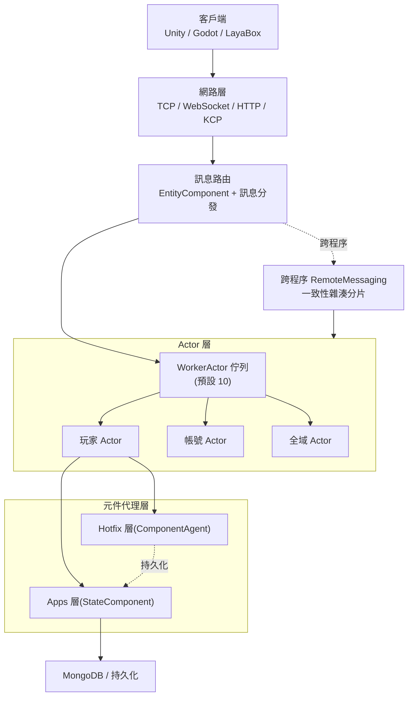

# 架構概覽:Actor 模型與多程序拓撲

GameFrameX 以 Actor 模型為核心來組織遊戲伺服器的執行單元。各 Actor 之間透過訊息傳遞而非共享狀態進行協作;多個遊戲程序透過一致的 ActorId 編碼與 ActorType 分段來路由訊息,構成可水平擴展的多程序拓撲。

## 快速開始

1. 啟動 `GameFrameX.Server.Start` 主程序。它會載入兩個組件:`GameFrameX.Apps`(持久化狀態層)與 `GameFrameX.Hotfix`(可熱重載的業務層)。
2. 客戶端可透過 TCP / WebSocket / HTTP / KCP 任一方式連線至網路層。訊息會被路由至對應的 Actor 處理器。
3. 伺服器會根據 ActorId 計算 Actor 所在的程序。跨程序投遞時使用 `RemoteMessaging`;程序內投遞時則派發至 `WorkerActor` 佇列。

```csharp
// 透過 ActorId 取得玩家元件代理(典型的程序內用法)
var agent = await ActorManager.GetComponentAgent<PlayerComponentAgent>(actorId);

[Actor.cs#L38-L100](https://github.com/GameFrameX/GameFrameX.Server.Source/blob/main/GameFrameX.Core/Actors/Actor.cs#L38-L100)
```

## 運作原理

GameFrameX 將「遊戲實體」封裝為 `IActor`,將「待處理訊息」封裝為 `IWorkerActor`,並透過 TPL DataFlow 實現無鎖的序列處理。跨程序場景下，則使用 `ActorId` 的高位段(`ActorType` + 程序 / 資料中心識別碼)進行一致性雜湊分片。



- **Actor = 狀態容器**:`IActor` 擁有 `Id`、`Type`、`ScheduleIdSet` 與 `WorkerActor`。Actor 內的訊息由其專屬的 `WorkerActor` 序列處理，無需加鎖。詳見 [IActor.cs](https://github.com/GameFrameX/GameFrameX.Server.Source/blob/main/GameFrameX.Core/Abstractions/IActor.cs#L38-L100)。
- **WorkerActor = 訊息幫浦**：基於 TPL DataFlow 建置，它會將流入的訊息轉換為可序列化執行的任務項目並依序執行。預設情況下，`ActorManager` 會啟動 10 個 `WorkerActor` 實例作為分片。詳見 [ActorManager.cs](https://github.com/GameFrameX/GameFrameX.Server.Source/blob/main/GameFrameX.Core/Actors/ActorManager.cs#L53-L100)。
- **程序內 vs. 跨程序**:`ActorManager` 使用 `ConcurrentDictionary<long, Actor>` 維護本程序的 Actor 資料表。跨程序通訊時，則透過 `RemoteMessaging` + 一致性雜湊來定位目標程序。
- **型別分段**:`ActorType` 以 `ushort` 編碼。小於 `Separator` 的值代表「單實例全域型別」，大於 `Separator` 的值則代表「多實例型別」(例如玩家、公會)。ActorId 由雪花 ID 與 ActorType 組合而成，以確保唯一性。詳見 [ActorType.cs](https://github.com/GameFrameX/GameFrameX.Server.Source/blob/main/GameFrameX.Apps/ActorType.cs#L38-L60)。

## 後續步驟

- 若要了解特定 Actor 的內部實作，請參閱 `GameFrameX.Core/Actors/Actor.cs`。
- 若要了解跨程序訊息的傳送與接收，請參閱 `GameFrameX.NetWork.Abstractions` 與 `NetWorkSenderFactory`。
- 若要了解 ActorId 編碼與雪花演算法，請參閱 `GameFrameX.Utility/ActorIdGenerator.cs`。
- 若要了解元件代理與熱更新邊界，請參閱「元件代理層與熱重載」頁面。

## 相關連結

- [IActor.cs](https://github.com/GameFrameX/GameFrameX.Server.Source/blob/main/GameFrameX.Core/Abstractions/IActor.cs#L38-L100)
- [IWorkerActor.cs](https://github.com/GameFrameX/GameFrameX.Server.Source/blob/main/GameFrameX.Core/Abstractions/IWorkerActor.cs)
- [ActorManager.cs](https://github.com/GameFrameX/GameFrameX.Server.Source/blob/main/GameFrameX.Core/Actors/ActorManager.cs#L53-L100)
- [Actor.cs](https://github.com/GameFrameX/GameFrameX.Server.Source/blob/main/GameFrameX.Core/Actors/Actor.cs)
- [WorkActor.cs](https://github.com/GameFrameX/GameFrameX.Server.Source/blob/main/GameFrameX.Core/Actors/Impl/WorkActor.cs)
- [ActorType.cs](https://github.com/GameFrameX/GameFrameX.Server.Source/blob/main/GameFrameX.Apps/ActorType.cs#L38-L60)
- [ActorIdGenerator.cs](https://github.com/GameFrameX/GameFrameX.Server.Source/blob/main/GameFrameX.Utility/ActorIdGenerator.cs)
- [NetWorkSenderFactory.cs](https://github.com/GameFrameX/GameFrameX.Server.Source/blob/main/GameFrameX.NetWork/NetWorkSenderFactory.cs)