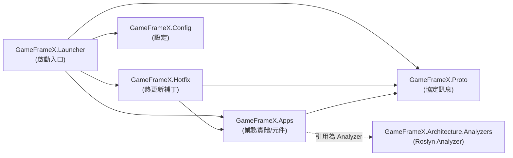

# 專案結構與分層(Apps / Hotfix / Proto / Config)速覽

GameFrameX.Server 解決方案把伺服器專案拆成四個職責單一的 C# 類別庫(以及 Launcher、Analyzers、Hotfix.Tests),讓「協定 → 業務邏輯 → 熱更新補丁 → 設定載入 → 啟動入口」各自獨立維護。下面這一屏可以看到每個專案裝什麼、誰引用誰。

## 快速開始

開啟 `Server.sln`,你會看到以下專案(均位於儲存庫根目錄):

| 專案 | csproj 路徑 | 目標框架 | 主要職責 |
|------|-------------|----------|----------|
| `GameFrameX.Launcher` | [GameFrameX.Launcher/GameFrameX.Launcher.csproj](https://github.com/GameFrameX/GameFrameX.Server/blob/main/GameFrameX.Launcher/GameFrameX.Launcher.csproj) | — (待補充) | 程式啟動入口 |
| `GameFrameX.Hotfix` | [GameFrameX.Hotfix/GameFrameX.Hotfix.csproj](https://github.com/GameFrameX/GameFrameX.Server/blob/main/GameFrameX.Hotfix/GameFrameX.Hotfix.csproj) | — (待補充) | 熱更新業務邏輯補丁 |
| `GameFrameX.Config` | [GameFrameX.Config/GameFrameX.Config.csproj](https://github.com/GameFrameX/GameFrameX.Server/blob/main/GameFrameX.Config/GameFrameX.Config.csproj) | — (待補充) | 執行時設定項 |
| `GameFrameX.Proto` | [GameFrameX.Proto/GameFrameX.Proto.csproj](https://github.com/GameFrameX/GameFrameX.Server/blob/main/GameFrameX.Proto/GameFrameX.Proto.csproj) | — (待補充) | 網路協定 / 訊息定義 |
| `GameFrameX.Apps` | [GameFrameX.Apps/GameFrameX.Apps.csproj](https://github.com/GameFrameX/GameFrameX.Server/blob/main/GameFrameX.Apps/GameFrameX.Apps.csproj) | `net10.0` | 業務實體、元件、狀態(下文有引用關係範例) |
| `GameFrameX.Architecture.Analyzers` | [GameFrameX.Architecture.Analyzers/GameFrameX.Architecture.Analyzers.csproj](https://github.com/GameFrameX/GameFrameX.Server/blob/main/GameFrameX.Architecture.Analyzers/GameFrameX.Architecture.Analyzers.csproj) | — (待補充) | 編譯期架構約束分析器(以 Roslyn Analyzer 形式被其他專案引用) |
| `GameFrameX.Hotfix.Tests` | [GameFrameX.Hotfix.Tests/GameFrameX.Hotfix.Tests.csproj](https://github.com/GameFrameX/GameFrameX.Server/blob/main/GameFrameX.Hotfix.Tests/GameFrameX.Hotfix.Tests.csproj) | — (待補充) | Hotfix 層的單元測試 |

> 表中的「待補充」欄表示該 csproj 的具體內容本次未直接讀取；具體資訊以各 csproj 實際檔案為準。

要「跑通」整個專案，在儲存庫根目錄執行：

```bash
# 還原並編譯整個解決方案
dotnet restore Server.sln
dotnet build  Server.sln -c Debug
```

## 工作原理速覽

四個核心專案在編譯期就透過 `ProjectReference` 形成一條單向依賴鏈，避免循環引用：



依賴方向只有一條主線(Launcher → Hotfix/Apps → Proto),Config 單獨掛在 Launcher 側，Analyzer 作為編譯期約束掛在 Apps 上，不參與執行時呼叫鏈。

### 各分層職責

- **Proto(協定層)**:`GameFrameX.Proto` 專案集中放客戶端-伺服器、伺服器-伺服器之間的訊息結構定義，被 Apps、Hotfix、Launcher 共同引用，保證全專案使用同一份協定契約。
- **Apps(業務實作層)**:`GameFrameX.Apps` 專案承載帳號、玩家、遊戲房間等業務實體(Entity)、元件(Component)、狀態與領域事件。它的 csproj 直接引用 Proto:

  ```xml
  <ProjectReference Include="..\GameFrameX.Proto\GameFrameX.Proto.csproj" />
  <ProjectReference Include="..\GameFrameX.Architecture.Analyzers\GameFrameX.Architecture.Analyzers.csproj"
                    OutputItemType="Analyzer" ReferenceOutputAssembly="false" />
  ```

  `OutputItemType="Analyzer"` 表示該引用是 **編譯期 Roslyn 分析器**，不參與執行時依賴，只在 `dotnet build` 時給 Apps 下的程式碼做架構規則檢查。

  Source: [GameFrameX.Apps/GameFrameX.Apps.csproj#L10-L11](https://github.com/GameFrameX/GameFrameX.Server/blob/main/GameFrameX.Apps/GameFrameX.Apps.csproj#L10-L11)

- **Hotfix(熱更新層)**:`GameFrameX.Hotfix` 依賴 Apps 與 Proto,承載可被執行時熱替換的業務補丁；`GameFrameX.Hotfix.Tests` 對其進行單元測試。
- **Config(設定層)**:`GameFrameX.Config` 集中管理伺服器啟動、連線、資料庫等設定項的讀取與校驗。
- **Launcher(啟動入口)**:`GameFrameX.Launcher` 是解決方案中的可執行入口(在 `.sln` 中被列為 `Project("{9A19103F-16F7-4668-BE54-9A1E7A4F7556}")`,即 SDK 風格的可執行專案)，它在啟動時初始化 Config、載入 Proto、向 Hotfix 註冊補丁。
- **Architecture.Analyzers(架構約束)**:`GameFrameX.Architecture.Analyzers` 以 Roslyn Analyzer 形式被 Apps 引用，在編譯期約束程式碼必須按既定分層組織，避免業務邏輯寫錯層。

### 解決方案組成(逐項核對自 `Server.sln`)

下面 7 條 `Project(...)` 行直接來自 `Server.sln`,是專案分層的「權威清單」：

| 專案 GUID | 專案名 |
|-----------|--------|
| `{835335CB-D99B-4CB9-99D3-A7883306E723}` | GameFrameX.Launcher |
| `{E47F7B43-E435-4B9E-AD10-1FE0D19F45CF}` | GameFrameX.Hotfix |
| `{08B73D90-AB00-4B9D-AE3C-AB19E6D594F9}` | GameFrameX.Config |
| `{12AA7D1B-E3EB-4DC4-BEAA-0C7BC5047B0C}` | GameFrameX.Proto |
| `{EAA64025-FD7E-4E0F-92D1-AEBAC1A552BF}` | GameFrameX.Apps |
| `{B973B133-20C6-4E43-AE76-99D845F93E6E}` | GameFrameX.Architecture.Analyzers |
| `{B216586B-DCF1-4492-90E3-34F0BE57BCD9}` | GameFrameX.Hotfix.Tests |

Source: [Server.sln#L6-L26](https://github.com/GameFrameX/GameFrameX.Server/blob/main/Server.sln#L6-L26)

## Apps 專案目錄約定

在 `GameFrameX.Apps/GameFrameX.Apps.csproj` 中顯式宣告了三個頂層業務目錄(`Account\`、`Player\`、`Server\`),業務程式碼必須落在這些目錄下：

```xml
<Folder Include="Account\" />
<Folder Include="Player\" />
<Folder Include="Server\" />
```

Source: [GameFrameX.Apps/GameFrameX.Apps.csproj#L15-L17](https://github.com/GameFrameX/GameFrameX.Server/blob/main/GameFrameX.Apps/GameFrameX.Apps.csproj#L15-L17)

實際目錄範例(`GameFrameX.Apps/` 下已存在的檔案，可作為後續編碼的參考)：

| 一級目錄 | 範例檔案 |
|----------|----------|
| `Account/` | [Login/Component/LoginComponent.cs](https://github.com/GameFrameX/GameFrameX.Server/blob/main/GameFrameX.Apps/Account/Login/Component/LoginComponent.cs)、[Login/Entity/LoginState.cs](https://github.com/GameFrameX/GameFrameX.Server/blob/main/GameFrameX.Apps/Account/Login/Entity/LoginState.cs) |
| `Game/` | [RockPaperScissors/Component/RockPaperScissorsGameComponent.cs](https://github.com/GameFrameX/GameFrameX.Server/blob/main/GameFrameX.Apps/Game/RockPaperScissors/Component/RockPaperScissorsGameComponent.cs)、[Room/Component/RoomComponent.cs](https://github.com/GameFrameX/GameFrameX.Server/blob/main/GameFrameX.Apps/Game/Room/Component/RoomComponent.cs) |
| `Common/Event/` | [EventAttribute.cs](https://github.com/GameFrameX/GameFrameX.Server/blob/main/GameFrameX.Apps/Common/Event/EventAttribute.cs)、[EventId.cs](https://github.com/GameFrameX/GameFrameX.Server/blob/main/GameFrameX.Apps/Common/Event/EventId.cs) |
| `Common/EventData/` | [AttributeChangedEventArgs.cs](https://github.com/GameFrameX/GameFrameX.Server/blob/main/GameFrameX.Apps/Common/EventData/AttributeChangedEventArgs.cs)、[PlayerSendItemEventArgs.cs](https://github.com/GameFrameX/GameFrameX.Server/blob/main/GameFrameX.Apps/Common/EventData/PlayerSendItemEventArgs.cs) |
| `Common/Session/` | [Session.cs](https://github.com/GameFrameX/GameFrameX.Server/blob/main/GameFrameX.Apps/Common/Session/Session.cs)、[SessionManager.cs](https://github.com/GameFrameX/GameFrameX.Server/blob/main/GameFrameX.Apps/Common/Session/SessionManager.cs) |
| 根目錄 | [AppsHandler.cs](https://github.com/GameFrameX/GameFrameX.Server/blob/main/GameFrameX.Apps/AppsHandler.cs)、[ActorType.cs](https://github.com/GameFrameX/GameFrameX.Server/blob/main/GameFrameX.Apps/ActorType.cs)、[BsonClassMapHelper.cs](https://github.com/GameFrameX/GameFrameX.Server/blob/main/GameFrameX.Apps/BsonClassMapHelper.cs)、[CacheStateTypeManager.cs](https://github.com/GameFrameX/GameFrameX.Server/blob/main/GameFrameX.Apps/CacheStateTypeManager.cs) |

> 表中檔案均透過 `ListFiles` 在 `GameFrameX.Apps/**/*.cs` 下掃描得到;`Player/` 與 `Server/` 兩個目錄在 csproj 中已宣告，但本次未直接列舉其下檔案。

## 接下來

- 想在 `Account/`、`Player/`、`Server/` 下加業務邏輯，見《如何在 Apps 層新增一個業務模組》(待補)。
- 想新增協定訊息，見《Proto 協定訊息定義規範》(待補)。
- 想給 Hotfix 加可熱更新的補丁，見《Hotfix 熱更新編寫指南》(待補)。
- 想加設定項，見《Config 設定載入與校驗》(待補)。
- 想啟動整個伺服器，見《Launcher 啟動流程》(待補)。