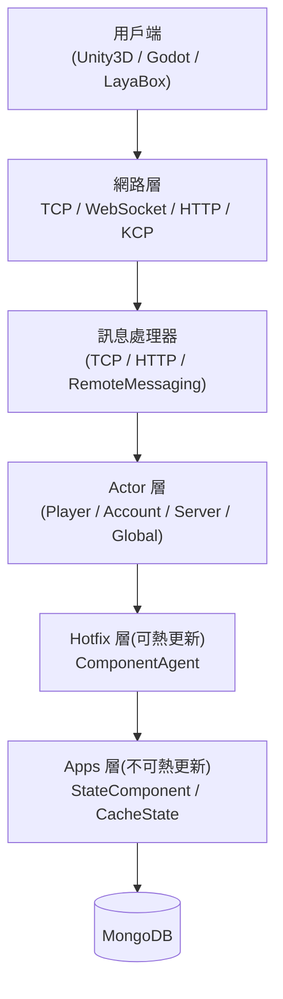

# 概覽

GameFrameX Server 是一個基於 C# .NET 10.0 建置的高效能、跨平台遊戲伺服器框架。它採用 Actor 模型與無鎖訊息佇列，支援熱更新機制，專為多人線上遊戲而設計。可與 Unity3D、Godot、LayaBox 等多種用戶端對接。

## 快速開始

### 環境需求

- [.NET 10.0 SDK](https://dotnet.microsoft.com/download/dotnet/10.0)(不支援 .NET 8/9)
- MongoDB 4.x+
- Visual Studio 2022 或 JetBrains Rider

### 啟動流程

1. 啟動 MongoDB:

```bash
docker run -d -p 27017:27017 --name mongo mongo:8.2
```

來源： [README.zh-CN.md](https://github.com/GameFrameX/GameFrameX.Server.Source/blob/main/README.zh-CN.md#L192-L199)

2. 還原並建置專案：

```bash
dotnet restore
dotnet build
```

來源： [README.zh-CN.md](https://github.com/GameFrameX/GameFrameX.Server.Source/blob/main/README.zh-CN.md#L182-L189)

3. 啟動伺服器(以 Game 類型為例)：

```bash
dotnet run --project GameFrameX.Launcher -- \
    --ServerType=Game \
    --ServerId=1000 \
    --OuterPort=29100 \
    --HttpPort=28080 \
    --DataBaseUrl=mongodb://127.0.0.1:27017 \
    --DataBaseName=gameframex
```

來源： [README.zh-CN.md](https://github.com/GameFrameX/GameFrameX.Server.Source/blob/main/README.zh-CN.md#L201-L210)

4. 驗證啟動：造訪 `http://localhost:28080/game/api/health` 檢查健康狀態，並查看主控台日誌，確認 `Actor` 與監聽連接埠已成功初始化。

來源： [README.zh-CN.md](https://github.com/GameFrameX/GameFrameX.Server.Source/blob/main/README.zh-CN.md#L212-L214)

## 運作原理一覽

GameFrameX Server 由四層組成：網路層負責接收用戶端訊息，Actor 層基於 TPL DataFlow 執行無鎖序列處理，業務邏輯由可熱更新的 Hotfix 層實作，狀態資料則由不可熱更新的 Apps 層管理，並透過批次持久化寫入 MongoDB。



來源： [README.zh-CN.md](https://github.com/GameFrameX/GameFrameX.Server.Source/blob/main/README.zh-CN.md#L92-L127)

### 核心功能

| 類別 | 功能 |
|------|------|
| 並行模型 | Actor 模型 + 完全非同步的 async/await、零鎖設計、批次持久化、Snowflake ID |
| 熱更新 | 新組件零停機載入、狀態與邏輯分離、舊組件卸載享有 10 分鐘寬限期、以 HTTP 為基礎的版本規範 |
| 網路協定 | TCP(SuperSocket)、WebSocket、HTTP/HTTPS(Kestrel + Swagger)、KCP(實驗性)、跨處理序 RemoteMessaging |
| 資料庫 | MongoDB 為主資料庫,具備健康狀態機、連線池、OpenTelemetry 指標 |
| 可觀測性 | OpenTelemetry Metrics/Tracing/Logging、Prometheus 匯出、Serilog 主控台/檔案/Loki 輸出 |

來源： [README.zh-CN.md](https://github.com/GameFrameX/GameFrameX.Server.Source/blob/main/README.zh-CN.md#L50-L89)

### 專案結構

```
Server/
├── GameFrameX.Launcher/              # 應用程式進入點
├── GameFrameX.StartUp/               # 啟動編排與初始化
├── GameFrameX.Core/                  # 核心框架(Actor、Component、Event、熱更新管理)
├── GameFrameX.Apps/                  # 狀態資料層(不可熱更新)
├── GameFrameX.Hotfix/                # 業務邏輯層(可熱更新)
├── GameFrameX.Config/                # 遊戲設定表(LuBan 產生)
├── GameFrameX.NetWork/               # 網路核心(訊息物件、傳送器、WebSocket)
├── GameFrameX.NetWork.HTTP/          # HTTP 伺服器(Swagger、Kestrel)
├── GameFrameX.NetWork.Kcp/           # KCP 協定支援
├── GameFrameX.NetWork.RemoteMessaging/ # 跨處理序遠端訊息(熔斷器、一致性雜湊)
├── GameFrameX.DataBase.Mongo/        # MongoDB 實作
├── GameFrameX.Monitor/               # OpenTelemetry + Prometheus 整合
├── GameFrameX.Utility/               # 工具集(日誌、壓縮、物件池、Mapster)
├── GameFrameX.AppHost/               # .NET Aspire 應用程式主機
└── Tests/GameFrameX.Tests/           # xUnit 測試套件
```

來源： [README.zh-CN.md](https://github.com/GameFrameX/GameFrameX.Server.Source/blob/main/README.zh-CN.md#L131-L162)

## 下一步

- 想先讓它跑起來：請依照上方「快速開始」完成複製 → 建置 → 啟動。
- 想瞭解各設定項目的預設值：請參閱「設定參考」(依 `--ServerType` / `--OuterPort` / `--DataBaseUrl` 等維度列出)。
- 想撰寫第一個業務 Handler:請參閱「如何實作業務 Handler」(範例基於 `ComponentAgent` + `StateComponent`)。
- 啟動後發生錯誤：請參閱「啟動失敗怎麼辦」(包含 MongoDB 連線問題、連接埠衝突、Actor 逾時等常見症狀)。
- 想學習 Actor 與 Component:請參閱「核心概念：Actor / Component / Proxy」。