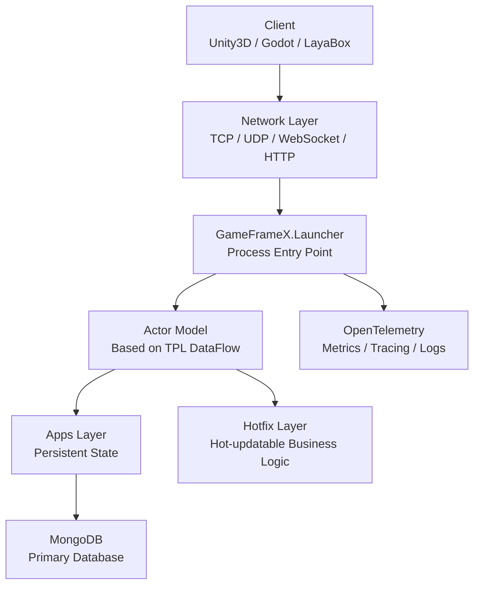

# 快速開始：設定您的第一個遊戲伺服器

按照本頁的步驟，在本機啟動 GameFrameX Server，並執行一個可監聽 TCP / HTTP / WebSocket 的遊戲伺服器程序。透過健康檢查端點驗證啟動是否成功。本框架基於 .NET 10.0，採用 Actor 模型，並預設連接 MongoDB 進行狀態持久化。

## 前置需求

| 相依套件 | 版本 | 說明 |
|------|------|------|
| .NET SDK | 10.0 | 框架目標為 .NET 10.0；可從 [dotnet 官方網站](https://dotnet.microsoft.com/download/dotnet/10.0)下載 |
| MongoDB | 4.x 及以上 | 主資料庫，用於狀態持久化；本機預設為 `mongodb://127.0.0.1:27017` |
| Docker（可選） | 最新版 | 若不想安裝 MongoDB，可使用儲存庫根目錄中的 `docker-compose.yml` 一鍵啟動 |
| IDE | 任意 | Rider / VS 2022 (17.10+) / VS Code 皆可使用 |

## 快速開始

### 1. 取得原始碼

```bash
git clone https://github.com/GameFrameX/GameFrameX.Server.Source.git
cd GameFrameX.Server.Source
```

### 2. 準備資料庫（擇一）

**方法 A：使用儲存庫內附的 Docker Compose**

```bash
docker-compose up -d mongodb
```

**方法 B：自行啟動 MongoDB**，並確保其監聽 `127.0.0.1:27017`。

### 3. 建置解決方案

```bash
dotnet build GameFrameX.Launcher -c Debug
```

### 4. 啟動伺服器

最小啟動命令（`Launcher` 為程序進入點）：

```bash
dotnet run --project GameFrameX.Launcher -- \
    --ServerType=Game \
    --ServerId=1000 \
    --OuterPort=29100 \
    --HttpPort=28080 \
    --DataBaseUrl=mongodb://127.0.0.1:27017 \
    --DataBaseName=gameframex
```

所有設定項皆透過 `--Key=Value` 命令列引數傳遞，定義於 `StartupOptions` 中。常用項目如下表所列：

| 設定項目 | 必填 | 預設值 | 說明 |
|--------|----------|--------|------|
| `ServerType` | 是 | 無 | 伺服器類型，如 `Game`、`Social` |
| `ServerId` | 是 | 無 | 唯一的伺服器標識 ID |
| `DataBaseUrl` | 是 | 無 | MongoDB 連線字串 |
| `DataBaseName` | 是 | 無 | 資料庫名稱 |
| `OuterPort` | 否 | `29100` | 供用戶端連線的 TCP 連接埠 |
| `HttpPort` | 否 | `8080` | HTTP / 健康檢查連接埠 |
| `IsEnableHttp` | 否 | `true` | 是否啟用 HTTP 服務 |
| `HttpIsDevelopment` | 否 | `false` | 開發模式（啟用 Swagger） |
| `IsEnableWebSocket` | 否 | `false` | 是否啟用 WebSocket |

### 5. 驗證啟動

啟動後，請執行以下兩項操作以確認服務正常運作：

1. **健康檢查端點**（預設 API 根路徑為 `/game/api/`）：
   ```bash
   curl http://localhost:28080/game/api/health
   ```
2. **檢查主控台日誌**，當看到類似 `Server started, listening on 0.0.0.0:29100` 的輸出時，即表示啟動成功。

## 運作原理一覽



- **Launcher**：程序進入點，接收命令列引數，啟動網路層與 Actor 容器。
- **Apps 層**：定義 `StateComponent` 與 `BaseCacheState`，負責狀態持久化，不可熱更新。
- **Hotfix 層**：實作 `StateComponentAgent`，承載業務邏輯，支援執行期熱更新。
- **Actor 模型**：無鎖高並行，內部狀態透過訊息佇列以序列方式存取。
- **網路層**：TCP（基於 SuperSocket）、WebSocket、HTTP/Kestrel 多協定並行。

## 撰寫一個最小化的登入元件

框架的核心模式是**狀態與邏輯分離**。以下是一個登入範例，展示完整鏈路。

**1. 狀態（Apps 層，不可熱更新）**

`GameFrameX.Apps/Account/Login/Entity/LoginState.cs` 已存在，欄位包含帳號、Token、登入時間等。

**2. 元件（Apps 層，不可熱更新）**

```csharp
public class LoginComponent : StateComponent<LoginState>
{
    protected override async Task OnInit()
    {
        await base.OnInit();
        // 初始化元件狀態
    }
}
```

**3. 業務邏輯（Hotfix 層，可熱更新）**

`GameFrameX.Hotfix/Logic/Account/Login/ReqLoginHandler.cs` 已存在，作為 HTTP / 訊息處理器，呼叫 `LoginComponent` 寫入 Token。

**4. 跨層呼叫**

```csharp
// 透過 ActorManager 取得元件代理
var loginAgent = await ActorManager.GetComponentAgent<LoginComponentAgent>(actorId);
var result = await loginAgent.Login(account, password);
```

完整的業務開發流程與元件代理模式，請參閱「業務邏輯開發」章節；Hotfix 組件置換機制請參閱「熱更新機制」章節。

## 後續步驟

- **完整設定參考**：請參閱「設定參考」—— 內含所有 `--Key=Value` 參數、預設值與範例。
- **業務開發**：請參閱「如何撰寫 Actor 元件」—— 狀態、元件與代理三件套。
- **熱更新**：請參閱「如何熱更新業務邏輯」—— 零停機的 Hotfix 組件置換。
- **Docker 部署**：請參閱「Docker 部署」—— 根目錄 `docker-compose.yml` / `docker-compose.multi.yml` 多程序編排。
- **監控**：請參閱「監控與可觀測性」—— Prometheus、Grafana Loki、OpenTelemetry 整合。