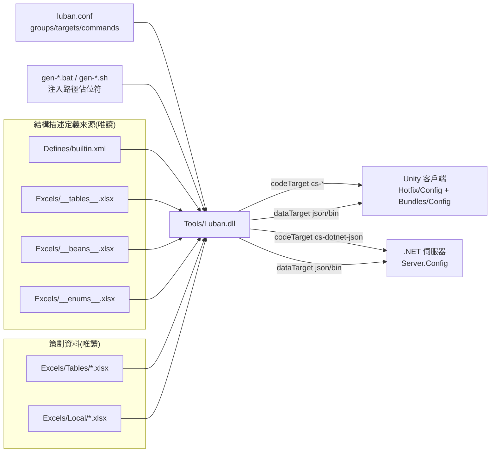

# Config 工具的運作原理

GameFrameX.Config 是一款基於 [Luban](https://github.com/GameFrameX/luban) 的配置表工具。它會讀取 `Excels/` 目錄下的 Excel 工作簿（資料表 + 本地化表 + 進階定義表），並結合 `Defines/builtin.xml` 與 `luban.conf` 的設定，一次性產生客戶端與伺服器兩側皆可直接載入的 C# 程式碼與資料檔案。

## 一句話概述工作流程

執行 `gen-*.bat` 或 `gen-*.sh` 腳本 → 工具讀取 `luban.conf` → 按照 `targets` 清單中的命令依序呼叫 `Tools/Luban.dll` → 將檔案輸出至 Unity 專案的 `Hotfix/Config/Generate/`（程式碼）與 `Bundles/Config/`（資料）目錄下，同時將伺服器版輸出至 `Server.Config/` 目錄下。

## 設定驅動：`luban.conf` 決定要產生什麼

`luban.conf` 是工具的「中央設定」，所有行為皆由此決定。出處:[luban.conf](https://github.com/GameFrameX/GameFrameX.Config/blob/main/luban.conf)

| 欄位 | 意義 | 範例 |
|------|------|------|
| `groups` | 群組識別。`c` = 客戶端、`s` = 伺服器 | `"names": ["c"]`、``"names": ["s"]` |
| `schemaFiles` | 資料結構描述（schema）定義的來源（包含欄位型別、列舉型別、bean、表格骨架） | `Defines`、`Excels/__tables__.xlsx`、`Excels/__beans__.xlsx`、`Excels/__enums__.xlsx` |
| `dataDir` | 存放業務資料的目錄 | `Excels` |
| `targets` | 單次產生所要輸出的目標集合（每個目標擁有各自的命名空間、manager、groups） | `server`、`client`、`all` |
| `commands` | 實際傳遞給 Luban 的命令列。每個目標可對應多條命令（json / bin 等不同格式） | `--target server --dataTarget json --codeTarget cs-dotnet-json …` |
| `toolPath` | Luban 工具 dll 的路徑 | `/../Config/Tools/Luban.dll` |
| `UNITY_ASSETS_PATH` / `SERVER_PATH` | 代表客戶端與伺服器專案位置的佔位符。會在命令中展開 | 由執行腳本注入 |

各 `commands` 透過佔位符 `%UNITY_ASSETS_PATH%` 與 `%SERVER_PATH%`，決定程式碼與資料要寫入哪個專案目錄。

## 3 層資料：運作 / 結構描述 / 資料

工具將作業內容分為 3 層來源：

1. **運作層**(`luban.conf`)：決定產生格式、目標、命名空間。
2. **結構描述層**(`Defines/builtin.xml` + `Excels/__*__.xlsx`)：定義欄位型別、列舉型別、結構體、表格骨架。
3. **資料層**(`Excels/Tables/*.xlsx`、`Excels/Local/*.xlsx`)：策劃實際輸入的資料。

出處範例 — `Defines/builtin.xml` 會將同一個「座標」在客戶端映射為 Unity 型別、在伺服器映射為 .NET 型別：

```xml
<bean name="vec3" valueType="1" sep="," group="*">
    <var name="x" type="float"/>
    <var name="y" type="float"/>
    <var name="z" type="float"/>
    <mapper target="client" codeTarget="cs-bin,cs-simple-json">
        <option name="type" value="UnityEngine.Vector3"/>
        <option name="constructor" value="ExternalTypeUtil.NewVector3"/>
    </mapper>
    <mapper target="server" codeTarget="cs-bin,cs-dotnet-json">
        <option name="type" value="System.Numerics.Vector3"/>
        <option name="constructor" value="ExternalTypeUtil.NewVector3"/>
    </mapper>
</bean>
```

出處:[Defines/builtin.xml](https://github.com/GameFrameX/GameFrameX.Config/blob/main/Defines/builtin.xml#L14-L26)

也就是說，策劃只需準備一份 Excel，工具就會針對各個目標自動輸出對應語言／引擎的程式碼。不需要分別撰寫客戶端版與伺服器版。

## 3 種產生目標

出處:[luban.conf](https://github.com/GameFrameX/GameFrameX.Config/blob/main/luban.conf#L35-L60)

| 目標名稱 | `topModule`（命名空間） | `manager` | 生效時機 |
|--------|-----------------------|-----------|----------|
| `server` | `GameFrameX.Config` | `TablesComponent` | 伺服器的程式碼/資料，groups = `s` |
| `client` | `Hotfix.Config` | `TablesComponent` | Unity 客戶端的程式碼/資料，groups = `c` |
| `all` | `cfg` | `Tables` | 通用匯出，groups = `c,s` |

`commands` 清單中的每條命令皆可個別切換 `dataTarget`（`json` 或 `bin`）、`codeTarget`（`cs-dotnet-json` / `cs-simple-json` / `cs-bin`）以及 `validationFailAsError`。

## 單次完整產生的步驟

1. 策劃在 `Excels/Tables/*.xlsx` 與 `Excels/Local/*.xlsx` 中輸入資料（命名遵循 `字母-英文名-中文名`）。
2. 在儲存庫根目錄執行 `gen-client-json.bat / .sh`（或 `gen-server-bin.bat / .sh` 等），腳本內部會將 `UNITY_ASSETS_PATH`、`SERVER_PATH` 注入佔位符。
3. 工具讀取 `luban.conf`，並按 `commands` 的順序啟動 `Tools/Luban.dll`。每個 target 對應一條命令。
4. Luban 解析結構描述檔案（`Defines/`、`__tables__.xlsx`、`__beans__.xlsx`、`__enums__.xlsx`），並逐一與 `Excels/` 中的資料進行驗證。
5. 依據 `codeTarget`，將 C# 原始碼產生至 `%UNITY_ASSETS_PATH%/Hotfix/Config/Generate/` 或 `%SERVER_PATH%/Server.Config/Config/`。
6. 依據 `dataTarget`，將資料檔案產生至 `Bundles/Config/`（執行時會打包進首包）或 `Server.Config/Json/`（供伺服器讀取）。
7. 若終端機輸出成功訊息且檔案已輸出，即可在專案中直接呼叫 `tables.TbXxx.Get(id)`。

## 架構關係圖



## 設計意圖（背景）

- **以設定為中心**： `luban.conf` 將「由誰產生、產生到哪裡、使用哪種格式」全部以 JSON 形式外部化。即使要新增目標或切換 json/bin，也無需修改工具本體。
- **同一份資料供兩側使用**： 在 `Defines/builtin.xml` 中，同一個 bean 分別透過 `<mapper target="client" ...>` 與 `<mapper target="server" ...>` 映射為 Unity 型別與 .NET 型別，讓 Unity 與伺服器能共用同一份業務表格。
- **群組的分割與合併**： 相同的英文表名（例： `D-ItemConfig-道具表-1001.xlsx` 與 `D-ItemConfig-道具表-2001.xlsx`）會合併為一張表，方便視需要拆分大型表格。

## 相關連結

- [Defines/builtin.xml](https://github.com/GameFrameX/GameFrameX.Config/blob/main/Defines/builtin.xml)
- [luban.conf](https://github.com/GameFrameX/GameFrameX.Config/blob/main/luban.conf)
- [README.zh-CN.md](https://github.com/GameFrameX/GameFrameX.Config/blob/main/README.zh-CN.md)
- 上游工具 [GameFrameX/luban](https://github.com/GameFrameX/luban)